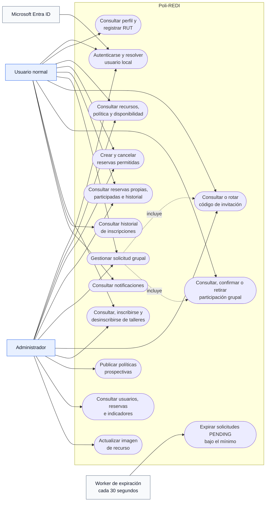

# Arquitectura y contratos de Poli-REDI

**Audiencia:** Arquitecto, Backend, Frontend, QA y DevOps

**Propósito:** definir arquitectura, límites, rutas y contratos transversales de MVP 1 y MVP 2

**Estado:** CANÓNICO; contrastado con el código local

**Corte:** 2026-08-11

**Fuente:** código local y auditoría técnica del 2026-08-11

**No demuestra:** despliegue actual, integración online ni ejecución real sobre Azure SQL

## Resumen

- La SPA Vue consume una API Go/Fiber; el backend decide identidad, permisos y
  reglas, y Azure SQL defiende persistencia, integridad y concurrencia.
- Microsoft Entra ID acredita identidad. `RequireAuth` sincroniza al usuario
  local y `RequireAdmin` protege las rutas administrativas.
- El feed de disponibilidad por rango está implementado en el backend local;
  su consumo completo desde el frontend permanece pendiente/no validado.
- La arquitectura es principalmente por capas, aunque existen recorridos
  reales Handler → Repository y Middleware → Repository.
- Un resultado local no acredita CORS, Entra ID, App Service, Azure SQL ni la
  experiencia online integrada.

## 1. Actores y límites del sistema

**Objetivo:** identificar quién inicia cada capacidad y evitar atribuir al
frontend permisos que solo puede decidir el backend.

**Alcance y estado:** las capacidades de usuario de MVP 1 y MVP 2 existen en
el código local. La administración de usuarios, bloqueos, programación,
notificaciones y reportes continúa parcial.

Decisiones y divergencias:

- `GROUP` y `CODE` están disponibles para usuario normal o administrador solo
  cuando es propietario de la solicitud.
- La exención administrativa de RUT aplica a crear reservas e inscribirse en
  talleres, no a confirmar o retirar una participación grupal.
- No existe `AdminGuard`. El frontend usa `router.beforeEach` con
  `requiresAdmin`; la autorización efectiva usa `RequireAdmin` en la API.

## 2. Responsabilidades por capa

| Capa | Responsabilidad |
|---|---|
| Vue / Router / Pinia / Axios | Navegación, estado asíncrono, presentación, validación anticipada y token. |
| Fiber Routes / Middleware | Autenticación, rol, usuario local y despacho HTTP. |
| Handlers | Contrato JSON, parámetros, códigos HTTP y mensajes seguros. |
| Services | Reglas de reservas, talleres y políticas. |
| Repositories | Transacciones, locks, consultas y persistencia. |
| Azure SQL | Constraints, índices, triggers, vistas e integridad concurrente. |

No todos los dominios atraviesan una capa Service. Participantes, perfil/RUT,
recursos, usuarios, actividades y notificaciones poseen accesos directos desde
handlers; `RequireAuth` también consulta y sincroniza usuarios mediante el
repositorio.

El diagrama detallado está en
[Arquitectura y despliegue](anexos/diagramas/arquitectura-y-despliegue.md).

## 3. Rutas y endpoints vigentes

Rutas frontend principales: `/availability`, `/reservations`,
`/reservations/:id`, `/history`, `/workshops`, `/join/:code?`, `/resources`,
`/admin`, `/users`, `/settings` y `/reports`.

| Dominio | Contratos principales |
|---|---|
| Identidad | `GET /api/me`, `PATCH /api/me/rut` |
| Catálogos | `GET /api/resources`, `GET /api/activities` |
| Disponibilidad | `GET /api/availability/reservations`; `from` y `to` habilitan el feed unificado |
| Reservas | `GET /api/reservations/mine`, `POST /api/reservations`, `PATCH /api/reservations/cancel` |
| Administración | `GET /api/reservations`, `GET /api/users`, publicación e historial de políticas bajo `RequireAdmin` |
| Flujo grupal | código owner-only, progreso por código, confirmación, retiro y objetivo |
| Talleres | listado, alta, baja propia e historial de episodios |
| Notificaciones | `GET /api/notifications` |

`GET /api/reservations` es administrativo. El usuario normal consulta
`GET /api/reservations/mine`, que reúne reservas propias y aquellas donde es
participante confirmado, con sanitización por audiencia.

## 4. Contratos transversales

### Identidad, rol y RUT

- El servidor obtiene el propietario desde la sesión; rechaza `userId` o
  `status` controlados por el cliente en la creación.
- El usuario normal necesita RUT válido para crear reservas o inscribirse en
  talleres. El administrador está exento en esas dos acciones.
- La participación grupal exige cuenta no bloqueada y RUT a cualquier actor,
  incluido el administrador.

### Tiempo y solape

- `APP_TIMEZONE=America/Santiago` define la hora institucional.
- Los intervalos son semiabiertos: `inicioA < finB` y `inicioB < finA`.
- Los extremos contiguos son válidos.
- La política vigente define jornada, slot, duraciones, ventana reservable,
  frecuencia y deadline; cada reserva conserva su `policy_id`.

### Disponibilidad y privacidad

El contrato unificado por `from/to` agrega reservas, actividades programadas,
ocurrencias de talleres y bloqueos. Expone `blocksResource` e
`isCurrentUserConflict` y sanitiza el contenido según usuario normal o
administrador. El endpoint conserva temporalmente el contrato legado sin rango;
la vista principal todavía usa ese camino y reconstruye parte de la agenda.

Por ello, **backend por rango implementado** no equivale a **frontend integrado**.

### Interfaz asíncrona

Los stores distinguen carga inicial, refresco con datos, mutación local, error
parcial y error terminal. Skeletons, `aria-busy`, restauración de foco y
`prefers-reduced-motion` forman parte del contrato visual, pero requieren QA
integrado y multidispositivo antes del cierre.

## 5. Riesgos y decisiones abiertas

- Integrar el rango unificado en el frontend y eliminar la reconstrucción
  paralela de talleres.
- Alinear la prevención visual de solape personal para `OPEN_USE` con el
  servidor.
- Completar administración de bloqueos, programación y notificaciones.
- Definir la relación futura taller ↔ reservas/participaciones antes de
  presentarla como agenda personal unificada.
- Validar Entra ID, CORS, API y Azure SQL juntos; no inferirlo del árbol local.

## 6. Diagramas relacionados

- [Arquitectura interna y despliegue](anexos/diagramas/arquitectura-y-despliegue.md)
- [Secuencia completa MVP 1](anexos/diagramas/secuencia-mvp1.md)
- [Secuencias MVP 2](anexos/diagramas/secuencias-mvp2.md)
- [Modelo entidad-relación](anexos/diagramas/modelo-entidad-relacion.md)
- [Reglas y flujos](06-reglas-y-flujos.md)
- [Base de datos y migraciones](04-base-de-datos-y-migraciones.md)

## Fuentes

- [`backend/internal/routes/routes.go`](../backend/internal/routes/routes.go)
- [`backend/internal/middleware/auth_middleware.go`](../backend/internal/middleware/auth_middleware.go)
- [`backend/internal/handlers`](../backend/internal/handlers)
- [`backend/internal/services`](../backend/internal/services)
- [`backend/internal/repositories`](../backend/internal/repositories)
- [`frontend/src/router/index.js`](../frontend/src/router/index.js)
- [`frontend/src/services`](../frontend/src/services)
- [`frontend/src/stores`](../frontend/src/stores)
