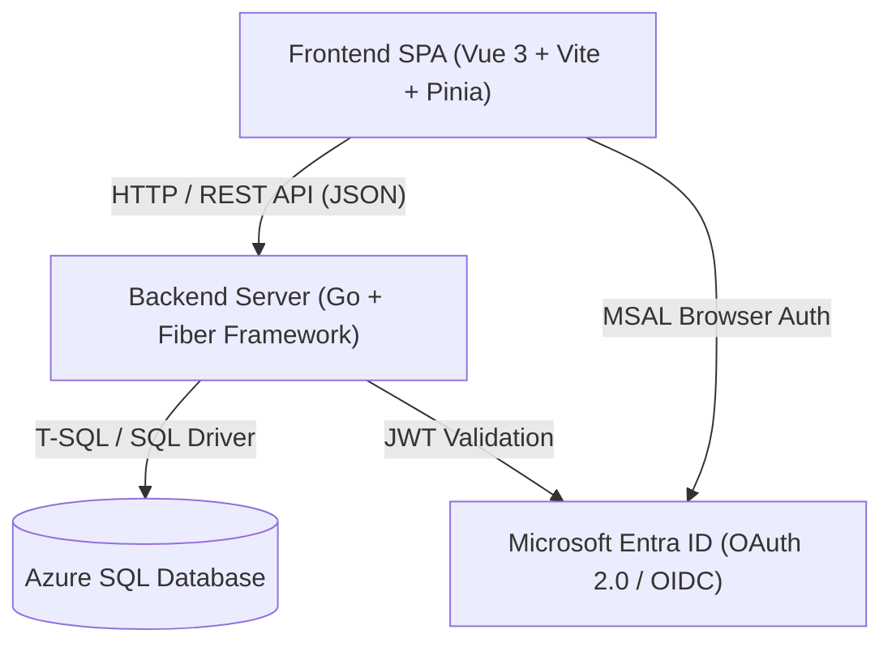
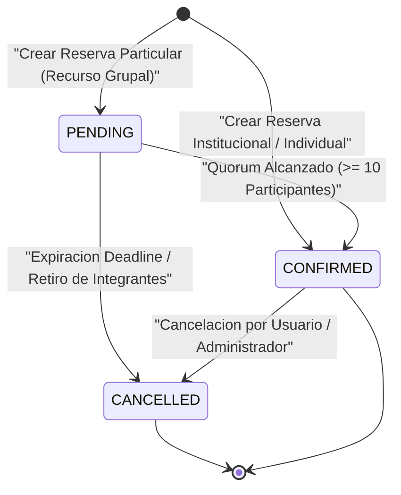

# Poli-REDI - Especificación de Arquitectura, Sistema y Base de Datos

> **Delta 2026-07-30:** detalle de reserva compartido con capacidades explicitas,
> endurecimiento accesible y migraciones prospectivas `007`/`008`.

> **Fecha de consolidación:** 2026-07-23  
> **Propósito:** Consolidar en una guía técnica única el diseño de arquitectura desacoplada, el esquema de Azure SQL Database, la API REST en Go y la SPA en Vue 3.

---

## 1. Arquitectura General del Sistema

Poli-REDI adopta una arquitectura cliente-servidor desacoplada compuesta por tres capas independientes:

---

## 2. Capa de Base de Datos (Azure SQL Database)

La persitencia se realiza en **Azure SQL Database** mediante scripts T-SQL ubicados en `database/`:
* `database/schema.sql`: Creación de tablas, llaves primarias/foráneas y restricciones.
* `database/seed.sql`: Carga de datos iniciales (Recursos, Roles, Actividades y Usuarios de prueba).
* `database/migrations/`: Scripts evolutivos de esquema para MVP 2 y flujo grupal.

### Entidades Principales:
1. `Users`: Almacena `id`, `email`, `name`, `rut`, `role_id` e `is_blocked`.
2. `Resources`: Representa los espacios reservables (`Cancha 1`, `Cancha 2`, `Cancha 3`, `Sala Multiusos`).
3. `reservations`: Almacena `user_id`, `resource_id`, `start_time`, `duration_minutes`, `status` (`PENDING`, `CONFIRMED`, `CANCELLED`), `join_code_hash`, capacidad y objetivo grupal.
4. `participants`: Registro único por usuario y reserva grupal.
5. `reservation_join_code_secrets`: Secreto cifrado versionado para recuperación owner-only.
6. `reservation_group_expirations`: Marca idempotente de expiración bajo el mínimo.
7. `activities`: Catálogo de actividades; la programación institucional usa entidades separadas.
8. `workshop_occurrences`: Días ISO e intervalos normalizados `[inicio, fin)` de cada taller.

---

## 3. Capa Backend (Go + Fiber API)

El backend está construido en **Go** estructurado en paquetes modulares (`backend/internal/`):
* `cmd/`: Punto de entrada de la aplicación (`main.go`).
* `handlers/`: Controladores HTTP de endpoints (Autenticación, Reservas, Recursos, Usuarios, Notificaciones).
* `services/`: Lógica de negocio (Validación de reglas horarias, ventana semanal, quorum grupal).
* `reservationrules/`: Evaluador atómico de solapamientos y disponibilidad.
* `joinsecret/`: Cifrado y descifrado AES de códigos grupales con rotación de llaves.
* `middleware/`: Validación de JWT Bearer Tokens de Microsoft Entra ID y headers Dev-Auth.

### Endpoints REST Principales:
* `GET /api/health`: Chequeo de estado.
* `GET /api/me` | `PATCH /api/me/rut`: Gestión de perfil y RUT.
* `GET /api/resources`: Listado de recintos deportivos.
* `GET /api/reservations` | `POST /api/reservations`: Consulta y creación de reservas.
* `PATCH /api/reservations/cancel`: Cancelación de reservas.
* `GET /api/activities`: Catálogo de actividades.
* `GET /api/workshops` | `POST /api/workshops/:id/enroll`: Talleres e inscripciones.
* `GET /api/group-reservations/:code`: Progreso agregado del flujo grupal.
* `PUT /api/group-reservations/:code/confirmation`: Confirmar o reconfirmar participación.
* `DELETE /api/group-reservations/:code/confirmation`: Retirar participación propia.
* `PATCH /api/reservations/:id/target-participants`: Editar objetivo, solo propietario y hasta el deadline inclusivo.
* `GET /api/reservations/:id/join-code`: Recuperar código cifrado, solo propietario.
* `POST /api/reservations/:id/join-code/rotate`: Rotar código y habilitar reservas legacy sin secreto.

---

## 4. Capa Frontend (Vue 3 + Vite + Pinia)

El detalle de reserva es un componente comun para Disponibilidad, Mis Reservas,
Historial y union por codigo. Recibe capacidades explicitas de lectura,
cancelacion, edicion de objetivo, consulta de codigo y
confirmacion/retiro; no infiere autorizacion desde la ruta. El secreto no viaja
en listados: se consulta bajo demanda mediante el endpoint owner-only.

Los dialogos comparten administracion de foco, cierre con Escape, bloqueo de
fondo y restauracion del foco. Las tarjetas de reservas, la linea temporal y el
progreso admiten operacion/semantica accesible.

La SPA desarrollada en **Vue 3** (Composition API) utiliza:
* **Pinia Stores:** Manejo de estado centralizado (`authStore`, `reservationStore`, `resourceStore`).
* **Vue Router:** Control de navegación y guardias de seguridad por rol (`AdminGuard`).
* **Axios:** Cliente HTTP con interceptores automáticos para inyección del Token Bearer.

### Vistas Principales:
- `/`: Inicio y resumen informativo.
- `/disponibilidad`: Agenda interactiva para seleccionar cancha, fecha y bloque horario.
- `/mis-reservas`: Vista personal del alumno con opciones de cancelación y visualización de código grupal.
- `/history`: Historial básico de reservas en MVP 1; se ampliará con las
  inscripciones propias a talleres en MVP 2 y con el historial institucional de
  clases y otros eventos en MVP 3.
- `/admin`: Panel administrativo restringido para gestión de recursos, bloqueos e indicadores.

---

## 5. Ciclo de Vida de una Reserva

El deadline inclusivo se aplica a objetivo, confirmación y retiro. Una persona retirada puede reconfirmar antes del límite. Las solicitudes `PENDING` bajo el mínimo expiran a `CANCELLED` mediante un worker periódico y resolución perezosa en consultas o acciones.

`OPEN_USE` no requiere participantes ni consume la frecuencia institucional. Aun así, el mismo usuario no puede mantener reservas activas solapadas entre sí; los horarios contiguos sí se permiten.

> **Estado:** Flujo grupal `ACCEPTED LOCALLY`. Migración 004, idempotencia y concurrencia real en Azure SQL pendientes.

## 6. Integridad de RUT y Talleres

El frontend y el backend normalizan el RUT y validan su formato y dígito verificador. La migración 005 valida y canonicaliza el estado existente; posteriormente la base garantiza unicidad filtrada y write-once, pero no revalida permanentemente el dígito verificador ante escrituras SQL externas. `PATCH /api/me/rut` es write-once: el mismo valor es idempotente y un cambio o duplicado responde `409`. La UI lo solicita únicamente cuando `/api/me` está listo, el usuario no es administrador y falta un RUT válido; después lo presenta solo lectura. Dev Auth no reinicia el dato.

La exención administrativa aplica a crear reservas normales/grupales e inscribirse en talleres, pero no a confirmar como participante. Esta última operación siempre exige cuenta activa con RUT.

Los talleres usan ocurrencias normalizadas y admiten múltiples días. El solape usa intervalos semiabiertos (`inicio < fin`): horarios contiguos no chocan. Solo se comparan inscripciones `CONFIRMED` entre talleres activos; filas `CANCELLED` y talleres inactivos no bloquean. Repetir la misma inscripción es idempotente (`200`); una creación nueva devuelve `201`. Un choque responde `409` con `code: WORKSHOP_SCHEDULE_CONFLICT` y detalle `title`, `dayText` y `scheduleText`.

El repositorio serializa por usuario y luego por taller, verifica cupo y horario y falla de forma cerrada ante ocurrencias faltantes o errores. El trigger protege escrituras externas set-based, sin reemplazar el orden de locks del repositorio. Migraciones 005/006 y carreras reales en Azure SQL permanecen pendientes.

## 7. Modelo de lectura del historial

### Deltas de base de datos 007/008

`007_repair_bootstrap_group_policy.sql` reconoce por identidad, modo, alcance y
huella una politica bootstrap concreta. Ante divergencia falla cerrada; no
repara una politica administrada ni altera reservas historicas.

`008_personal_overlap_includes_participations.sql` protege la agenda personal al
considerar reservas propias y participaciones `CONFIRMED`. Usa intervalos
semiabiertos, por lo que los extremos contiguos son validos. Sus triggers
complementan, pero no sustituyen, las validaciones de servicio.

El historial conserva la separación entre dominios y no convierte todos los
elementos en reservas:

* **Reserva:** solicitud particular o grupal asociada al propietario y, cuando
  corresponde, a participantes confirmados.
* **Taller:** oferta recurrente con cupo; su relación personal se determina por
  `workshop_enrollments`.
* **Actividad institucional programada:** clase, entrenamiento, campeonato u
  otro evento registrado en `scheduled_activities`.

La ampliación de MVP 2 debe consultar las inscripciones propias, incluidas las
que deban conservarse históricamente, sin alterar el flujo de escritura de
reservas. MVP 3 incorporará la lectura institucional de clases y otros eventos.
Una actividad programada no forma parte del historial personal por el solo hecho
de existir en la agenda: se requerirá una relación explícita usuario–actividad
antes de atribuir participación o asistencia.

El contrato de lectura deberá identificar el tipo de elemento y exponer solo los
campos comunes necesarios para ordenar y filtrar, manteniendo detalles y
autorización específicos por dominio.
