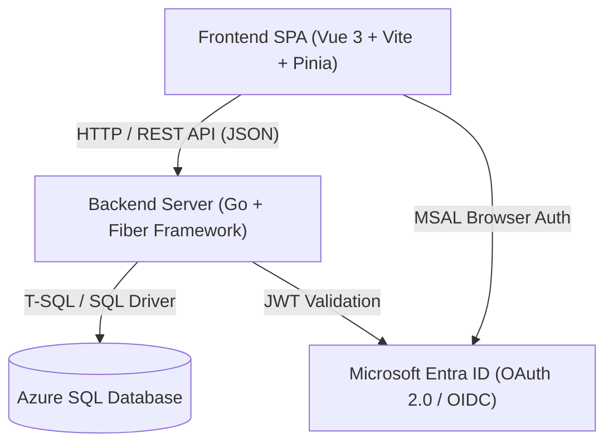

# Poli-REDI - Especificación de Arquitectura, Sistema y Base de Datos

> **Fecha de consolidación:** 2026-07-23  
> **Propósito:** Consolidar en una guía técnica única el diseño de arquitectura desacoplada, el esquema de Azure SQL Database, la API REST en Go y la SPA en Vue 3.

---

## 1. Arquitectura General del Sistema

Poli-REDI adopta una arquitectura cliente-servidor desacoplada compuesta por tres capas independientes:

---

## 2. Capa de Base de Datos (Azure SQL Database)

La persitencia se realiza en **Azure SQL Database** mediante scripts T-SQL ubicados en `database/`:
* `database/schema.sql`: Creación de tablas, llaves primarias/foráneas y restricciones.
* `database/seed.sql`: Carga de datos iniciales (Recursos, Roles, Actividades y Usuarios de prueba).
* `database/migrations/`: Scripts evolutivos de esquema para MVP 2 y flujo grupal.

### Entidades Principales:
1. `Users`: Almacena `id`, `email`, `name`, `rut`, `role_id` e `is_blocked`.
2. `Resources`: Representa los espacios reservables (`Cancha 1`, `Cancha 2`, `Cancha 3`, `Sala Multiusos`).
3. `Reservations`: Almacena `user_id`, `resource_id`, `start_time`, `end_time`, `status` (`PENDING`, `CONFIRMED`, `CANCELLED`) y `join_code`.
4. `ReservationParticipants`: Registro de participantes asociados a reservas grupales.
5. `Activities`: Catalogo de talleres y actividades institucionales recurrentes.

---

## 3. Capa Backend (Go + Fiber API)

El backend está construido en **Go** estructurado en paquetes modulares (`backend/internal/`):
* `cmd/`: Punto de entrada de la aplicación (`main.go`).
* `handlers/`: Controladores HTTP de endpoints (Autenticación, Reservas, Recursos, Usuarios, Notificaciones).
* `services/`: Lógica de negocio (Validación de reglas horarias, ventana semanal, quorum grupal).
* `reservationrules/`: Evaluador atómico de solapamientos y disponibilidad.
* `joinsecret/`: Cifrado y descifrado AES de códigos grupales con rotación de llaves.
* `middleware/`: Validación de JWT Bearer Tokens de Microsoft Entra ID y headers Dev-Auth.

### Endpoints REST Principales:
* `GET /api/health`: Chequeo de estado.
* `GET /api/me` | `PATCH /api/me/rut`: Gestión de perfil y RUT.
* `GET /api/resources`: Listado de recintos deportivos.
* `GET /api/reservations` | `POST /api/reservations`: Consulta y creación de reservas.
* `PATCH /api/reservations/cancel`: Cancelación de reservas.
* `GET /api/activities` | `POST /api/activities/enroll`: Talleres e inscripciones.

---

## 4. Capa Frontend (Vue 3 + Vite + Pinia)

La SPA desarrollada en **Vue 3** (Composition API) utiliza:
* **Pinia Stores:** Manejo de estado centralizado (`authStore`, `reservationStore`, `resourceStore`).
* **Vue Router:** Control de navegación y guardias de seguridad por rol (`AdminGuard`).
* **Axios:** Cliente HTTP con interceptores automáticos para inyección del Token Bearer.

### Vistas Principales:
- `/`: Inicio y resumen informativo.
- `/disponibilidad`: Agenda interactiva para seleccionar cancha, fecha y bloque horario.
- `/mis-reservas`: Vista personal del alumno con opciones de cancelación y visualización de código grupal.
- `/admin`: Panel administrativo restringido para gestión de recursos, bloqueos e indicadores.

---

## 5. Ciclo de Vida de una Reserva

