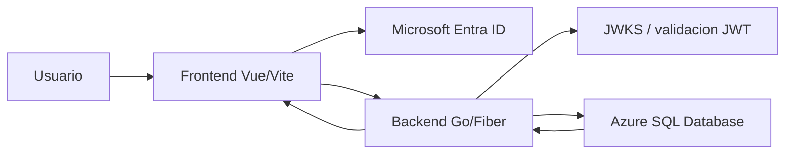
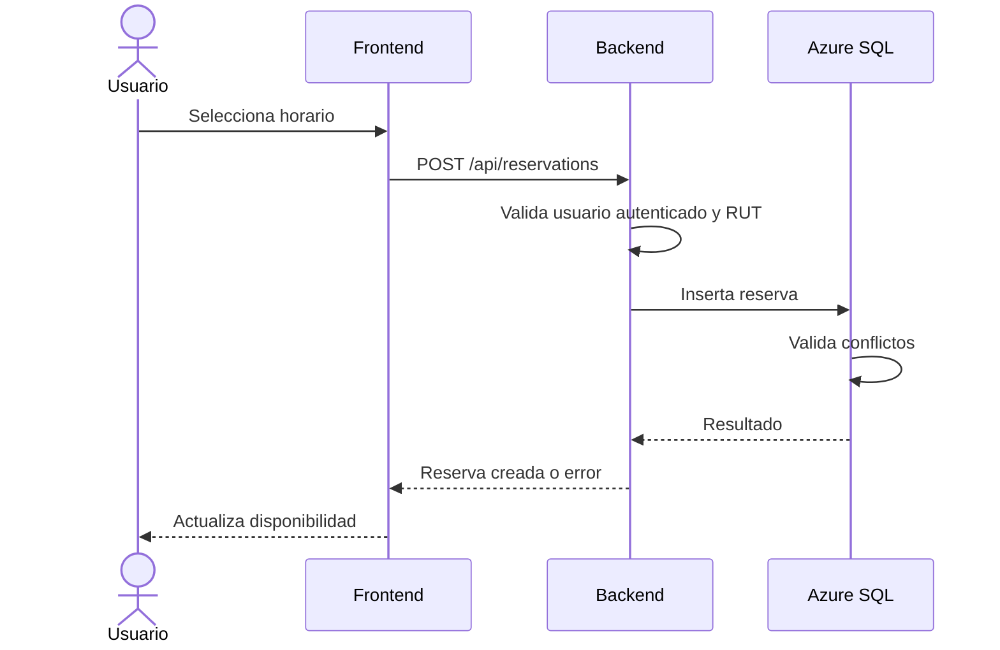

# Poli-REDI - Arquitectura

## Objetivo

Este documento resume la arquitectura vigente de Poli-REDI y el flujo principal entre frontend, backend, autenticacion y base de datos.

## Vista general

## Frontend

El frontend vive en `frontend/` y usa:

- Vue 3.
- Vite.
- Pinia.
- Vue Router.
- Axios.
- MSAL Browser.

Responsabilidades principales:

- Autenticar al usuario con Microsoft Entra ID o modo local de desarrollo.
- Proteger rutas publicas, autenticadas y administrativas.
- Consultar recursos, actividades, reservas, talleres, notificaciones y usuario actual.
- Mostrar disponibilidad, formularios de reserva, historial, talleres deportivos y panel admin base.
- Enviar reservas sin confiar en IDs de usuario definidos en cliente.

## Backend

El backend vive en `backend/` y usa Go/Fiber.

Estructura principal:

- `cmd/`: arranque de la API.
- `internal/routes/`: registro de rutas.
- `internal/middleware/`: autenticacion, modo local y usuario actual.
- `internal/handlers/`: entrada HTTP.
- `internal/services/`: reglas de negocio.
- `internal/repositories/`: consultas Azure SQL.
- `internal/models/`: modelos de datos.
- `internal/validators/`: validadores reutilizables.

Responsabilidades principales:

- Validar tokens Bearer de Microsoft Entra ID.
- Resolver o crear usuario local autenticado.
- Aplicar permisos de usuario normal y administrador.
- Crear y cancelar reservas usando el usuario autenticado.
- Listar talleres activos e inscribir al usuario autenticado cuando tenga RUT.
- Validar RUT obligatorio para usuarios normales.
- Exponer datos desde Azure SQL Database.

## Base de datos

La base vigente es Azure SQL Database.

Scripts principales:

- `database/schema.sql`.
- `database/seed.sql`.
- `database/drop.sql`.

La base aplica reglas criticas mediante constraints, indices, triggers y vistas:

- Usuarios, recursos, actividades, reservas, talleres e inscripciones.
- Validacion basica de RUT.
- Conflictos de reserva por recurso y usuario.
- Control de cupos e inscripcion unica por usuario en talleres.
- Bloqueos y actividades programadas para iteraciones administrativas.
- Notificaciones y auditoria.

## Autenticacion

Flujo real:

1. El usuario inicia sesion con Microsoft Entra ID.
2. El frontend obtiene token para la API.
3. El backend valida issuer, audience, firma y claims.
4. El backend busca o crea usuario local.
5. Las rutas protegidas usan el usuario local resuelto.

Flujo local:

1. `DEV_AUTH_ENABLED=true` habilita accesos locales.
2. El frontend envia headers `X-Dev-Auth-*`.
3. El backend crea o resuelve un usuario local de prueba.
4. Este modo no debe activarse en ambientes publicos.

## Flujo de reserva

## Despliegue

La demo online inicial usa:

- Frontend: Azure Static Web Apps.
- Backend: Azure App Service con Docker.
- Base de datos: Azure SQL Database.
- Variables frontend `VITE_*` desde GitHub Actions.
- Variables backend en App Service.

## Riesgos y mejoras recomendadas

- Crear endpoint de disponibilidad sanitizado para no exponer datos innecesarios de reservas ajenas.
- Centralizar validacion de administrador con middleware reutilizable.
- Confirmar `DEV_AUTH_ENABLED=false` antes de cualquier despliegue publico.
- Agregar pruebas backend para reglas criticas de reservas y cancelacion.
- Agregar checklist frontend o pruebas de humo para demo.
