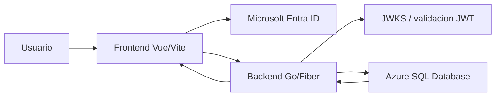
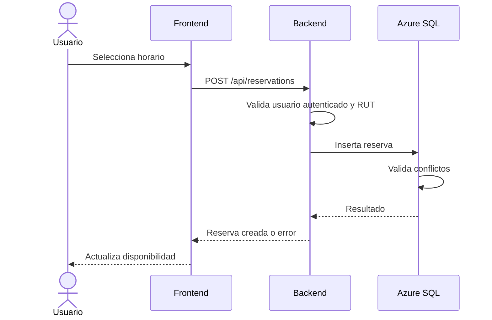

# Poli-REDI - Arquitectura

## Objetivo

Este documento resume la arquitectura vigente de Poli-REDI y el flujo principal entre frontend, backend, autenticacion y base de datos.

## Vista general

## Frontend

El frontend vive en `frontend/` y usa:

- Vue 3.
- Vite.
- Pinia.
- Vue Router.
- Axios.
- MSAL Browser.

Responsabilidades principales:

- Autenticar al usuario con Microsoft Entra ID o modo local de desarrollo.
- Proteger rutas publicas, autenticadas y administrativas.
- Consultar recursos, actividades, reservas, talleres, notificaciones y usuario actual.
- Mostrar disponibilidad, formularios de reserva, historial, talleres deportivos y panel admin base.
- Mostrar imagenes configurables de recursos y permitir su actualizacion a administradores.
- Enviar reservas sin confiar en IDs de usuario definidos en cliente.
- Consumir disponibilidad desde un endpoint sanitizado y combinar reservas, talleres recurrentes y actividades institucionales para bloquear horarios ocupados.

## Backend

El backend vive en `backend/` y usa Go/Fiber.

Estructura principal:

- `cmd/`: arranque de la API.
- `internal/routes/`: registro de rutas.
- `internal/middleware/`: autenticacion, modo local y usuario actual.
- `internal/handlers/`: entrada HTTP.
- `internal/services/`: reglas de negocio.
- `internal/repositories/`: consultas Azure SQL.
- `internal/models/`: modelos de datos.
- `internal/validators/`: validadores reutilizables.

Responsabilidades principales:

- Validar tokens Bearer de Microsoft Entra ID.
- Resolver o crear usuario local autenticado.
- Aplicar permisos de usuario normal y administrador.
- Crear y cancelar reservas usando el usuario autenticado.
- Listar talleres activos e inscribir al usuario autenticado cuando tenga RUT.
- Actualizar imagenes de recursos mediante ruta administrativa protegida.
- Exponer disponibilidad sanitizada para usuarios normales y detalle completo de reservas solo a administradores.
- Validar que reservas no se crucen con talleres activos asociados al mismo recurso.
- Validar RUT obligatorio para usuarios normales.
- Exponer datos desde Azure SQL Database.

## Base de datos

La base vigente es Azure SQL Database.

Scripts principales:

- `database/schema.sql`.
- `database/seed.sql`.
- `database/drop.sql`.

La base aplica reglas criticas mediante constraints, indices, triggers y vistas:

- Usuarios, recursos, actividades, reservas, talleres e inscripciones.
- Imagen opcional por recurso mediante `resources.image_url`.
- Validacion basica de RUT.
- Conflictos de reserva por recurso y usuario.
- Recursos de uso libre (`OPEN_USE`) que permiten concurrencia y se visualizan como intensidad de uso.
- Control de cupos e inscripcion unica por usuario en talleres.
- Bloqueos y actividades programadas para iteraciones administrativas.
- Notificaciones y auditoria.

## Autenticacion

Flujo real:

1. El usuario inicia sesion con Microsoft Entra ID.
2. El frontend obtiene token para la API.
3. El backend valida issuer, audience, firma y claims.
4. El backend busca o crea usuario local.
5. Las rutas protegidas usan el usuario local resuelto.

Flujo local:

1. `DEV_AUTH_ENABLED=true` habilita accesos locales.
2. El frontend envia headers `X-Dev-Auth-*`.
3. El backend crea o resuelve un usuario local de prueba.
4. Este modo no debe activarse en ambientes publicos.

## Flujo de reserva

## Despliegue

La demo online inicial usa:

- Frontend: Azure Static Web Apps.
- Backend: Azure App Service con Docker.
- Base de datos: Azure SQL Database.
- Variables frontend `VITE_*` desde GitHub Actions.
- Variables backend en App Service.

## Arquitectura de politicas de reserva

Estado: APROBADA e IMPLEMENTADA para el versionado prospectivo y la publicacion administrativa; VERIFICADA LOCALMENTE el 2026-07-21. La ejecucion contra SQL Server/Azure SQL y la concurrencia real siguen PENDIENTES de verificacion.

- Las politicas de ventana, frecuencia, plazo, minimo, jornada, intervalo, duraciones y recursos permitidos se almacenan como versiones inmutables. La clasificacion de recursos que requeriran confirmacion grupal permanece APROBADA pero PENDIENTE.
- Cada solicitud referencia la version vigente al crearse y conserva sus condiciones.
- La publicacion tiene vigencia inmediata. Una transaccion serializable cierra la version anterior, crea el snapshot completo y publica la nueva; en concurrencia, la transaccion que obtiene primero el bloqueo determina la version disponible para la reserva.
- Existe un bootstrap tecnico controlado: el esquema crea sus protecciones y, despues de cargar los recursos, el seed completa y marca una sola vez los recursos permitidos de la politica inicial heredada. No constituye una via administrativa para editar versiones publicadas.
- El solicitante se registra como participante, no puede retirar su participacion y debe cancelar la solicitud completa si desea abandonarla.
- Confirmar o retirar participacion, recalcular el estado y resolver el vencimiento forman una sola operacion transaccional por reserva.
- Los vencimientos se resuelven antes de consultar o modificar las reservas relevantes. Un ejecutor programado queda como mejora futura si se exige notificacion exactamente al minuto sin actividad del sistema.
- Una correccion excepcional permanece fuera de este incremento: el diseno aprobado exige seleccionar solicitudes futuras activas, previsualizar el efecto, declarar un motivo y aplicar el lote de forma atomica y auditada, sin editar versiones historicas ni cancelar implicitamente.
- `ADMIN-005`, incluida la prioridad de actividades institucionales, se disenara en una entrega arquitectonica posterior.

### Contratos implementados

- `GET /api/reservation-policy/current`: autenticado; devuelve solo condiciones operativas, sin ID, autoria, vigencias ni metadatos de auditoria.
- `GET /api/admin/reservation-policies`: solo administrador; devuelve el historial completo.
- `POST /api/admin/reservation-policies`: solo administrador; exige `Idempotency-Key` (maximo 100 caracteres). Responde `201` al crear, `200` al repetir la misma clave con payload equivalente y `409` al reutilizarla con datos distintos.

Los endpoints de participantes y correcciones que siguen son contratos aprobados pero PENDIENTES, no parte del incremento verificado:
- `PUT /api/reservations/:id/participants/me`: confirmar participacion propia.
- `DELETE /api/reservations/:id/participants/me`: retirar participacion propia; el solicitante recibe rechazo y debe cancelar.
- `POST /api/admin/reservation-policy-corrections/preview`: simular una correccion excepcional.
- `POST /api/admin/reservation-policy-corrections/apply`: aplicar una simulacion vigente con idempotencia por lote.

## Riesgos y mejoras recomendadas

- Extender el endpoint de disponibilidad para aceptar fecha o rango y sumar bloqueos; las actividades programadas activas ya forman parte del contrato.
- Verificar en el ambiente integrado/online el contrato temporal ya implementado entre `DATETIME2`, API y frontend mediante `APP_TIMEZONE` (`RES-009`).
- Verificar desplegado que estado inicial y transiciones de reserva pertenecen exclusivamente al servidor (`RES-010`).
- Verificar desplegadas la jornada y las duraciones permitidas que ya aplica el backend (`RES-011`).
- Ampliar las pruebas backend actuales hacia permisos, conflictos y persistencia; `go test ./...` ya ejecuta casos reales (`QA-001`).
- Agregar regresion frontend automatizada para router, formulario, recursos no reservables y helpers temporales (`QA-002`).
- Evitar detalles internos en respuestas HTTP y conservarlos solo en logs sanitizados (`SEC-005`).
- Mantener `RequireAdmin` para nuevas rutas administrativas y `DEV_AUTH_ENABLED=false` en despliegues publicos; ambas bases ya estan implementadas/documentadas.
