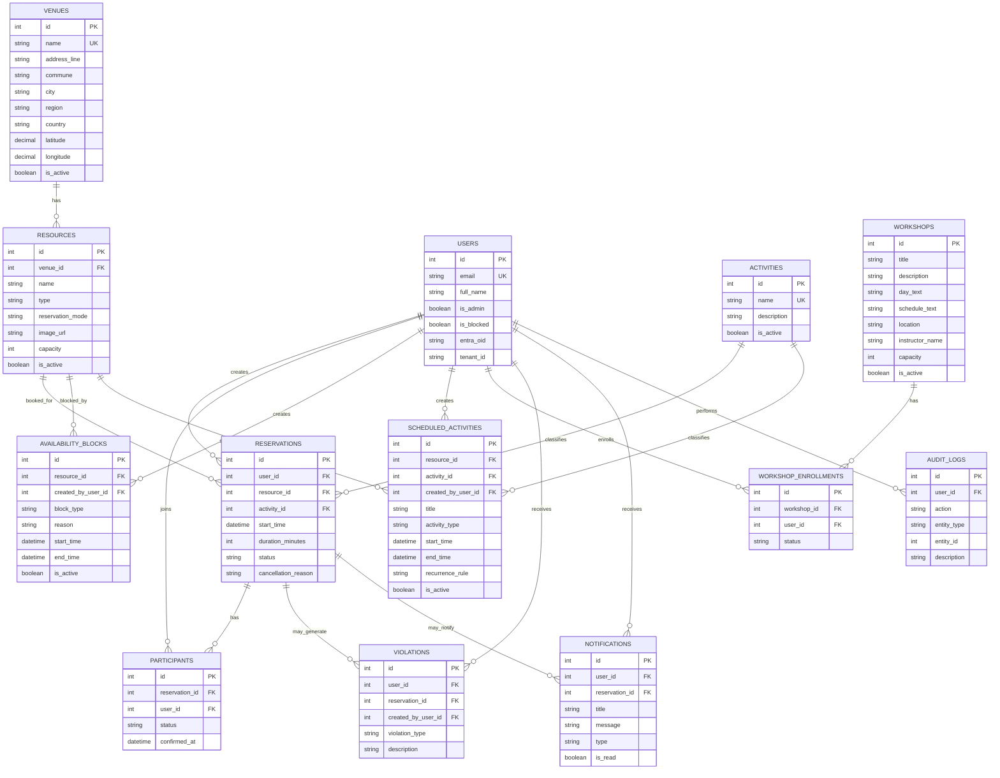

# Poli-REDI - Base de datos y modelo de persistencia

Fecha de corte: 2026-08-25

## Objetivo del documento

Este documento describe el modelo de datos funcional de Poli-REDI y la evolucion de su persistencia.

La fuente de verdad tecnica vigente es PostgreSQL 16. La etapa Azure SQL se conserva como antecedente arquitectonico dentro de `EV-011`.

## Estado actual

Motor vigente:

```txt
PostgreSQL 16
```

Driver backend:

```txt
github.com/jackc/pgx/v5
```

Configuracion:

```env
DATABASE_URL=postgres://...
PGHOST=
PGPORT=
PGDATABASE=
PGUSER=
PGPASSWORD=
PGSSLMODE=
```

El backend rechaza URLs de base de datos con esquema distinto de `postgres` o `postgresql`.

## Estructura canonica

```txt
database/postgres/bootstrap/
database/postgres/migrations/
database/postgres/seed/
database/postgres/check/
```

Migraciones vigentes:

```txt
PG16_0001_mvp1_baseline.sql
PG16_0002_mvp1_indexes.sql
PG16_0003_mvp1_invariants.sql
PG16_0004_mvp2_group_participants.sql
PG16_0005_mvp2_institutional_scheduling.sql
PG16_0006_mvp2_institutional_availability.sql
PG16_0007_mvp2_schedule_exceptions.sql
PG16_0008_mvp2_schedule_exception_availability.sql
PG16_0009_full_notifications.sql
PG16_0010_mvp2_group_resource_rules.sql
```

La migracion `0010` agrega minimo por recurso grupal, snapshot del minimo,
Sala Multiuso como recurso grupal y una politica prospectiva con deadline de
60 minutos. `0009` mantiene la tabla fisica de notificaciones, aunque sus
generadores generales permanecen fuera del cierre funcional MVP2.

La cadena completa puede comprobarse sobre una base descartable mediante
`infra/local/quadlet/verify-mvp2-ephemeral.sh` y
`database/postgres/check/PG16_verify_mvp2.sql`.

## Genealogia EV-011

1. PostgreSQL inicial - 2026-05-23.
2. Migracion deliberada a Azure SQL - 2026-07-03.
3. Nueva baseline PostgreSQL 16 - 2026-08-14.
4. Integracion estable MVP1 PostgreSQL - 2026-08-17.

La etapa Azure SQL fue valida durante julio de 2026 y produjo evidencia real de QA. No debe borrarse de la historia, pero tampoco describirse como motor actual.

## SQL Server legacy

Los archivos en la raiz de `database/` (`schema.sql`, `seed.sql`, `drop.sql`, `seed_today_temp.sql`, `queries*.sql`) pertenecen a la etapa SQL Server/Azure SQL.

El backend compilable ya no conserva consultas T-SQL. Talleres y actividades programadas legacy fueron retirados; notificaciones y publicacion de politicas fueron migradas a PostgreSQL. Los scripts SQL Server se conservan solo como historia arquitectonica.

Consultar `database/README.md` para la clasificacion operativa actual.

## Nota sobre las entidades descritas abajo

Las secciones siguientes conservan el modelo conceptual de entidades construido durante el proyecto. Cuando aparezcan tipos o mecanismos especificamente SQL Server (`DATETIME2`, `dbo`, `UPDLOCK`, `HOLDLOCK`), deben interpretarse como descripcion de la version Azure SQL previa, no como contrato de la persistencia PostgreSQL vigente.

## Tablas principales

### `venues`

Representa una sede o recinto institucional. Permite asociar recursos deportivos a ubicaciones fisicas.

Campos relevantes:

- `id`
- `name`
- `address_line`
- `commune`
- `city`
- `region`
- `country`
- `latitude`
- `longitude`
- `is_active`

### `users`

Representa usuarios autenticados mediante Microsoft Entra ID.

Campos relevantes:

- `id`
- `email`
- `full_name`
- `is_admin`
- `is_blocked`
- `entra_oid`
- `tenant_id`

### `resources`

Representa recursos deportivos asociados a una sede.

Ejemplos:

- Cancha de Futbol
- Cancha de Basquetbol
- Piscina
- Gimnasio
- Sala Multiuso

Modos de reserva:

- `RESERVABLE`
- `OPEN_USE`
- `INFORMATIVE`
- `ADMIN_ONLY`

`OPEN_USE` representa recursos de uso libre, como piscina o gimnasio, donde varias reservas pueden coexistir para medir asistencia o intensidad de uso sin bloquear el recurso completo.

`image_url` permite asociar una URL `http`, `https` o ruta local iniciada en `/` para mostrar imagenes del recurso en dashboard y catalogo. Es opcional y puede quedar `NULL`.

### `activities`

Representa actividades asociadas a reservas o programacion institucional.

Ejemplos:

- Futbol
- Basquetbol
- Natacion
- Entrenamiento Libre
- Yoga
- Campeonato

### `reservations`

Representa reservas realizadas por usuarios.

Estados permitidos:

- `PENDING`
- `CONFIRMED`
- `CANCELLED`
- `REJECTED`
- `EXPIRED`

Campos temporales relevantes:

- `start_time`: `DATETIME2`, sin zona horaria embebida.
- `duration_minutes`: duracion numerica usada para calcular el termino.

Contrato temporal de reservas para MVP 1:

- `start_time` y los rangos de disponibilidad guardan hora institucional de muro en `America/Santiago`.
- `DATETIME2` no contiene zona. Un valor SQL `2026-07-14 10:30:00` significa 10:30 de Chile, no 10:30 UTC.
- El backend asigna `APP_TIMEZONE` al leer estos campos y responde RFC 3339 con el offset real. Ejemplo de invierno: `2026-07-14T10:30:00-04:00`.
- Un request sin offset, por ejemplo `2026-07-14T10:30:00`, se interpreta en `APP_TIMEZONE`.
- Un request con `Z` u otro offset se convierte primero a la hora equivalente de Santiago.
- `created_at`, `updated_at` y otros campos generados mediante `SYSUTCDATETIME()` continuan representando UTC.
- La estrategia conserva las horas de las reservas existentes y evita una conversion masiva de datos.

### `participants`

Representa participantes asociados a una reserva.

Estados permitidos:

- `PENDING`
- `CONFIRMED`
- `REJECTED`
- `CANCELLED`

### `availability_blocks`

Representa bloqueos administrativos, mantenciones o cierres sobre un recurso.

Tipos permitidos:

- `MAINTENANCE`
- `ADMINISTRATIVE`
- `EVENT`
- `CLOSED`
- `OTHER`

### `scheduled_activities`

Representa programacion institucional, como clases, talleres, eventos, campeonatos o entrenamientos.

Tipos permitidos:

- `CLASS`
- `WORKSHOP`
- `EVENT`
- `CHAMPIONSHIP`
- `TRAINING`
- `OTHER`

### `workshops`

Representa talleres deportivos recurrentes disponibles para inscripcion de estudiantes.

Cada taller queda asociado a un `resource_id`. Esa relacion permite que backend y frontend lo traten como ocupacion del recurso durante sus dias y horarios recurrentes.

Campos relevantes:

- `id`
- `title`
- `description`
- `day_text`
- `schedule_text`
- `location`
- `instructor_name`
- `capacity`
- `is_active`

### `workshop_enrollments`

Representa inscripciones de usuarios a talleres deportivos.

Estados permitidos:

- `CONFIRMED`
- `CANCELLED`

### `violations`

Representa infracciones o incumplimientos de usuarios.

Tipos permitidos:

- `NO_SHOW`
- `LATE_CANCEL`
- `MISUSE`
- `PARTICIPANTS_NOT_MET`
- `OTHER`

### `notifications`

Representa notificaciones internas del sistema.

Tipos permitidos:

- `RESERVATION_CREATED`
- `RESERVATION_CONFIRMED`
- `RESERVATION_CANCELLED`
- `RESERVATION_MODIFIED`
- `REMINDER`
- `SYSTEM`

### `audit_logs`

Representa auditoria y trazabilidad de acciones relevantes.

## Reglas de negocio en base de datos

El modelo incluye restricciones y triggers para proteger reglas importantes.

### Reglas de reservas

El trigger `trg_reservations_validate_conflicts` valida que:

- Un usuario bloqueado no pueda crear reservas.
- Un recurso inactivo no pueda ser reservado.
- Un recurso `INFORMATIVE` no pueda ser reservado.
- Un recurso `ADMIN_ONLY` solo pueda ser reservado por administradores.
- No existan reservas confirmadas solapadas para el mismo recurso.
- Un usuario no tenga dos reservas confirmadas en el mismo horario.
- No se reserve durante un bloqueo activo.
- No se reserve durante una actividad institucional programada.

Limites conocidos:

- Las reglas de solapamiento dependen de estados activos como `CONFIRMED`; por eso el endpoint publico no debe permitir que el cliente escoja `status` (`RES-010`).
- La base solo comprueba que `duration_minutes` sea positivo. Jornada, pasos y duraciones permitidas deben validarse en servicio (`RES-011`).
- Las comparaciones de pasado, en curso y finalizada pertenecen a la capa de negocio y deben usar la zona definida en `RES-009`.

### Reglas de bloqueos

El trigger `trg_blocks_validate_conflicts` valida que:

- No existan bloqueos activos solapados sobre el mismo recurso.
- No se cree un bloqueo sobre una reserva confirmada existente.

### Reglas de programacion institucional

El trigger `trg_scheduled_activities_validate_conflicts` valida que:

- No existan actividades programadas solapadas sobre el mismo recurso.
- Una actividad programada no se cruce con un bloqueo activo.
- Una actividad programada no se cruce con una reserva confirmada.

### Reglas de talleres

La base de datos registra talleres activos y sus inscripciones. El backend complementa estas reglas con transaccion serializable para validar cupos antes de insertar una inscripcion.

- Cada taller apunta a un recurso existente.
- Cada taller debe tener capacidad mayor a cero.
- Una inscripcion apunta a un taller y a un usuario existente.
- Solo puede existir una inscripcion `CONFIRMED` por usuario y taller.
- El contador de inscritos se calcula desde `workshop_enrollments`.

### Auditoria y notificaciones

- `trg_violations_notify`: genera una notificacion cuando se registra una infraccion.
- `trg_reservations_audit`: registra cambios sobre reservas en `audit_logs`.

## Vistas

### `vw_resource_usage`

Resume uso de recursos por sede y recurso.

### `vw_peak_hours`

Resume cantidad de reservas confirmadas por hora del dia.

### `vw_user_violations`

Resume infracciones por usuario.

### `vw_resource_calendar`

Unifica reservas, bloqueos y actividades programadas para mostrar disponibilidad/calendario.

## Diagrama ER



## Estado verificado

- La etapa Azure SQL compilo y fue validada historicamente; el backend vigente utiliza PostgreSQL 16.
- Frontend compila correctamente.
- El frontend ya carga datos desde el backend.
- `/api/me` funciona despues de corregir el manejo de `OUTPUT` en tablas con triggers.
- El router del frontend ya no entra en redireccion infinita.

## Pendientes tecnicos

- Probar `database/schema.sql` y `database/seed.sql` en una base limpia desde cero.
- Agregar pruebas automatizadas para reglas de reservas.
- Agregar pruebas automatizadas para inscripcion de talleres, cupos completos e inscripcion duplicada.
- Definir si `scheduled_activities` sera editable desde el panel administrador.
- Definir politicas de auditoria completas para mas entidades, no solo reservas.
- Definir politicas de retencion para `notifications` y `audit_logs`.

## Politicas versionadas

Estado historico: la version Azure SQL fue aprobada y probada durante julio. Estado vigente: PostgreSQL 16 reemplaza esa arquitectura; las reglas deben verificarse contra las migraciones `PG16_*` y las pruebas de integracion actuales.

El modelo agrega:

- `reservation_policies`: versiones inmutables con ventana reservable, frecuencia, plazo, minimo, `effective_from` y `effective_to`.
- `reservation_policy_resources`: relacion unica entre version y recursos permitidos para reservar bajo esa politica. No clasifica recursos para confirmacion grupal.
- `reservation_policy_durations`: snapshot de duraciones permitidas por version.
- `reservations.policy_id`: version aplicada a la solicitud; se agrega nullable, se completa con la version inicial y luego pasa a `NOT NULL`.
- Jornada, intervalo, clave/hash de idempotencia, autoria, vigencias UTC y estado de publicacion por version.
- `reservation_policy_scope_migrations`: marca el bootstrap tecnico, unico y acotado, del alcance heredado de la politica inicial.

Debe existir una sola version vigente. Publicar una politica cierra la anterior y activa inmediatamente la nueva dentro de una transaccion serializable. Indices filtrados impiden dos versiones vigentes y claves de idempotencia duplicadas. Triggers protegen de edicion o eliminacion las politicas publicadas y sus colecciones. Las reservas conservan `policy_id`; las claves foraneas impiden eliminar su politica mientras exista historial relacionado.

`schema.sql` crea la estructura, la tabla de marca y los triggers que admiten exclusivamente el bootstrap tecnico controlado. Despues, `seed.sql` carga primero los recursos y, dentro de una transaccion, completa una sola vez los recursos permitidos de la politica inicial y registra la marca de migracion. Este flujo `schema.sql` -> `seed.sql` no es el mecanismo de publicacion administrativa.

La persistencia y los endpoints de correcciones excepcionales no estan implementados en este incremento. Su contrato aprobado exige solicitudes futuras activas, vista previa temporal de un solo uso vinculada al administrador, motivo, revalidacion y aplicacion atomica auditada, sin cancelaciones implicitas.

Los conflictos de recursos grupales deben considerar `PENDING` y `CONFIRMED`. Confirmacion, retiro, cancelacion y vencimiento deben serializarse mediante mecanismos transaccionales PostgreSQL. `UPDLOCK/HOLDLOCK` corresponde al diseno Azure SQL historico y no debe introducirse en migraciones nuevas.

## Recomendacion siguiente

Continuar con una revision funcional de pantallas:

1. Dashboard
2. Disponibilidad
3. Recursos
4. Mis Reservas
5. Historial
6. Talleres
7. Administracion
8. Usuarios
9. Reportes
10. Configuracion

El objetivo de esa revision es detectar que pantallas estan completas, cuales cargan datos reales y cuales deben convertirse en tareas del backlog.
