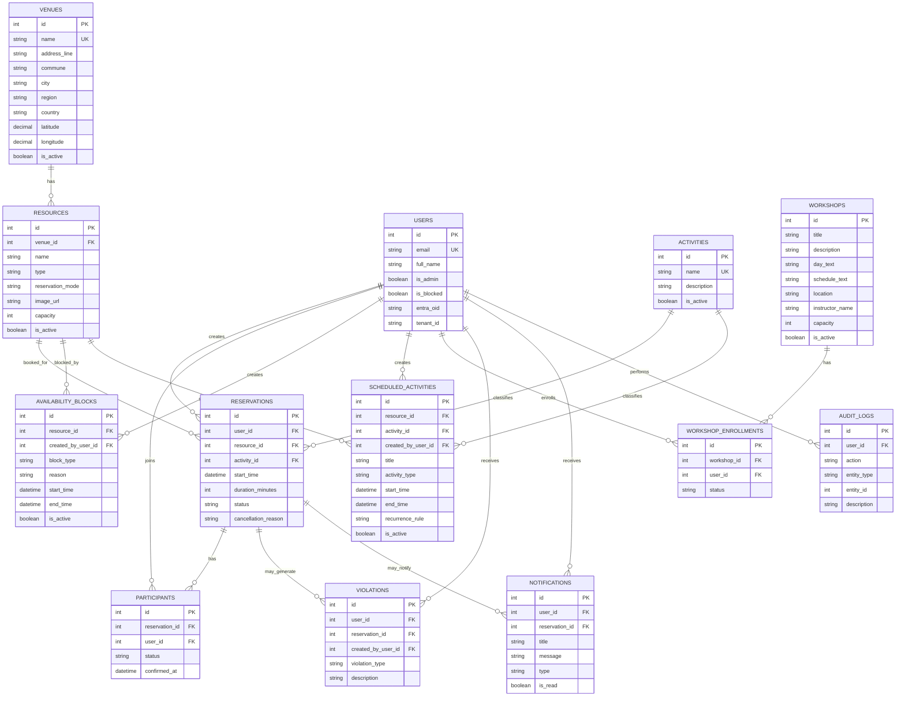

# Poli-REDI - Base de datos

## Objetivo del documento

Este documento describe el modelo de datos actual de Poli-REDI, la decision de usar Azure SQL Database y el estado de la migracion desde la implementacion anterior basada en PostgreSQL.

## Estado actual

La base de datos objetivo del proyecto es Azure SQL Database. El backend ya fue migrado para conectarse mediante el driver oficial de SQL Server para Go:

```txt
github.com/microsoft/go-mssqldb
```

El frontend ya logra cargar datos desde el backend conectado a Azure SQL Database.

## Datos de conexion

La configuracion local del backend se realiza mediante variables de entorno. La plantilla segura esta en:

```txt
backend/.env.example
```

Variables principales:

```env
DB_SERVER=poli-redi-server.database.windows.net
DB_PORT=1433
DB_NAME=poli-redi-database
DB_USER=poli-redi-admin
DB_PASSWORD=
DB_ENCRYPT=true
DB_TRUST_SERVER_CERTIFICATE=false
```

Importante: `DB_PASSWORD` no debe guardarse en archivos versionados. Solo debe existir en `backend/.env` local o en variables de entorno del despliegue.

## Archivos de base de datos

```txt
database/schema.sql      # Modelo principal en T-SQL para Azure SQL Database
database/seed.sql        # Datos iniciales de prueba/desarrollo
database/drop.sql        # Limpieza de objetos de base de datos
database/schema_0.1.sql  # Referencia historica
```

## Motor de base de datos

Motor actual:

```txt
Azure SQL Database
```

Lenguaje de definicion:

```txt
T-SQL
```

La implementacion anterior usaba PostgreSQL. Por eso se eliminaron o reemplazaron elementos como:

- `CREATE EXTENSION`
- `btree_gist`
- `SERIAL`
- `BOOLEAN`
- `EXCLUDE USING gist`
- `tsrange`
- `plpgsql`
- `CREATE OR REPLACE FUNCTION`

## Tablas principales

### `venues`

Representa una sede o recinto institucional. Permite asociar recursos deportivos a ubicaciones fisicas.

Campos relevantes:

- `id`
- `name`
- `address_line`
- `commune`
- `city`
- `region`
- `country`
- `latitude`
- `longitude`
- `is_active`

### `users`

Representa usuarios autenticados mediante Microsoft Entra ID.

Campos relevantes:

- `id`
- `email`
- `full_name`
- `is_admin`
- `is_blocked`
- `entra_oid`
- `tenant_id`

### `resources`

Representa recursos deportivos asociados a una sede.

Ejemplos:

- Cancha de Futbol
- Cancha de Basquetbol
- Piscina
- Gimnasio
- Sala Multiuso

Modos de reserva:

- `RESERVABLE`
- `OPEN_USE`
- `INFORMATIVE`
- `ADMIN_ONLY`

`OPEN_USE` representa recursos de uso libre, como piscina o gimnasio, donde varias reservas pueden coexistir para medir asistencia o intensidad de uso sin bloquear el recurso completo.

`image_url` permite asociar una URL `http`, `https` o ruta local iniciada en `/` para mostrar imagenes del recurso en dashboard y catalogo. Es opcional y puede quedar `NULL`.

### `activities`

Representa actividades asociadas a reservas o programacion institucional.

Ejemplos:

- Futbol
- Basquetbol
- Natacion
- Entrenamiento Libre
- Yoga
- Campeonato

### `reservations`

Representa reservas realizadas por usuarios.

Estados permitidos:

- `PENDING`
- `CONFIRMED`
- `CANCELLED`
- `REJECTED`
- `EXPIRED`

Campos temporales relevantes:

- `start_time`: `DATETIME2`, sin zona horaria embebida.
- `duration_minutes`: duracion numerica usada para calcular el termino.

Contrato temporal pendiente para MVP 1:

- `DATETIME2` no permite deducir por si solo si el valor representa UTC o hora local institucional.
- `RES-009` debe escoger una unica estrategia: UTC normalizado o `America/Santiago` como hora de muro.
- La estrategia elegida debe aplicarse en request, persistencia, response, frontend y comparaciones con la hora actual.
- Hasta cerrar `RES-009`, un sufijo `Z` generado al serializar no debe asumirse como prueba de que el valor fue persistido en UTC.

### `participants`

Representa participantes asociados a una reserva.

Estados permitidos:

- `PENDING`
- `CONFIRMED`
- `REJECTED`
- `CANCELLED`

### `availability_blocks`

Representa bloqueos administrativos, mantenciones o cierres sobre un recurso.

Tipos permitidos:

- `MAINTENANCE`
- `ADMINISTRATIVE`
- `EVENT`
- `CLOSED`
- `OTHER`

### `scheduled_activities`

Representa programacion institucional, como clases, talleres, eventos, campeonatos o entrenamientos.

Tipos permitidos:

- `CLASS`
- `WORKSHOP`
- `EVENT`
- `CHAMPIONSHIP`
- `TRAINING`
- `OTHER`

### `workshops`

Representa talleres deportivos recurrentes disponibles para inscripcion de estudiantes.

Cada taller queda asociado a un `resource_id`. Esa relacion permite que backend y frontend lo traten como ocupacion del recurso durante sus dias y horarios recurrentes.

Campos relevantes:

- `id`
- `title`
- `description`
- `day_text`
- `schedule_text`
- `location`
- `instructor_name`
- `capacity`
- `is_active`

### `workshop_enrollments`

Representa inscripciones de usuarios a talleres deportivos.

Estados permitidos:

- `CONFIRMED`
- `CANCELLED`

### `violations`

Representa infracciones o incumplimientos de usuarios.

Tipos permitidos:

- `NO_SHOW`
- `LATE_CANCEL`
- `MISUSE`
- `PARTICIPANTS_NOT_MET`
- `OTHER`

### `notifications`

Representa notificaciones internas del sistema.

Tipos permitidos:

- `RESERVATION_CREATED`
- `RESERVATION_CONFIRMED`
- `RESERVATION_CANCELLED`
- `RESERVATION_MODIFIED`
- `REMINDER`
- `SYSTEM`

### `audit_logs`

Representa auditoria y trazabilidad de acciones relevantes.

## Reglas de negocio en base de datos

El modelo incluye restricciones y triggers para proteger reglas importantes.

### Reglas de reservas

El trigger `trg_reservations_validate_conflicts` valida que:

- Un usuario bloqueado no pueda crear reservas.
- Un recurso inactivo no pueda ser reservado.
- Un recurso `INFORMATIVE` no pueda ser reservado.
- Un recurso `ADMIN_ONLY` solo pueda ser reservado por administradores.
- No existan reservas confirmadas solapadas para el mismo recurso.
- Un usuario no tenga dos reservas confirmadas en el mismo horario.
- No se reserve durante un bloqueo activo.
- No se reserve durante una actividad institucional programada.

Limites conocidos:

- Las reglas de solapamiento dependen de estados activos como `CONFIRMED`; por eso el endpoint publico no debe permitir que el cliente escoja `status` (`RES-010`).
- La base solo comprueba que `duration_minutes` sea positivo. Jornada, pasos y duraciones permitidas deben validarse en servicio (`RES-011`).
- Las comparaciones de pasado, en curso y finalizada pertenecen a la capa de negocio y deben usar la zona definida en `RES-009`.

### Reglas de bloqueos

El trigger `trg_blocks_validate_conflicts` valida que:

- No existan bloqueos activos solapados sobre el mismo recurso.
- No se cree un bloqueo sobre una reserva confirmada existente.

### Reglas de programacion institucional

El trigger `trg_scheduled_activities_validate_conflicts` valida que:

- No existan actividades programadas solapadas sobre el mismo recurso.
- Una actividad programada no se cruce con un bloqueo activo.
- Una actividad programada no se cruce con una reserva confirmada.

### Reglas de talleres

La base de datos registra talleres activos y sus inscripciones. El backend complementa estas reglas con transaccion serializable para validar cupos antes de insertar una inscripcion.

- Cada taller apunta a un recurso existente.
- Cada taller debe tener capacidad mayor a cero.
- Una inscripcion apunta a un taller y a un usuario existente.
- Solo puede existir una inscripcion `CONFIRMED` por usuario y taller.
- El contador de inscritos se calcula desde `workshop_enrollments`.

### Auditoria y notificaciones

- `trg_violations_notify`: genera una notificacion cuando se registra una infraccion.
- `trg_reservations_audit`: registra cambios sobre reservas en `audit_logs`.

## Vistas

### `vw_resource_usage`

Resume uso de recursos por sede y recurso.

### `vw_peak_hours`

Resume cantidad de reservas confirmadas por hora del dia.

### `vw_user_violations`

Resume infracciones por usuario.

### `vw_resource_calendar`

Unifica reservas, bloqueos y actividades programadas para mostrar disponibilidad/calendario.

## Diagrama ER



## Estado verificado

- Backend compila correctamente con Azure SQL.
- Frontend compila correctamente.
- El frontend ya carga datos desde el backend.
- `/api/me` funciona despues de corregir el manejo de `OUTPUT` en tablas con triggers.
- El router del frontend ya no entra en redireccion infinita.

## Pendientes tecnicos

- Probar `database/schema.sql` y `database/seed.sql` en una base limpia desde cero.
- Agregar pruebas automatizadas para reglas de reservas.
- Agregar pruebas automatizadas para inscripcion de talleres, cupos completos e inscripcion duplicada.
- Definir si `scheduled_activities` sera editable desde el panel administrador.
- Definir politicas de auditoria completas para mas entidades, no solo reservas.
- Definir politicas de retencion para `notifications` y `audit_logs`.

## Recomendacion siguiente

Continuar con una revision funcional de pantallas:

1. Dashboard
2. Disponibilidad
3. Recursos
4. Mis Reservas
5. Historial
6. Talleres
7. Administracion
8. Usuarios
9. Reportes
10. Configuracion

El objetivo de esa revision es detectar que pantallas estan completas, cuales cargan datos reales y cuales deben convertirse en tareas del backlog.
