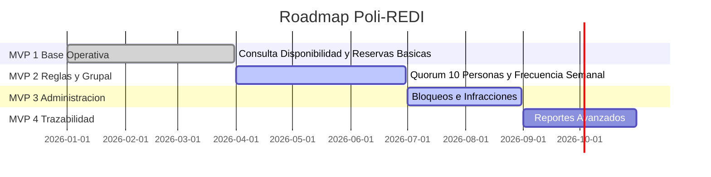

# Poli-REDI - Requisitos, Historias de Usuario, Casos de Uso y Roadmap MVP

> **Fecha de consolidación:** 2026-07-23  
> **Propósito:** Agrupar el catálogo funcional, historias de usuario, casos de uso formales y la hoja de ruta de incrementos de software (MVP 1 a MVP 4).

---

## 1. Roadmap por Incrementos (MVPs)

* **MVP 1 (Base Operativa):** Demo funcional. Inicios de sesión, disponibilidad en agenda, reservas simples, captura de RUT y panel admin inicial.
* **MVP 2 (Reglas y Flujo Grupal):** `ACCEPTED LOCALLY`. Frecuencia semanal, mínimo y objetivo, código grupal cifrado, `/join`, participación, deadline y expiración. Migración 004 y concurrencia real en Azure SQL pendientes. La prioridad institucional no forma parte del cierre aceptado.
* **MVP 3 (Administración Extendida):** Parcial. Bloqueo con motivos, notificaciones internas y pantalla informativa pública.
* **MVP 4 (Trazabilidad y Futuro):** En desarrollo/Trabajo futuro. Reportes avanzados e integración con sistemas académicos institucionales.

---

## 2. Historias de Usuario (HU)

* **HU-01 (Estudiante - Consultar Disponibilidad):** *Como estudiante, quiero consultar la disponibilidad de las canchas por fecha y hora para saber cuándo puedo reservar.*
* **HU-02 (Estudiante - Crear Reserva Particular):** *Como estudiante, quiero reservar una cancha ingresando mis datos para asegurar un bloque horario de juego.*
* **HU-03 (Estudiante - Flujo Grupal):** *Como estudiante organizador, quiero invitar a 9 compañeros mediante un código de unión para alcanzar el quorum mínimo requerido.*
* **HU-04 (Administrador - Cancelación Excepcional):** *Como administrador, quiero cancelar una reserva particular ante un evento institucional prioritario para reasignar la cancha.*
* **HU-05 (Estudiante - Inscripción a Talleres):** *Como estudiante, quiero inscribirme a talleres deportivos semanales según los cupos disponibles.*
* **HU-06 (Perfil - Registrar RUT):** *Como usuario normal, quiero registrar una vez mi RUT para habilitar operaciones personales sin que el dato pueda ser reemplazado posteriormente.*

---

## 3. Casos de Uso Formales (CU)

### CU-01: Solicitar Reserva Particular
* **Actor:** Estudiante Autenticado.
* **Precondición:** El usuario debe tener su RUT registrado y cumplir la frecuencia configurada para solicitudes normales activas. `OPEN_USE` no consume frecuencia, pero tampoco permite solapes activos del mismo usuario.
* **Flujo Principal:**
  1. El estudiante ingresa a la vista `/disponibilidad`.
  2. Selecciona la cancha, fecha y horario deseado.
  3. El sistema valida disponibilidad y restricción semanal en servidor.
  4. Si la cancha requiere grupo, el sistema crea la reserva en estado `PENDING`; el propietario recupera bajo demanda el código cifrado y puede rotarlo.
  5. Los participantes ingresan manualmente o mediante `/join/:code`, consultan progreso y pueden confirmar, retirar o reconfirmar antes del deadline inclusivo.
  6. Al alcanzar el mínimo, la reserva pasa automáticamente a `CONFIRMED`; si vence bajo el mínimo, cambia a `CANCELLED`.

### CU-02: Gestionar Conflicto Institucional (Administrador)
* **Actor:** Administrador.
* **Precondición:** Existen reservas particulares `CONFIRMED` en un horario donde se programará una clase/EFI.
* **Flujo Principal:**
  1. El administrador ingresa la actividad institucional en la agenda.
  2. El sistema detecta el solapamiento de horarios.
  3. El servidor cancela automáticamente la reserva particular afectada.
  4. El sistema emite una notificación interna explicativa al alumno desasociado.

### CU-03: Inscribirse en un Taller
* **Actor:** Usuario autenticado.
* **Precondición:** Usuario normal con RUT válido, o administrador; taller activo con ocurrencias válidas y cupo.
* **Flujo Principal:**
  1. El sistema normaliza las ocurrencias de todos los días del taller.
  2. Compara solo talleres activos en los que el usuario mantiene una inscripción `CONFIRMED`.
  3. Usa intervalos semiabiertos; los horarios contiguos se permiten.
  4. Si no existe solape, crea la inscripción (`201`) o devuelve la inscripción ya vigente de forma idempotente (`200`).
* **Alternativa:** Si existe solape, responde `409` con código y detalle estructurado del taller en conflicto. Inscripciones `CANCELLED` y talleres inactivos no bloquean.

### CU-04: Registrar RUT
* **Actor:** Usuario normal autenticado.
* **Precondición:** `/api/me` cargado y ausencia de RUT válido.
* **Resultado:** El RUT queda normalizado, único y write-once. Repetir el mismo valor es idempotente; cambiarlo o duplicarlo responde `409`. Administradores no reciben el modal.
