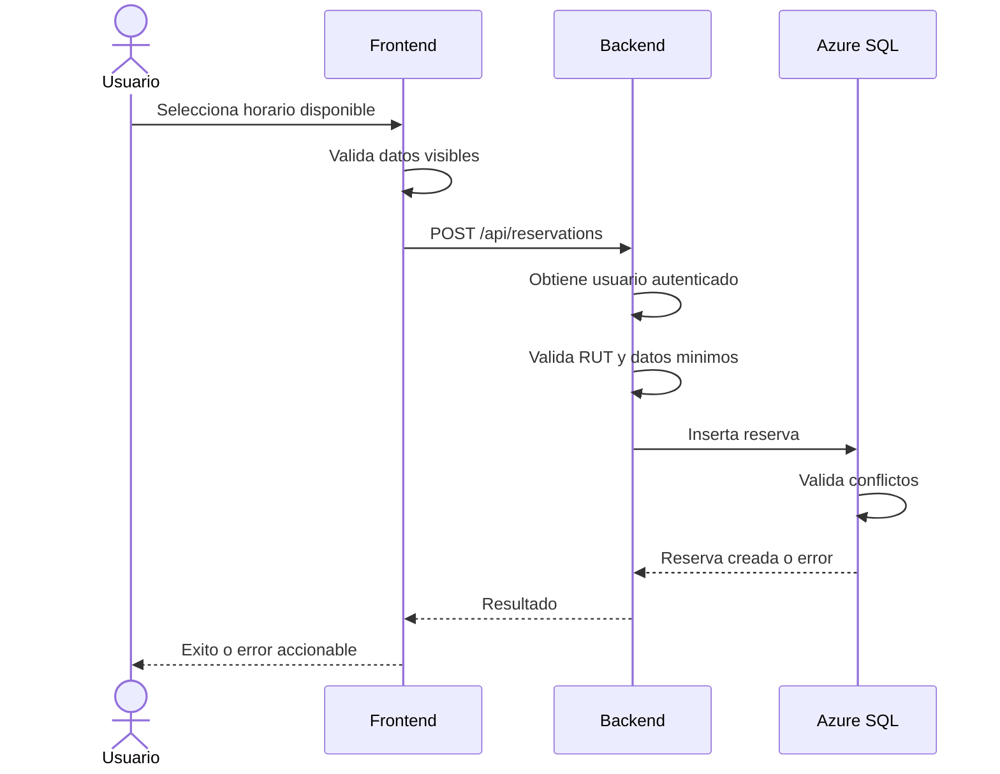

# Poli-REDI - Flujo de reservas

## Objetivo del documento

Este documento describe el flujo funcional de reservas en Poli-REDI, sus validaciones principales, puntos de experiencia de usuario y pruebas recomendadas.

## Actores

- Usuario normal: consulta disponibilidad, crea reservas propias, cancela reservas propias y revisa historial.
- Administrador: consulta informacion operacional y puede cancelar reservas segun permisos.
- Backend: valida autenticacion, usuario, RUT, recurso, permisos y estado.
- Azure SQL Database: aplica restricciones de integridad y reglas de conflicto.

## Flujo actual de creacion de reserva

1. El usuario inicia sesion.
2. El frontend carga usuario actual, recursos, reservas y actividades.
3. El usuario abre disponibilidad.
4. El sistema muestra recursos, reservas, talleres y actividades institucionales del dia seleccionado.
5. El usuario selecciona un horario libre.
6. Si el usuario normal no tiene RUT, la UI bloquea la accion.
7. El formulario permite ajustar recurso, fecha, hora, duracion y actividad. Participantes no se solicita en MVP 1 porque todavia no se persiste.
8. El frontend valida campos obligatorios.
9. El backend toma el usuario desde la sesion autenticada.
10. El backend rechaza usuarios normales sin RUT.
11. El servicio valida zona horaria de negocio, fecha/hora, duracion permitida, paso de inicio y jornada operativa.
12. La base de datos valida conflictos de recurso, usuario, bloqueos y actividades programadas.
13. Si la reserva se crea, la UI refresca disponibilidad y muestra mensaje de exito.
14. Si existe conflicto, el formulario mantiene el error visible.

Este flujo describe el comportamiento implementado, no el flujo objetivo completo aprobado el 2026-07-20. Actualmente no aplica la restriccion semanal, no registra confirmaciones de participantes y crea toda reserva como `CONFIRMED`.

## Flujo objetivo aprobado de solicitud y confirmacion

1. El usuario autenticado y con RUT selecciona recurso, fecha, hora y duracion.
2. El servidor valida la restriccion semanal antes de aceptar la solicitud.
3. El sistema consulta la politica del recurso.
4. Si el recurso es `OPEN_USE`, no exige confirmacion grupal.
5. Si el recurso requiere uso grupal, como multicancha, registra la solicitud como `PENDING`.
6. Participantes unicos confirman su participacion.
7. Con menos de 10 confirmaciones vigentes, la solicitud permanece pendiente.
8. Al alcanzar 10 confirmaciones, el sistema vuelve a validar las demas reglas y cambia automaticamente la solicitud a `CONFIRMED`.

Precisiones pendientes:

- Evento y limite exacto para calcular la semana.
- Si el solicitante cuenta entre los 10 participantes.
- Vigencia de la solicitud pendiente y efecto sobre disponibilidad.
- Recursos oficiales sujetos a confirmacion grupal.
- Efecto de retirar una confirmacion.

## Flujo objetivo aprobado de prioridad institucional

1. El administrador registra o modifica una actividad institucional.
2. El sistema detecta ocupaciones solapadas y las presenta al administrador.
3. Si existe una reserva particular, el sistema la cancela automaticamente al confirmar la actividad institucional.
4. Si existe otra actividad institucional, el administrador puede cancelar cualquiera de las dos o mantener ambas cuando compartan validamente el espacio.
5. El sistema registra la decision y actualiza la agenda.

La notificacion obligatoria al usuario cuya reserva fue cancelada permanece pendiente de confirmacion de producto.

## Flujo actual de cancelacion

1. El usuario selecciona una reserva existente.
2. La UI abre el detalle de reserva.
3. La UI muestra accion de cancelacion solo si el usuario puede cancelar.
4. El frontend solicita cancelacion enviando el ID de reserva.
5. El backend obtiene el usuario autenticado desde middleware.
6. El servicio valida que el usuario sea propietario o administrador.
7. Si la reserva existe, no esta cancelada y su termino no ha pasado, cambia su estado a `CANCELLED`.
8. La UI refresca disponibilidad y muestra mensaje de exito.

Estado de integridad MVP 1:

- El servidor permite la transicion solo desde estados activos y no confia en estados enviados por el cliente (`RES-010`, en revision por despliegue).
- Todas las comparaciones de inicio/termino usan la zona de negocio definida por `APP_TIMEZONE` (`RES-009`, en revision por despliegue).

## Mejora requerida en cancelacion

La interfaz actual muestra una advertencia, pero debe agregarse una confirmacion fuerte antes de ejecutar la cancelacion.

Confirmacion recomendada:

- Titulo: `Cancelar reserva`.
- Resumen: recurso, fecha, horario y actividad.
- Acciones: `Mantener reserva` y `Cancelar reserva`.
- Mensaje: `Esta accion cambiara la reserva a estado cancelada.`

## Estado real y clasificacion temporal

Para evitar ambiguedades, Poli-REDI diferencia entre estado persistido y clasificacion temporal.

Estado real persistido:

- `PENDING`: pendiente.
- `CONFIRMED`: confirmada.
- `CANCELLED`: cancelada.
- `REJECTED`: rechazada.
- `EXPIRED`: expirada, si se usa en futuras iteraciones.

Regla de integridad MVP 1:

- El endpoint publico de creacion no acepta un estado decidido por el cliente.
- El backend asigna el estado inicial.
- Solo estados activos pueden transicionar a `CANCELLED`.

Clasificacion temporal derivada:

- Futura: la reserva aun no comienza.
- En curso: la hora actual esta dentro del rango de la reserva.
- Pasada: la reserva ya termino.

Regla UX:

- `CONFIRMED` futura se muestra como `Confirmada`.
- `CONFIRMED` en curso se muestra como `En curso`.
- `CONFIRMED` pasada se muestra como `Finalizada`.
- `CANCELLED` siempre se muestra como `Cancelada`.

`Mis Reservas` muestra reservas accionables para el usuario normal. `Historial` muestra reservas pasadas o canceladas. Estas vistas no representan estados de base de datos, sino formas de consultar la misma entidad segun contexto.

## Validaciones funcionales

### Frontend

- Recurso obligatorio.
- Fecha obligatoria.
- Hora obligatoria.
- Duracion mayor a cero.
- Bloqueo de creacion si no se pudo cargar disponibilidad.
- Bloqueo de creacion si usuario normal no tiene RUT.
- Instalaciones inactivas, informativas o no permitidas para el rol deben mostrarse deshabilitadas (`BACK-020`).

### Backend

- Usuario autenticado obligatorio.
- Usuario normal con RUT obligatorio para crear reservas.
- `resourceId` obligatorio.
- `startTime` obligatorio y parseable.
- `durationMinutes` en `30, 60, 90, 120, 150, 180`.
- Inicio entre 08:00 y 21:30, en intervalos de 15 minutos.
- Termino completo de la reserva a mas tardar a las 22:00.
- El payload publico no acepta `status`; el servidor asigna `CONFIRMED`.
- Cancelacion solo por propietario o administrador.
- Cancelacion permitida unicamente desde `CONFIRMED` o `PENDING`.

Validaciones backend pendientes antes de cerrar MVP 1:

- Verificacion desplegada de la zona horaria institucional compartida (`RES-009`, en revision).
- Verificacion desplegada del estado inicial y transiciones controlados por servidor (`RES-010`, en revision).
- Verificacion desplegada de duraciones, paso de inicio y jornada operativa (`RES-011`, en revision).

### Base de datos

- Rechaza usuario bloqueado.
- Rechaza recurso inactivo.
- Rechaza recurso informativo.
- Rechaza recurso solo admin para usuario normal.
- Rechaza choque con reserva confirmada del mismo recurso.
- Rechaza choque con reserva confirmada del mismo usuario.
- Rechaza cruce con bloqueo activo.
- Rechaza cruce con actividad programada.

## Reglas UX recomendadas

- Mostrar siempre el rango completo de la reserva antes de confirmar.
- Redondear seleccion de horario a intervalos institucionales.
- Mostrar capacidad y avance de confirmaciones. Los participantes deben incorporarse de punta a punta para recursos grupales en MVP 2 (`RES-008`).
- Diferenciar visualmente reserva, bloqueo, mantencion y actividad institucional.
- No exponer informacion personal de reservas ajenas en disponibilidad.
- Mantener errores recuperables dentro del mismo contexto visual.

## Diagrama resumido

## Pruebas recomendadas para cierre del flujo

- Crear reserva valida.
- Crear reserva sin RUT debe fallar para usuario normal.
- Crear una nueva solicitud dentro de la restriccion semanal debe fallar en el limite aprobado.
- Una solicitud grupal con 9 participantes confirmados debe permanecer `PENDING`.
- La decima confirmacion valida debe cambiarla a `CONFIRMED` si las demas reglas siguen vigentes.
- Un recurso `OPEN_USE` no debe exigir confirmaciones grupales.
- Crear reserva con conflicto debe fallar y mantener modal abierto.
- Enviar un estado manipulado no debe alterar el estado inicial ni evitar conflictos.
- Crear fuera de horario o con duracion no permitida debe fallar en backend.
- La misma reserva debe conservar hora y categoria temporal en local y Azure.
- Cancelar reserva propia debe pedir confirmacion y actualizar grilla.
- Cancelar reserva ajena debe fallar para usuario normal.
- Cancelar una reserva rechazada, expirada, cancelada o finalizada debe fallar.
- Admin puede cancelar reserva ajena.
- Cambio de fecha no debe mostrar reservas de otro dia.
- Reservas canceladas no deben bloquear disponibilidad activa.
- Una actividad institucional en conflicto debe cancelar automaticamente la reserva particular.
- Dos actividades institucionales en conflicto deben permitir al administrador cancelar una o mantener ambas.

## Politica temporal vigente

Poli-REDI usa `APP_TIMEZONE=America/Santiago` como zona de negocio y un reloj inyectable en pruebas. La estrategia vigente mantiene `DATETIME2` como hora local institucional: un valor `2026-07-14 10:30:00` significa 10:30 de Chile. Requests con offset se convierten a Santiago antes de persistir; requests sin offset se interpretan directamente en la zona institucional. La API responde fechas RFC 3339 con el offset real de Chile para evitar que frontend y backend clasifiquen reservas con horas distintas.
