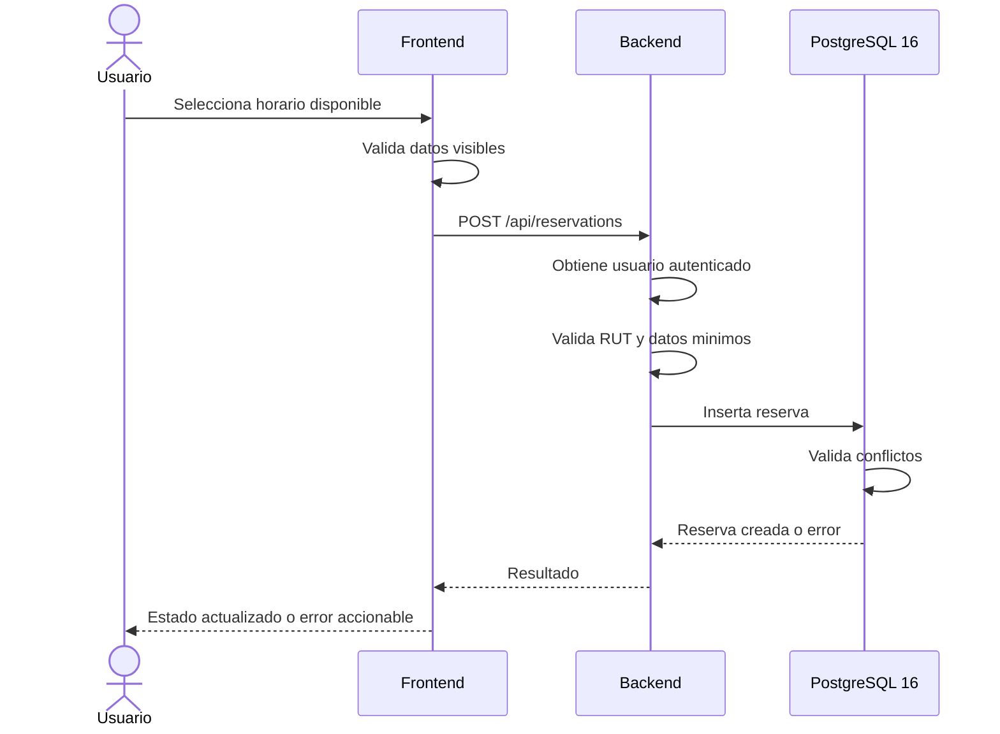

# Poli-REDI - Flujo de reservas

## Objetivo del documento

Este documento describe el flujo funcional de reservas en Poli-REDI, sus validaciones principales, puntos de experiencia de usuario y pruebas recomendadas.

## Actores

- Usuario normal: consulta disponibilidad, crea reservas propias, cancela reservas propias y revisa historial.
- Administrador: consulta informacion operacional y puede cancelar reservas segun permisos.
- Backend: valida autenticacion, usuario, RUT, recurso, permisos y estado.
- PostgreSQL 16: aplica restricciones de integridad, concurrencia y reglas de conflicto. Los restos T-SQL pertenecen a la deuda EV-011.

## Flujo actual de creacion de reserva

1. El usuario inicia sesion.
2. El frontend carga usuario actual, recursos, reservas y actividades.
3. El usuario abre disponibilidad.
4. El sistema muestra recursos, reservas, talleres y actividades institucionales del dia seleccionado.
5. El usuario selecciona un horario libre.
6. Si el usuario normal no tiene RUT, la UI bloquea la accion.
7. El formulario permite ajustar recurso, fecha, hora, duracion y actividad. En MVP2, las reservas grupales persisten participantes autenticados y el detalle presenta avance y condicion del grupo.
8. El frontend valida campos obligatorios.
9. El backend toma el usuario desde la sesion autenticada.
10. El backend rechaza usuarios normales sin RUT.
11. El servicio valida zona horaria de negocio, fecha/hora, duracion permitida, paso de inicio, jornada operativa, ventana reservable y frecuencia desde la creacion de la solicitud activa anterior.
12. La base de datos vuelve a proteger ventana y frecuencia ante concurrencia, ademas de validar conflictos de recurso, usuario, bloqueos y actividades programadas.
13. Si la reserva se crea, el mismo modal pasa a mostrar el resultado de la operacion y la UI refresca disponibilidad.
14. No se muestra por ahora un toast global de exito; la confirmacion se comunica mediante el nuevo estado visible de la reserva.
15. Si existe conflicto, el formulario mantiene el error visible y permite corregir los datos sin perder el contexto.

Este flujo se ha extendido durante MVP 2. La interfaz ya representa correctamente reservas `PENDING` cuando la API las entrega y el modal de detalle soporta informacion grupal como cantidad de participantes, minimo requerido, condicion del grupo y codigo de invitacion. Por lo tanto, la documentacion ya no debe asumir que toda reserva se crea necesariamente como `CONFIRMED`.

La ventana y la frecuencia versionadas permanecen sujetas a la validacion de infraestructura indicada en sus requisitos correspondientes. El ciclo completo de confirmacion grupal debe considerarse cerrado solo cuando backend, persistencia y pruebas de integracion validen conjuntamente todas las transiciones definidas en `RES-008`, `RES-010` y `RES-012`.

## Flujo vigente de solicitud y confirmacion grupal

1. El usuario autenticado y con RUT selecciona recurso, fecha, hora y duracion.
2. El servidor valida que la fecha elegida este dentro de la ventana configurable; con el valor vigente de siete dias, un martes se puede elegir desde ese martes hasta el lunes siguiente.
3. El servidor valida la frecuencia configurable desde la fecha de creacion de la solicitud anterior. Una solicitud `PENDING` consume la oportunidad desde que se crea; una solicitud `CANCELLED` deja de consumirla.
4. El sistema consulta la politica del recurso.
5. Si el recurso es `OPEN_USE`, no exige confirmacion grupal.
6. Para multicancha 1, 2 y 3, identificadas en el inventario como Cancha 1, 2 y 3, registra la solicitud como `PENDING` y bloquea el horario.
7. El solicitante cuenta entre los 10. Los participantes, todos con cuenta, confirman hasta el limite configurable, inicialmente una hora antes del inicio e inclusivo en el instante exacto.
8. Mientras nunca haya alcanzado el minimo, con menos de 10 confirmaciones vigentes la solicitud permanece `PENDING` con condicion `PENDING_MINIMUM`.
9. Al alcanzar 10 confirmaciones, el sistema vuelve a validar las demas reglas y cambia la reserva a `CONFIRMED` con condicion `HEALTHY`.
10. Una vez confirmada, una retirada que reduzca el grupo bajo el minimo no revierte el ciclo de vida: la reserva conserva `CONFIRMED` y su condicion grupal cambia a `AT_RISK`.
11. Si el grupo recupera el minimo antes del plazo, conserva `CONFIRMED` y vuelve a condicion `HEALTHY`.
12. Si al alcanzar el limite aplicable el grupo permanece bajo el minimo, el flujo de vencimiento debe cancelar la reserva, liberar el horario y dejar de consumir la oportunidad semanal conforme a la politica vigente.

Solo un usuario con rol administrador puede modificar los recursos sujetos a confirmacion, el periodo semanal o el plazo previo. Como propuesta no bloqueante, los cambios se aplican a solicitudes creadas despues de la modificacion.

### Estado y condicion grupal

`status` y `groupCondition` no representan lo mismo.

`status` expresa el ciclo de vida persistido:

- `PENDING`
- `CONFIRMED`
- `CANCELLED`
- `REJECTED`
- `EXPIRED`

`groupCondition` expresa la condicion operacional del grupo:

- `PENDING_MINIMUM`: todavia no alcanza el minimo inicial;
- `HEALTHY`: minimo alcanzado;
- `AT_RISK`: una reserva ya confirmada quedo posteriormente bajo el minimo;
- `INACTIVE`: la condicion grupal ya no participa del flujo activo.

Esta separacion evita hacer oscilar una reserva entre `PENDING` y `CONFIRMED` y prepara eventos de dominio utiles para el sistema de notificaciones.

Transiciones especialmente relevantes para futuros MVP:

- `PENDING_MINIMUM -> HEALTHY`: minimo alcanzado;
- `HEALTHY -> AT_RISK`: grupo bajo el minimo;
- `AT_RISK -> HEALTHY`: grupo recuperado;
- `AT_RISK -> CANCELLED`: vencimiento bajo el minimo.

Estas transiciones pueden originar notificaciones sin convertir `groupCondition` en un nuevo estado de reserva.

## Flujo objetivo aprobado de prioridad institucional

1. El administrador registra o modifica una actividad institucional.
2. El sistema detecta ocupaciones solapadas y las presenta al administrador.
3. Si existe una reserva particular, el sistema registra el conflicto. RF-023/v1 define cancelacion automatica por prioridad institucional, mientras `EV-010` mantiene abierta la decision de adoptar la resolucion administrativa como modelo general.
4. Si existe otra actividad institucional, el administrador puede cancelar cualquiera de las dos o mantener ambas cuando compartan validamente el espacio.
5. El sistema notifica al usuario cuya reserva particular fue cancelada automaticamente.
6. El sistema registra la decision y actualiza la agenda.

## Flujo actual de cancelacion

1. El usuario selecciona una reserva existente desde Disponibilidad, Inicio o el modulo de Reservas.
2. La UI abre `ReservationForm.vue` en modo `detail` cuando ese flujo utiliza el modal compartido.
3. La accion de cancelacion solo aparece cuando el usuario posee permisos para cancelar la reserva.
4. Al pulsar cancelar, el modal cambia a una confirmacion destructiva inline.
5. El usuario puede volver sin modificar la reserva o confirmar explicitamente la cancelacion.
6. Solo despues de la confirmacion el componente emite el evento de cancelacion.
7. La vista padre ejecuta la mutacion a traves del store.
8. El backend obtiene el usuario autenticado desde middleware.
9. El servicio valida que el usuario sea propietario o administrador.
10. Si la reserva es cancelable, cambia su estado a `CANCELLED`.
11. La UI refresca los datos afectados y el nuevo estado visible confirma la accion.
12. Por decision UX temporal no se muestra un toast global de exito.

La responsabilidad queda separada de esta forma:

- `ReservationForm.vue`: presentacion y confirmacion de la accion destructiva.
- vista/store: mutacion de datos.
- backend: autorizacion e integridad de la transicion.

Estado de integridad MVP 1:

- El servidor permite la transicion solo desde estados activos y no confia en estados enviados por el cliente (`RES-010`, en revision por despliegue).
- Todas las comparaciones de inicio/termino usan la zona de negocio definida por `APP_TIMEZONE` (`RES-009`, en revision por despliegue).

## Confirmacion de cancelacion implementada

La confirmacion fuerte dejo de ser una mejora pendiente del frontend.

Comportamiento vigente:

- no se usa `window.confirm`;
- no se abre un segundo modal encima del detalle;
- el mismo modal muestra una advertencia destructiva;
- existe una accion para volver;
- existe una accion explicita para confirmar la cancelacion;
- la vista padre no vuelve a pedir confirmacion.

La confirmacion debe mantenerse consistente en todas las superficies que reutilizan `ReservationForm.vue`.

## Estado real y clasificacion temporal

Para evitar ambiguedades, Poli-REDI diferencia entre estado persistido y clasificacion temporal.

Estado real persistido:

- `PENDING`: pendiente.
- `CONFIRMED`: confirmada.
- `CANCELLED`: cancelada.
- `REJECTED`: rechazada.
- `EXPIRED`: expirada, si se usa en futuras iteraciones.

Regla de integridad MVP 1:

- El endpoint publico de creacion no acepta un estado decidido por el cliente.
- El backend asigna el estado inicial.
- Solo estados activos pueden transicionar a `CANCELLED`.

Clasificacion temporal derivada:

- Futura: la reserva aun no comienza.
- En curso: la hora actual esta dentro del rango de la reserva.
- Pasada: la reserva ya termino.

Regla UX:

- `CONFIRMED` futura se muestra como `Confirmada`.
- `CONFIRMED` en curso se muestra como `En curso`.
- `CONFIRMED` pasada se muestra como `Finalizada`.
- `CANCELLED` siempre se muestra como `Cancelada`.

El modulo `/reservations` presenta dos contextos sobre la misma entidad:

- reservas activas o accionables;
- historial mediante `?tab=history`.

`/history` se conserva como redireccion al tab historico. La antigua vista separada de Historial fue retirada.

Estas categorias no representan nuevos estados de base de datos, sino distintas formas de consultar y ordenar la misma entidad segun contexto.

## Validaciones funcionales

### Frontend

- Recurso obligatorio.
- Fecha obligatoria.
- Hora obligatoria.
- Duracion mayor a cero.
- Bloqueo de creacion si no se pudo cargar disponibilidad.
- Bloqueo de creacion si usuario normal no tiene RUT.
- Instalaciones inactivas, informativas o no permitidas para el rol deben mostrarse deshabilitadas (`BACK-020`).

### Backend

- Usuario autenticado obligatorio.
- Usuario normal con RUT obligatorio para crear reservas.
- `resourceId` obligatorio.
- `startTime` obligatorio y parseable.
- `durationMinutes` en `30, 60, 90, 120, 150, 180`.
- Inicio entre 08:00 y 21:30, en intervalos de 15 minutos.
- Termino completo de la reserva a mas tardar a las 22:00.
- El payload publico no acepta `status`; el servidor asigna el estado segun la politica del recurso. Una reserva grupal puede iniciar `PENDING + PENDING_MINIMUM`.
- Cancelacion solo por propietario o administrador.
- Cancelacion permitida unicamente desde `CONFIRMED` o `PENDING`.

Validaciones backend pendientes antes de cerrar MVP 1:

- Verificacion desplegada de la zona horaria institucional compartida (`RES-009`, en revision).
- Verificacion desplegada del estado inicial y transiciones controlados por servidor (`RES-010`, en revision).
- Verificacion desplegada de duraciones, paso de inicio y jornada operativa (`RES-011`, en revision).

### Base de datos

- Rechaza usuario bloqueado.
- Rechaza recurso inactivo.
- Rechaza recurso informativo.
- Rechaza recurso solo admin para usuario normal.
- Rechaza choque con reserva confirmada del mismo recurso.
- Rechaza choque con reserva confirmada del mismo usuario.
- Rechaza cruce con bloqueo activo.
- Rechaza cruce con actividad programada.

## Reglas UX recomendadas

- Mostrar siempre el rango completo de la reserva antes de confirmar.
- Redondear seleccion de horario a intervalos institucionales.
- Mostrar capacidad y avance de confirmaciones en reservas grupales. El detalle frontend ya soporta `participantCount`, `minimumParticipants` y condicion del grupo cuando la API los entrega; el cierre funcional de punta a punta sigue sujeto a `RES-008`.
- Diferenciar visualmente reserva, bloqueo, mantencion y actividad institucional.
- No exponer informacion personal de reservas ajenas en disponibilidad.
- Mantener errores recuperables dentro del mismo contexto visual.

## Diagrama resumido

## Pruebas recomendadas para cierre del flujo

- Crear reserva valida.
- Crear reserva sin RUT debe fallar para usuario normal.
- Elegir una fecha posterior al ultimo dia de la ventana configurable debe fallar; con siete dias, un martes permite hasta el lunes siguiente inclusive.
- Crear una nueva solicitud antes del mismo dia de la semana siguiente debe fallar; al llegar a ese dia debe permitirse, salvo otro impedimento.
- Una solicitud grupal con 9 participantes confirmados debe permanecer `PENDING`.
- La decima confirmacion valida debe cambiarla a `CONFIRMED` si las demas reglas siguen vigentes.
- Retirar una confirmacion de una reserva ya confirmada y bajar de 10 debe conservar `CONFIRMED`, cambiar a `AT_RISK` y mantener el horario bloqueado.
- El solicitante cuenta una vez y no puede retirar su participacion; si desea abandonar debe cancelar la solicitud completa.
- Confirmar o retirar exactamente una hora antes debe permitirse; cualquier intento posterior debe rechazarse.
- Una solicitud que llega al limite con menos de 10 confirmaciones debe cancelarse, liberar el horario y liberar la oportunidad semanal.
- Un recurso `OPEN_USE` no debe exigir confirmaciones grupales.
- Crear reserva con conflicto debe fallar y mantener modal abierto.
- Enviar un estado manipulado no debe alterar el estado inicial ni evitar conflictos.
- Crear fuera de horario o con duracion no permitida debe fallar en backend.
- La misma reserva debe conservar hora y categoria temporal en local y en cualquier entorno PostgreSQL integrado/desplegado.
- Cancelar reserva propia debe pedir confirmacion y actualizar grilla.
- Cancelar reserva ajena debe fallar para usuario normal.
- Cancelar una reserva rechazada, expirada, cancelada o finalizada debe fallar.
- Admin puede cancelar reserva ajena.
- Cambio de fecha no debe mostrar reservas de otro dia.
- Reservas canceladas no deben bloquear disponibilidad activa.
- Un conflicto actividad institucional/reserva particular debe seguir la decision que cierre `EV-010`; mientras tanto se valida deteccion y resolucion sin asumir como definitiva la cancelacion automatica.
- Dos actividades institucionales en conflicto deben permitir al administrador cancelar una o mantener ambas.

## Cambios administrativos de politica

- Una publicacion administrativa crea un snapshot completo e inmutable con vigencia inmediata; las solicitudes existentes conservan su `policy_id`.
- La publicacion exige `Idempotency-Key`: un replay identico devuelve la misma version y uno divergente se rechaza.
- La reserva selecciona la politica dentro de la transaccion; entre operaciones concurrentes, la primera que obtiene el bloqueo determina la version aplicable.
- El usuario autenticado consulta solo condiciones operativas; el historial con identificadores, autoria y vigencias exige rol administrador.
- La correccion excepcional no esta implementada en este incremento. El diseno aprobado exige vista previa temporal de un solo uso vinculada al administrador, seleccion de solicitudes futuras activas, motivo y aplicacion atomica auditada, sin cancelaciones implicitas.

## Politica temporal vigente

Poli-REDI usa `APP_TIMEZONE=America/Santiago` como zona de negocio y un reloj inyectable en pruebas. La persistencia PostgreSQL vigente utiliza tipos temporales adecuados y las migraciones actuales emplean `timestamptz` para instantes. La API conserva un contrato temporal explicito para evitar que frontend, backend y base clasifiquen reservas con horas distintas. La antigua estrategia `DATETIME2` corresponde a la etapa Azure SQL registrada en `EV-011`.
