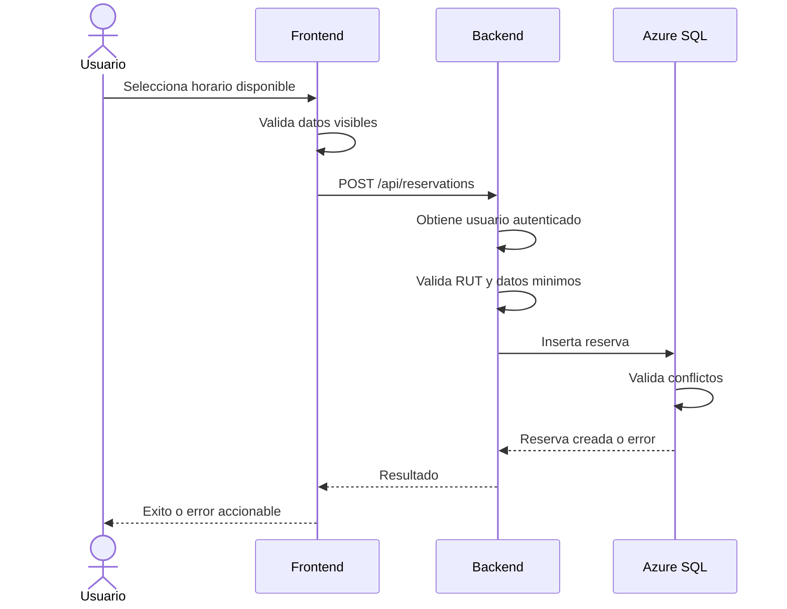

# Poli-REDI - Flujo de reservas

## Objetivo del documento

Este documento describe el flujo funcional de reservas en Poli-REDI, sus validaciones principales, puntos de experiencia de usuario y pruebas recomendadas.

## Actores

- Usuario normal: consulta disponibilidad, crea reservas propias, cancela reservas propias y revisa historial.
- Administrador: consulta informacion operacional y puede cancelar reservas segun permisos.
- Backend: valida autenticacion, usuario, RUT, recurso, permisos y estado.
- Azure SQL Database: aplica restricciones de integridad y reglas de conflicto.

## Flujo actual de creacion de reserva

1. El usuario inicia sesion.
2. El frontend carga usuario actual, recursos, reservas y actividades.
3. El usuario abre disponibilidad.
4. El sistema muestra recursos y reservas del dia seleccionado.
5. El usuario selecciona un horario libre.
6. Si el usuario normal no tiene RUT, la UI bloquea la accion.
7. El formulario permite ajustar recurso, fecha, hora, duracion, actividad y participantes.
8. El frontend valida campos obligatorios.
9. El backend toma el usuario desde la sesion autenticada.
10. El backend rechaza usuarios normales sin RUT.
11. El servicio valida datos minimos de reserva.
12. La base de datos valida conflictos de recurso, usuario, bloqueos y actividades programadas.
13. Si la reserva se crea, la UI refresca disponibilidad y muestra mensaje de exito.
14. Si existe conflicto, el formulario mantiene el error visible.

## Flujo actual de cancelacion

1. El usuario selecciona una reserva existente.
2. La UI abre el detalle de reserva.
3. La UI muestra accion de cancelacion solo si el usuario puede cancelar.
4. El frontend solicita cancelacion enviando el ID de reserva.
5. El backend obtiene el usuario autenticado desde middleware.
6. El servicio valida que el usuario sea propietario o administrador.
7. Si la reserva existe y no esta cancelada, cambia su estado a `CANCELLED`.
8. La UI refresca disponibilidad y muestra mensaje de exito.

## Mejora requerida en cancelacion

La interfaz actual muestra una advertencia, pero debe agregarse una confirmacion fuerte antes de ejecutar la cancelacion.

Confirmacion recomendada:

- Titulo: `Cancelar reserva`.
- Resumen: recurso, fecha, horario y actividad.
- Acciones: `Mantener reserva` y `Cancelar reserva`.
- Mensaje: `Esta accion cambiara la reserva a estado cancelada.`

## Estado real y clasificacion temporal

Para evitar ambiguedades, Poli-REDI diferencia entre estado persistido y clasificacion temporal.

Estado real persistido:

- `PENDING`: pendiente.
- `CONFIRMED`: confirmada.
- `CANCELLED`: cancelada.
- `REJECTED`: rechazada.
- `EXPIRED`: expirada, si se usa en futuras iteraciones.

Clasificacion temporal derivada:

- Futura: la reserva aun no comienza.
- En curso: la hora actual esta dentro del rango de la reserva.
- Pasada: la reserva ya termino.

Regla UX:

- `CONFIRMED` futura se muestra como `Confirmada`.
- `CONFIRMED` en curso se muestra como `En curso`.
- `CONFIRMED` pasada se muestra como `Finalizada`.
- `CANCELLED` siempre se muestra como `Cancelada`.

`Mis Reservas` muestra reservas accionables para el usuario normal. `Historial` muestra reservas pasadas o canceladas. Estas vistas no representan estados de base de datos, sino formas de consultar la misma entidad segun contexto.

## Validaciones funcionales

### Frontend

- Recurso obligatorio.
- Fecha obligatoria.
- Hora obligatoria.
- Duracion mayor a cero.
- Participantes mayor a cero.
- Bloqueo de creacion si no se pudo cargar disponibilidad.
- Bloqueo de creacion si usuario normal no tiene RUT.

### Backend

- Usuario autenticado obligatorio.
- Usuario normal con RUT obligatorio para crear reservas.
- `resourceId` obligatorio.
- `startTime` obligatorio y parseable.
- `durationMinutes` mayor a cero.
- Cancelacion solo por propietario o administrador.

### Base de datos

- Rechaza usuario bloqueado.
- Rechaza recurso inactivo.
- Rechaza recurso informativo.
- Rechaza recurso solo admin para usuario normal.
- Rechaza choque con reserva confirmada del mismo recurso.
- Rechaza choque con reserva confirmada del mismo usuario.
- Rechaza cruce con bloqueo activo.
- Rechaza cruce con actividad programada.

## Reglas UX recomendadas

- Mostrar siempre el rango completo de la reserva antes de confirmar.
- Redondear seleccion de horario a intervalos institucionales.
- Mostrar capacidad y validar participantes cuando el recurso la tenga.
- Diferenciar visualmente reserva, bloqueo, mantencion y actividad institucional.
- No exponer informacion personal de reservas ajenas en disponibilidad.
- Mantener errores recuperables dentro del mismo contexto visual.

## Diagrama resumido

## Pruebas recomendadas para cierre del flujo

- Crear reserva valida.
- Crear reserva sin RUT debe fallar para usuario normal.
- Crear reserva con conflicto debe fallar y mantener modal abierto.
- Cancelar reserva propia debe pedir confirmacion y actualizar grilla.
- Cancelar reserva ajena debe fallar para usuario normal.
- Admin puede cancelar reserva ajena.
- Cambio de fecha no debe mostrar reservas de otro dia.
- Reservas canceladas no deben bloquear disponibilidad activa.
