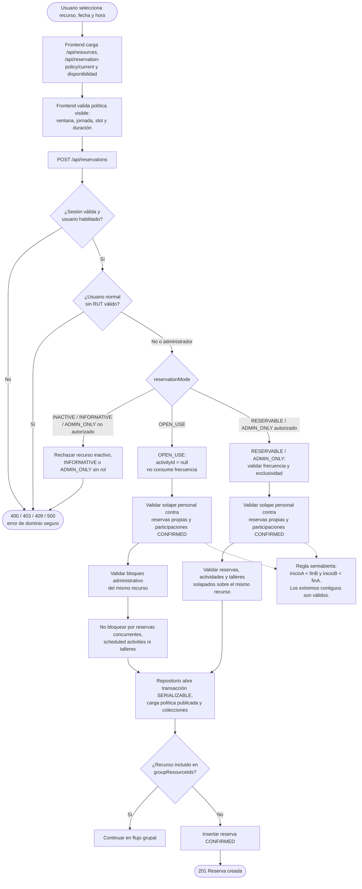
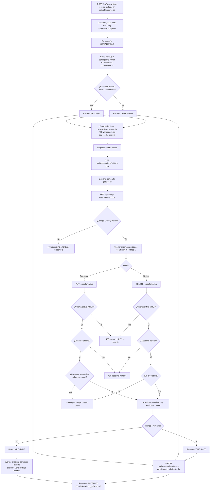
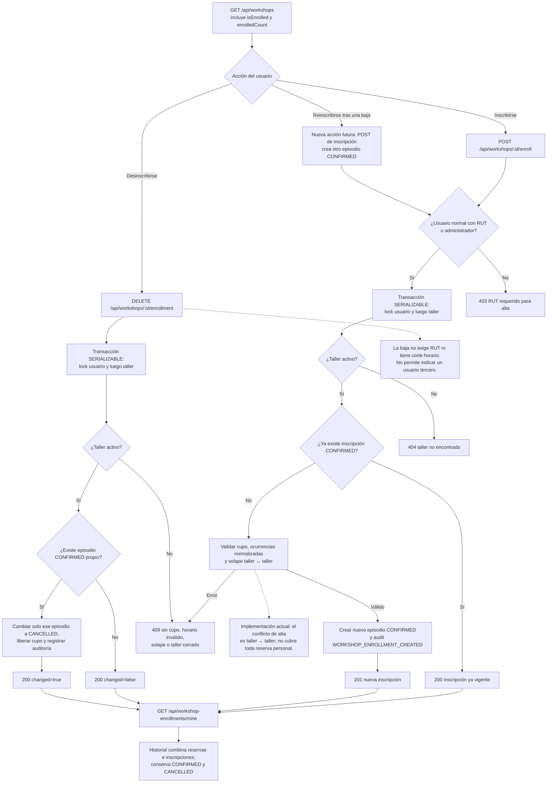

# Reglas y flujos de Poli-REDI

> **Estado:** CANDIDATO CANÓNICO DEL NUEVO ÁRBOL — contrastado con el código local 
> **Corte:** 2026-08-11 
> **Alcance:** reservas individuales, `OPEN_USE`, solicitudes grupales y talleres 
> **No demuestra:** validación integrada online, concurrencia real en Azure SQL ni migraciones aplicadas

## Resumen

- Una reserva no grupal válida nace `CONFIRMED`; una grupal nace `PENDING` o
  `CONFIRMED` según el owner inicial y el mínimo de su política.
- `OPEN_USE` no consume frecuencia ni exclusividad del recurso, pero respeta
  la agenda personal y bloqueos administrativos.
- El grupo cambia reversiblemente entre `PENDING` y `CONFIRMED` antes del
  deadline; el owner no puede retirar su propia participación.
- Talleres conservan episodios: alta `CONFIRMED`, baja `CANCELLED` y una
  reinscripción futura crea una fila nueva.
- El conflicto de alta de talleres vigente es taller ↔ taller, no una agenda
  unificada taller ↔ reserva.

## 1. Transiciones operativas de una reserva

**Objetivo:** representar las transiciones implementadas sin afirmar que un
retiro ordinario cancela automáticamente la solicitud.

```mermaid
stateDiagram-v2
    [*] --> CONFIRMED : Crear reserva no grupal
    [*] --> PENDING : Crear solicitud grupal; conteo inicial bajo el mínimo
    PENDING --> PENDING : Confirmación o retiro sin alcanzar el mínimo
    PENDING --> CONFIRMED : Confirmación deja conteo >= mínimo
    CONFIRMED --> CONFIRMED : Cambio mantiene conteo >= mínimo
    CONFIRMED --> PENDING : Retiro no-owner deja conteo < mínimo
    PENDING --> CANCELLED : Deadline vencido y conteo < mínimo
    PENDING --> CANCELLED : Cancela propietario o administrador
    CONFIRMED --> CANCELLED : Cancela propietario o administrador
    CANCELLED --> [*]
    note right of PENDING
      El propietario ya cuenta como
      participante CONFIRMED.
    end note
    note right of CONFIRMED
      Finalizar el horario no cambia
      el estado persistido; Historial
      lo deriva de fecha y hora.
    end note
```

- El deadline es inclusivo: confirmar, retirar o editar el objetivo se admite
  mientras `now` no sea posterior al límite.
- `REJECTED` y `EXPIRED` existen en modelo/constraint, pero no poseen una ruta
  backend que produzca esas transiciones en este corte.
- La cancelación manual implementada está disponible para owner/admin mientras
  la reserva no haya finalizado; un cutoff anticipado configurable es futuro.

## 2. Reserva individual y recurso `OPEN_USE`

**Objetivo:** separar conflicto de agenda personal de exclusividad del recurso.

- `OPEN_USE` no puede ser recurso grupal, no consume frecuencia y fuerza
  `activityId = null`.
- Sí lo afectan los bloqueos administrativos y los solapes de agenda del actor.
  No lo bloquean las reservas concurrentes, actividades ni talleres del recurso.
- El solape personal incluye reservas propias y participaciones grupales
  `CONFIRMED`; no incluye de forma general talleres en otro recurso.

## 3. Solicitud grupal completa

**Objetivo:** cubrir creación, código, participación, quórum, expiración y
cancelación sin exponer PII ni el secreto en listados.

- Owner cuenta desde la creación y no puede retirarse; debe cancelar la
  solicitud completa si corresponde.
- Confirmar y retirar exigen cuenta no bloqueada, RUT y deadline abierto.
  Cupo y solape personal se evalúan solo al confirmar.
- El código no viaja en listados ni en el POST. El owner lo consulta o rota;
  código inválido, rotado, terminal o ajeno recibe una respuesta uniforme.
- El worker periódico y las lecturas perezosas cancelan únicamente solicitudes
  `PENDING` vencidas que siguen bajo el mínimo.

## 4. Talleres

**Objetivo:** mostrar alta, baja, reinscripción e historial como episodios
distintos, sin inferir asistencia.

- Un taller inactivo devuelve `404` al inscribir y
  `409 WORKSHOP_ENROLLMENT_CLOSED` al intentar la baja.
- La baja propia es idempotente, libera cupo, no exige RUT y no posee cutoff
  mientras el taller siga activo.
- Reinscribir crea un episodio `CONFIRMED` nuevo; no reactiva la fila
  `CANCELLED`.
- El historial ordena por `enrolledAt`; no atribuye asistencia ni usa cada
  ocurrencia semanal como fecha de inscripción.

## 5. Privacidad, disponibilidad e historial

- Una reserva ajena expone ocupación y tipo seguro, no owner, actividad,
  participantes, objetivo, capacidad ni deadline.
- Una actividad institucional ajena conserva la categoría segura y usa un
  título genérico.
- Historial reúne reservas propias/participadas e inscripciones de talleres.
  Una actividad programada no se vuelve personal sin una relación explícita
  usuario–actividad.
- El feed unificado de disponibilidad por rango existe en backend, pero la
  integración completa del frontend continúa pendiente/no validada.

## 6. Flujos pendientes de MVP 3/MVP 4

No deben documentarse como cerrados todavía:

1. prioridad institucional y resolución de conflictos;
2. publicación prospectiva frente a corrección excepcional;
3. bloqueo/desbloqueo y CRUD de disponibilidad;
4. composición completa de disponibilidad por audiencia;
5. notificaciones, lectura, reportes e infracciones;
6. relación usuario–actividad institucional;
7. corte y conciliación con Google Calendar.

## 7. Secuencias y documentos relacionados

- [Secuencia completa MVP 1](anexos/diagramas/secuencia-mvp1.md)
- [Secuencias MVP 2](anexos/diagramas/secuencias-mvp2.md)
- [Arquitectura y contratos](02-arquitectura-y-contratos.md)
- [Base de datos y migraciones](04-base-de-datos-y-migraciones.md)
- [Modelo entidad-relación](anexos/diagramas/modelo-entidad-relacion.md)

## Fuentes

- [`backend/internal/services/reservations_service.go`](../backend/internal/services/reservations_service.go)
- [`backend/internal/repositories/reservations_repository.go`](../backend/internal/repositories/reservations_repository.go)
- [`backend/internal/repositories/participants_repository.go`](../backend/internal/repositories/participants_repository.go)
- [`backend/internal/services/workshops_service.go`](../backend/internal/services/workshops_service.go)
- [`backend/internal/repositories/workshops_repository.go`](../backend/internal/repositories/workshops_repository.go)
- [`frontend/src/services/reservations.service.js`](../frontend/src/services/reservations.service.js)
- [`frontend/src/services/workshops.service.js`](../frontend/src/services/workshops.service.js)
- [`database/schema.sql`](../database/schema.sql)
