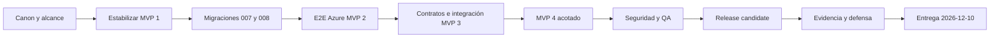

# Plan de entrega 2026

**Audiencia:** dirección de proyecto, Analista, Arquitecto, QA, DevOps y Documentador

**Propósito:** gobernar backlog, hitos, dependencias y fecha final

**Estado:** canónico, corte 2026-08-11

**Fuente:** backlog y cronograma adoptados el 2026-08-11

## Resumen

La fecha límite absoluta es el **2026-12-10**, en `America/Santiago`. La ruta crítica pasa por estabilizar MVP 1, ejecutar `007`/`008`, validar MVP 2 en Azure, completar MVP 3 y MVP 4 acotados, congelar un candidato y cerrar evidencia y defensa.

`009` no está aprobada ni forma parte del plan. Un cambio de alcance debe sustituir trabajo equivalente; no puede consumir seguridad, recuperación, evidencia ni el buffer final.

## Hitos obligatorios

| Hito | Fecha límite | Criterio de salida |
|---|---:|---|
| Gobierno y alcance congelados | 2026-08-14 | Canon, asignación MVP, exclusiones y trazabilidad publicados. |
| MVP 1 cerrado | 2026-08-28 | Base, identidad, disponibilidad y reserva básica estabilizadas; límite online explícito. |
| MVP 2 cerrado | 2026-09-25 | Usuario, grupo y talleres E2E; `007`/`008` y Azure verificados. |
| MVP 3 cerrado | 2026-10-30 | Administración, programación, prioridad, pantalla pública e historial institucional verificados. |
| MVP 4 cerrado y feature freeze | 2026-11-27 | Calidad, soporte, notificaciones core, reportes, auditoría y despliegue en candidato. |
| Documentación integrada | 2026-12-04 | Memoria, diagramas, anexos y evidencia consistentes. |
| Ensayo y buffer | 2026-12-09 | Regresión, contingencia y defensa ensayadas. |
| Entrega absoluta | 2026-12-10 | Prototipo y documentación entregados y registrados. |

## Calendario semanal

| Semana | Objetivo | Trabajo principal | Roles | Salida |
|---|---|---|---|---|
| 11–14 ago | Gobierno | Canon, alcance, riesgos y baseline | Analista, Arquitecto, Documentador | Árbol y decisiones coherentes. |
| 17–21 ago | Estabilizar MVP 1 | Contratos, disponibilidad frontend y regresión | Arquitecto, Frontend, Backend, QA | Defectos priorizados. |
| 24–28 ago | Cerrar MVP 1 | Identidad, reserva, disponibilidad y preparación online | Backend, Frontend, QA, DevOps | Acta MVP 1. |
| 31 ago–4 sep | MVP 2 local | Congelar grupo/taller y ensayar `007`/`008` | Arquitecto, Backend, QA, DevOps | Pre/postcheck y reversión. |
| 7–11 sep | Migrar MVP 2 | Ejecutar `007`/`008` de forma controlada | Backend, QA, DevOps | Evidencia DB. |
| 14–18 sep | Integrar MVP 2 | Entra, CORS, frontend, API, DB y privacidad | Backend, Frontend, QA, DevOps | Matriz E2E online. |
| 21–25 sep | Cerrar MVP 2 | Corregir, regresar y documentar | Frontend, Backend, QA, Documentador | Acta MVP 2. |
| 28 sep–2 oct | Diseñar MVP 3 | Permisos, estados, prioridad y auditoría | Analista, Arquitecto, Diseñador UX | Contratos aceptados. |
| 5–9 oct | Administración base | Inventario, usuarios y bloqueos | Backend, Frontend, QA | CRUD autorizado. |
| 12–16 oct | Programación | Talleres, clases, eventos, prioridad y notificación específica | Backend, Frontend, QA | Conflictos deterministas. |
| 19–23 oct | Historia y público | Historial institucional y pantalla sanitizada | Backend, Frontend, QA | Vistas por audiencia. |
| 26–30 oct | Cerrar MVP 3 | E2E, concurrencia, permisos y documentación | Arquitecto, QA, Documentador | Acta MVP 3. |
| 2–6 nov | Construir MVP 4 | Notificaciones core, reportes, auditoría y soporte | Backend, Frontend, QA | Flujos integrados. |
| 9–13 nov | Seguridad | Autorización, secretos, datos y configuración | Arquitecto, Backend, QA, DevOps | Críticos resueltos. |
| 16–20 nov | UX y accesibilidad | Responsive, estados, teclado, foco y contraste | Diseñador UX, Frontend, QA | Matriz visual. |
| 23–27 nov | Freeze/RC | Regresión, despliegue, smoke y rollback | QA, DevOps, Documentador | Candidato y acta MVP 4. |
| 30 nov–4 dic | Documentar | Memoria, diagramas, anexos y referencias | Documentador, Analista, Arquitecto | Paquete documental. |
| 7–9 dic | Buffer | Smoke final, contingencia y defensa | QA, DevOps, Analista, Documentador | Candidato final. |
| 10 dic | Entregar | Verificación, entrega y recepción | Documentador | Entrega registrada. |

## Backlog de cierre

| ID | Resultado | Depende de | Rol principal | Hito |
|---|---|---|---|---|
| M1-DISP | Frontend consume disponibilidad por rango y muestra estados completos | Contrato estable | Frontend | MVP 1 |
| M1-REG | Identidad, reserva y disponibilidad sin regresiones críticas | M1-DISP | QA | MVP 1 |
| DB-007 | Integridad de agenda aplicada y recuperable | Backup y precheck | Backend/DevOps | MVP 2 |
| DB-008 | Historial de talleres aplicado y recuperable | DB-007 | Backend/DevOps | MVP 2 |
| M2-GRUPO | Código, progreso, mínimo, retiros, expiración y privacidad E2E | DB-007/008 | Backend/Frontend | MVP 2 |
| M2-TALLER | Alta, baja, reinscripción y solape taller↔taller E2E | DB-008 | Backend/Frontend | MVP 2 |
| M2-AZURE | Entra, CORS, API y Azure SQL validados | M2-GRUPO/TALLER | DevOps/QA | MVP 2 |
| M3-ADMIN | Usuarios, inventario y bloqueos con permisos y auditoría | Contratos MVP 3 | Backend/Frontend | MVP 3 |
| M3-PROG | Programación y prioridad determinista | M3-ADMIN | Backend/Frontend | MVP 3 |
| M3-PUBLICO | Pantalla sanitizada e historial institucional | M3-PROG | Frontend/QA | MVP 3 |
| M4-SOPORTE | Notificaciones core, reportes y auditoría consultable | MVP 3 | Backend/Frontend | MVP 4 |
| M4-CALIDAD | Seguridad, privacidad, visual y accesibilidad | Funciones congeladas | QA/UX | MVP 4 |
| M4-RC | Despliegue, smoke y rollback del candidato | M4-CALIDAD | DevOps/QA | MVP 4 |
| DOC-FINAL | Memoria, diagramas, evidencia y defensa | MVP 1–4 | Documentador | Entrega |

## Ruta crítica

La documentación corre en paralelo del 2026-08-11 al 2026-11-27. Su integración final termina el 2026-12-04, antes del buffer de entrega.

## Dependencias y criterios de salida

Cada hito requiere:

- alcance trazado y sin ampliaciones implícitas;
- P0/P1 resueltos o riesgo formalmente aceptado cuando no comprometa seguridad;
- pruebas reproducibles con ambiente y versión;
- privacidad revisada para cada audiencia;
- migración y reversión demostradas cuando corresponda;
- documentación y diagramas sincronizados;
- checklist y acta de cierre.

## Riesgos

| Riesgo | Respuesta | Roles |
|---|---|---|
| Expansión de alcance | Control semanal y sustitución de trabajo equivalente. | Analista, Arquitecto |
| Una sola base disponible | Copia recuperable, backup, pre/postcheck y rollback. | Backend, DevOps |
| Cuota o indisponibilidad Azure | Ventana acordada y smoke priorizado; rotular evidencia local. | DevOps, QA |
| Ejecución accidental de `009` | Excluir de secuencia y exigir ADR futuro. | Arquitecto, DevOps |
| MVP 3–4 demasiado amplios | Respetar [ADR-003](decisiones/ADR-003-alcance-mvp-y-exclusiones.md). | Analista |
| Evidencia desactualizada | Registrar por incremento, no reutilizar resultados históricos. | QA, Documentador |
| Fuga de datos o secretos | Revisión antes de cada publicación. | Arquitecto, QA |
| Defectos tardíos de interfaz | QA incremental y semana dedicada en noviembre. | UX, Frontend, QA |
| Documentación atrasada | Corriente paralela y freeze el 2026-12-04. | Documentador |

## Gobierno del cambio

Desde el congelamiento del 2026-08-14, todo cambio registra impacto en requisitos, ruta crítica, riesgos y evidencia. Si amenaza el 2026-12-10, se difiere o reemplaza alcance; nunca se elimina seguridad, recuperación, E2E, documentación ni buffer final. El control operativo se realiza en [09-checklist-cierre.md](09-checklist-cierre.md).
