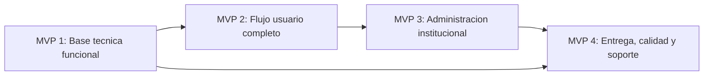

# Poli-REDI - Roadmap de MVPs

## Objetivo del documento

Este documento define los MVPs incrementales de Poli-REDI, que implementa cada uno, su estado actual y los criterios para considerarlos cerrados.

Los MVPs organizan el proyecto desde una base tecnica funcional hasta una version institucional lista para entrega, validacion y despliegue.

## Resumen ejecutivo

| MVP | Nombre | Proposito | Estado |
| --- | --- | --- | --- |
| MVP 1 | Base tecnica funcional | Dejar frontend, backend, base de datos, autenticacion, seguridad minima y demo online operando con datos reales. | Reabierto para pulido final |
| MVP 2 | Flujo usuario completo | Permitir que un usuario normal consulte disponibilidad, reserve, cancele y revise su informacion. | Muy avanzado |
| MVP 3 | Administracion institucional | Completar calendario institucional, bloqueos, recursos y gestion administrativa. | Parcial |
| MVP 4 | Entrega, calidad y soporte | Completar reportes, notificaciones, pruebas, documentacion y despliegue. | En desarrollo |

## MVP 1 - Base tecnica funcional

### Proposito

Construir la base operativa del sistema: aplicacion web, API, base de datos real, autenticacion, seguridad minima y reglas criticas para que el sistema pueda ejecutarse localmente y en una demo online con datos persistidos.

### Implementa

- Backend Go/Fiber.
- Frontend Vue/Vite.
- Azure SQL Database como base objetivo.
- Migracion desde PostgreSQL historico a SQL Server/Azure SQL.
- Scripts `drop.sql`, `schema.sql` y `seed.sql` funcionales.
- Conexion backend a Azure SQL.
- Endpoint publico `/api/health`.
- Rutas protegidas con token Bearer.
- Autenticacion Microsoft Entra ID.
- Modo local de desarrollo controlado.
- Despliegue online inicial en Azure.
- Frontend en Azure Static Web Apps.
- Backend en Azure App Service.
- Configuracion de variables de entorno para nube.
- Rutas SPA configuradas con `staticwebapp.config.json`.
- CORS configurable por ambiente.
- Uso del usuario autenticado en operaciones protegidas.
- Creacion de reservas sin confiar en `userId` enviado por frontend.
- Cancelacion de reservas con permisos.
- Actividades reales desde base de datos.
- Limpieza de logs de depuracion.
- Revision de secretos y archivos `.env`.

### Backlog relacionado

- `BACK-001`
- `BACK-002`
- `BACK-003`
- `BACK-004`
- `BACK-005`
- `BACK-006`
- `BACK-007`
- `BACK-008`
- `BACK-009`
- `BACK-010`
- `BACK-011`
- `BACK-012`
- `BACK-013`
- `BACK-014`
- `BACK-015`
- `BACK-016`
- `BACK-017`
- `AUTH-001`
- `AUTH-002`
- `API-003`
- `RES-001`
- `RES-002`
- `SEC-001`
- `SEC-002`
- `DEPLOY-001`
- `DEPLOY-002`

### Requisitos relacionados

- `RF-001`
- `RF-002`
- `RF-006`
- `RF-008`
- `RNF-001`
- `RNF-002`
- `RNF-006`

### Estado actual

Reabierto para pulido final.

El MVP 1 ya esta funcional y desplegado como demo online, pero se reabre para aprovechar tiempo disponible y mejorar estabilidad, documentacion, seguridad ligera y evidencia de pruebas antes de considerarlo cerrado definitivamente.

### Pendientes de pulido final

- Documentar paso a paso el despliegue como guia estable de entrega.
- Automatizar despliegue del backend Docker si se mantiene App Service con contenedor.
- Endurecer configuracion productiva si se pasa de demo a produccion institucional.
- Ejecutar checklist de demo tecnica MVP 1 (`BACK-005`).
- Revisar documentacion historica para evitar confusiones con PostgreSQL (`BACK-003`).
- Confirmar que README, instalacion y arquitectura reflejan el estado real (`BACK-004`).
- Validar en pantalla los mensajes visibles y posibles problemas de codificacion (`BACK-006`).
- Crear una base global de sistema visual para reducir inconsistencias (`BACK-007`).
- Aplicar esa base global a pantallas y componentes principales del MVP 1 (`BACK-008`).
- Separar estado real de categoria temporal de reserva (`BACK-009`).
- Alinear el formulario de reserva con los datos realmente persistidos (`BACK-012`).
- Retirar controles visibles sin accion en disponibilidad (`BACK-013`).
- Rechazar cancelacion de reservas finalizadas desde backend (`BACK-014`).
- Unificar estado visual del modal de disponibilidad con el helper compartido (`BACK-015`).
- Sincronizar el mini calendario con la navegacion de dias (`BACK-016`).
- Hacer accesible la seleccion de instalacion en el formulario (`BACK-017`).
- Definir plan de corte desde Google Calendar legado antes de mover operacion real (`OPS-001`).
- Dejar evidencia de `go test ./...` y `npm run build` antes del cierre definitivo.

### Pulidos completados durante reapertura

- Separacion entre estado real y categoria temporal de reserva (`BACK-009`).
- Unificacion de tarjetas/listado de Mis Reservas e Historial (`BACK-010`).
- Unificacion de estados, filtros y vacios en vistas de reservas (`BACK-011`).
- Creacion del checklist manual de demo tecnica MVP 1 (`BACK-005`).
- Normalizacion de mensajes visibles y errores frecuentes (`BACK-006`).

### Criterio de cierre

El MVP 1 se considera cerrado definitivamente cuando backend, frontend y Azure SQL funcionan juntos en local y en Azure, la autenticacion protege rutas internas, las reservas usan el usuario autenticado, CORS permite solo origenes configurados, no existen secretos versionados, la documentacion base esta alineada con el estado actual, existe evidencia de pruebas de humo y la interfaz base usa un sistema visual consistente.

## MVP 2 - Flujo usuario completo

### Proposito

Entregar una experiencia usable para el usuario normal, desde login hasta reserva, historial y configuracion de cuenta.

### Implementa

- Login y proteccion de rutas.
- Registro y validacion de RUT.
- Bloqueo de reserva para usuarios normales sin RUT.
- Modal obligatorio cuando falta RUT.
- Vista de disponibilidad con datos reales.
- Reservas visibles por dia seleccionado.
- Formulario de reserva con validaciones visibles.
- Seleccion de actividad desde catalogo aprobado.
- Mis Reservas.
- Detalle de reserva.
- Cancelacion de reserva propia.
- Historial de reservas.
- Filtros de historial por estado y fecha.
- Talleres deportivos con inscripcion.
- Catalogo de recursos con datos reales.
- Filtros basicos de recursos en frontend.
- Imagenes configurables de recursos en catalogo y dashboard.
- Dashboard con datos reales.
- Configuracion de cuenta.
- Cierre de sesion redirigido a `/login`.
- Notificaciones basicas visibles.

### Backlog relacionado

- `AUTH-003`
- `AUTH-004`
- `RES-003`
- `RES-005`
- `RES-006`
- `RES-007`
- `RES-008`
- `UI-001`
- `UI-002`
- `UI-003`
- `UI-004`
- `UI-005`
- `UI-006`
- `UX-001`
- `UX-002`
- `UX-003`
- `NOTIF-001`
- `API-002`
- `API-004`

### Requisitos relacionados

- `RF-003`
- `RF-004`
- `RF-005`
- `RF-006`
- `RF-007`
- `RF-008`
- `RF-009`
- `RF-010`
- `RF-011`
- `RF-017`
- `RF-019`
- `HU-001`
- `HU-002`
- `HU-003`
- `HU-004`
- `HU-005`
- `HU-006`
- `HU-007`
- `HU-008`
- `HU-014`
- `CU-001`
- `CU-002`
- `CU-003`
- `CU-004`
- `CU-005`
- `CU-007`
- `CU-008`

### Estado actual

Muy avanzado.

Incluye tambien una primera version funcional de talleres deportivos: listado de talleres activos, busqueda, cupos, estado de inscripcion e inscripcion protegida por RUT. La disponibilidad ya consume un endpoint sanitizado y muestra talleres como ocupacion recurrente; los recursos `OPEN_USE` operan como uso libre con intensidad de uso. El catalogo y dashboard ya pueden mostrar imagenes configuradas para recursos.

### Pendientes para cierre completo

- Completar filtros backend de reservas por fecha/rango/estado (`API-002`).
- Completar filtros por fecha/rango y sumar bloqueos/actividades al endpoint de disponibilidad (`API-004`, `ADMIN-004`, `ADMIN-005`).
- Agregar confirmacion fuerte antes de cancelar reservas (`RES-007`).
- Persistir participantes y validar capacidad si el campo vuelve al formulario (`RES-008`).
- Profesionalizar la seleccion de horario, capacidad, etiquetas humanas y experiencia movil (`UX-001`).
- Mostrar feedback preventivo de conflicto antes de confirmar una reserva (`UX-003`).
- Completar notificaciones: marcar como leida y diferenciar leidas/no leidas (`NOTIF-001`).
- Confirmar si el detalle de reserva requiere participantes persistidos (`UI-002`).

### Criterio de cierre

El MVP 2 se considera cerrado cuando un usuario normal puede autenticarse, completar su perfil, consultar disponibilidad, crear una reserva valida, cancelar una reserva propia, revisar reservas/historial/recursos, inscribirse en talleres deportivos disponibles y operar sin errores visibles en los flujos principales.

## MVP 3 - Administracion institucional

### Proposito

Convertir Poli-REDI en una herramienta administrable por la institucion, con calendario completo, bloqueos, gestion de recursos y control de usuarios.

### Implementa

- Panel administrador base.
- Accesos administrativos solo para administradores.
- Menu administrativo oculto para usuarios normales.
- Listado de usuarios reales.
- Resumen administrativo de recursos y reservas.
- Reportes iniciales visibles para administradores.
- Cancelacion administrativa de reservas.
- Actualizacion administrativa de imagenes de recursos.

### Backlog relacionado

- `ADMIN-001`
- `ADMIN-002`
- `ADMIN-003`
- `ADMIN-004`
- `ADMIN-005`
- `RES-004`
- `API-001`
- `API-005`
- `REP-001`

### Requisitos relacionados

- `RF-005`
- `RF-007`
- `RF-012`
- `RF-013`
- `RF-014`
- `RF-015`
- `RF-016`
- `RF-018`
- `HU-009`
- `HU-010`
- `HU-011`
- `HU-012`
- `HU-013`
- `CU-006`

### Estado actual

Parcial.

### Pendientes para cierre completo

- Integrar reservas, bloqueos y actividades programadas en un calendario unificado (`RES-004`).
- Crear bloqueos de disponibilidad desde administracion (`ADMIN-004`).
- Completar CRUD basico de recursos; la actualizacion de imagen ya esta implementada (`ADMIN-003`).
- Bloquear y desbloquear usuarios con auditoria (`ADMIN-002`).
- Registrar programacion institucional (`ADMIN-005`).
- Agregar filtros backend de recursos por sede, tipo y estado (`API-001`).
- Centralizar validacion de administrador con middleware (`API-005`).
- Completar reportes desde vistas SQL e infracciones si corresponde (`REP-001`).

### Criterio de cierre

El MVP 3 se considera cerrado cuando un administrador puede controlar disponibilidad institucional, administrar recursos y usuarios, y visualizar informacion operacional sin modificar datos directamente en base de datos.

## MVP 4 - Entrega, calidad y soporte

### Proposito

Completar los elementos de soporte necesarios para entregar, defender, probar y eventualmente desplegar Poli-REDI.

### Implementa

- Reportes administrativos.
- Infracciones.
- Notificaciones completas.
- Pruebas backend para reglas criticas.
- Pruebas o checklist frontend.
- README actualizado.
- Arquitectura documentada.
- Flujo de reservas documentado.
- Requisitos, historias de usuario y casos de uso.
- Roadmap de MVPs.
- Estrategia de despliegue.
- Preparacion backend para produccion.
- Demo online inicial en Azure.

### Backlog relacionado

- `REP-001`
- `REP-002`
- `NOTIF-001`
- `QA-001`
- `QA-002`
- `DOC-001`
- `DOC-002`
- `DOC-003`
- `DOC-004`
- `DOC-005`
- `DEPLOY-001`
- `DEPLOY-002`
- `SEC-002`
- `SEC-003`
- `SEC-004`

### Requisitos relacionados

- `RF-017`
- `RF-018`
- `RNF-003`
- `RNF-004`
- `RNF-005`
- `RNF-006`
- `RNF-007`

### Estado actual

En desarrollo.

### Pendientes para cierre completo

- Completar README principal (`DOC-001`).
- Completar arquitectura con diagrama (`DOC-002`).
- Completar flujo de reservas con diagramas (`DOC-003`).
- Agregar pruebas backend para reservas (`QA-001`).
- Agregar pruebas frontend o checklist automatizado (`QA-002`).
- Limpiar logs de configuracion de autenticacion (`SEC-003`).
- Confirmar checklist productivo para desactivar modo desarrollo (`SEC-004`).
- Completar infracciones (`REP-002`).
- Mantener y completar la guia de despliegue y operacion (`docs/10-guia-redeploy.md`).
- Ejecutar o cerrar plan de corte desde Google Calendar legado (`OPS-001`).
- Automatizar o estandarizar redeploy del backend Docker.
- Endurecer configuracion si se pasa de demo online a produccion institucional.

### Criterio de cierre

El MVP 4 se considera cerrado cuando el proyecto tiene evidencia de pruebas, documentacion suficiente para instalacion/arquitectura/flujo/requisitos, reportes y notificaciones completas, y una estrategia clara de despliegue.

## Dependencias entre MVPs

## Estado recomendado de presentacion

### Presentable como demo funcional

MVP 1, incluido despliegue online, y gran parte de MVP 2.

La demo puede mostrar login Microsoft Entra ID, perfil/RUT, disponibilidad, creacion de reserva, mis reservas, cancelacion, historial, dashboard y panel admin base desde la URL publica de Azure Static Web Apps.

### Presentable como sistema institucional completo

MVP 1, MVP 2 y MVP 3.

Para esto faltan especialmente calendario unificado, bloqueos, CRUD de recursos y gestion real de usuarios.

### Presentable como entrega final de tesis/FIP

MVP 1, MVP 2, MVP 3 y MVP 4.

Para esto faltan pruebas, documentacion tecnica final, estrategia de despliegue y cierre de reportes/notificaciones/infracciones.

## Protocolo de mantenimiento

Este documento debe actualizarse cuando:

- Cambie el alcance de un MVP.
- Se complete una tarea que mueva el estado de un MVP.
- Se agregue una nueva funcionalidad relevante.
- Se cambie el orden recomendado de entrega.
- Se redefina lo necesario para demo, entrega institucional o entrega final.

Cada cambio debe mantenerse coherente con:

- `docs/07-backlog.md`
- `docs/08-requisitos-historias-casos-uso.md`
- Documentos tecnicos afectados dentro de `docs/`
