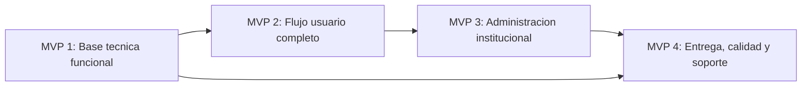

# Poli-REDI - Roadmap de MVPs

## Objetivo del documento

Este documento define los MVPs incrementales de Poli-REDI, que implementa cada uno, su estado actual y los criterios para considerarlos cerrados.

Los MVPs organizan el proyecto desde una base tecnica funcional hasta una version institucional lista para entrega, validacion y despliegue.

## Principio de evolucion de requisitos

En Poli-REDI los MVPs no congelan permanentemente los requisitos de incrementos anteriores. Cada MVP funciona tambien como una instancia de validacion del dominio.

Un requisito aprobado puede refinarse cuando la implementacion, las pruebas o la observacion del caso de uso muestran una representacion mas adecuada, siempre que el cambio quede trazable.

El ciclo utilizado es:

`requisito -> implementacion -> validacion -> aprendizaje -> requisito refinado`

Una mutacion de requisito debe registrar:

- comportamiento anterior;
- motivo del refinamiento;
- comportamiento vigente;
- requisitos, casos de uso y backlog afectados;
- impacto sobre datos, API, frontend y pruebas;
- compatibilidad con incrementos posteriores.

Esto permite evolucionar el prototipo sin presentar una decision anterior como error cuando en realidad fue una hipotesis valida para un incremento previo.

### Decision de dominio 2026-08-20: reservas grupales

Durante MVP 2 se refino la regla que indicaba que una reserva confirmada debia regresar a `PENDING` si posteriormente bajaba del minimo de participantes.

La decision vigente separa dos dimensiones:

- `reservation.status`: ciclo de vida de la reserva;
- `groupCondition`: condicion operacional del grupo.

Por lo tanto:

- una reserva grupal nueva comienza `PENDING + PENDING_MINIMUM`;
- al alcanzar por primera vez el minimo cambia a `CONFIRMED + HEALTHY`;
- si posteriormente baja del minimo conserva `CONFIRMED` y cambia a `AT_RISK`;
- si recupera el minimo vuelve a `HEALTHY`;
- si alcanza el plazo limite bajo el minimo, el flujo puede cancelar la reserva conforme a la politica vigente.

La condicion `AT_RISK` permite que futuros incrementos de notificaciones reaccionen a riesgo, recuperacion y vencimiento sin degradar artificialmente el ciclo de vida persistido de la reserva.

## Resumen ejecutivo

| MVP | Nombre | Proposito | Estado |
| --- | --- | --- | --- |
| MVP 1 | Base tecnica funcional | Dejar frontend, backend, base de datos, autenticacion, seguridad minima y demo online operando con datos reales. | Reabierto para pulido final |
| MVP 2 | Flujo usuario completo | Permitir que un usuario normal consulte disponibilidad, solicite, confirme por participantes cuando corresponda, cancele y revise su informacion. | Avanzado; UX principal unificado |
| MVP 3 | Administracion institucional | Completar calendario institucional, bloqueos, recursos y gestion administrativa. | Parcial |
| MVP 4 | Entrega, calidad y soporte | Completar reportes, notificaciones, pruebas, documentacion y despliegue. | En desarrollo |

## MVP 1 - Base tecnica funcional

### Proposito

Construir la base operativa del sistema: aplicacion web, API, base de datos real, autenticacion, seguridad minima y reglas criticas para que el sistema pueda ejecutarse localmente y en una demo online con datos persistidos.

### Implementa

- Backend Go/Fiber.
- Frontend Vue/Vite.
- PostgreSQL 16 como motor de persistencia vigente.
- Genealogia EV-011: PostgreSQL inicial -> Azure SQL intermedio -> PostgreSQL 16 vigente.
- Migraciones canonicas `PG16_*` bajo `database/postgres/migrations/`.
- Conexion backend mediante `pgx` y `DATABASE_URL`/variables `PG*`.
- Scripts T-SQL conservados temporalmente como legado, no como esquema vigente.
- Endpoint publico `/api/health`.
- Rutas protegidas con token Bearer.
- Autenticacion Microsoft Entra ID.
- Modo local de desarrollo controlado.
- Despliegue online inicial en Azure.
- Frontend en Azure Static Web Apps.
- Backend en Azure App Service.
- Configuracion de variables de entorno para nube.
- Rutas SPA configuradas con `staticwebapp.config.json`.
- CORS configurable por ambiente.
- Uso del usuario autenticado en operaciones protegidas.
- Creacion de reservas sin confiar en `userId` enviado por frontend.
- Cancelacion de reservas con permisos.
- Actividades reales desde base de datos.
- Limpieza de logs de depuracion.
- Revision de secretos y archivos `.env`.

### Backlog relacionado

- `BACK-001`
- `BACK-002`
- `BACK-003`
- `BACK-004`
- `BACK-005`
- `BACK-006`
- `BACK-007`
- `BACK-008`
- `BACK-009`
- `BACK-010`
- `BACK-011`
- `BACK-012`
- `BACK-013`
- `BACK-014`
- `BACK-015`
- `BACK-016`
- `BACK-017`
- `BACK-018`
- `BACK-019`
- `BACK-020`
- `BACK-021`
- `BACK-022`
- `BACK-023`
- `BACK-024`
- `AUTH-001`
- `AUTH-002`
- `API-003`
- `RES-001`
- `RES-002`
- `RES-009`
- `RES-010`
- `RES-011`
- `QA-001`
- `QA-002`
- `SEC-001`
- `SEC-002`
- `SEC-005`
- `DEPLOY-001`
- `DEPLOY-002`

### Requisitos relacionados

- `RF-001`
- `RF-002`
- `RF-006`
- `RF-008`
- `RNF-001`
- `RNF-002`
- `RNF-006`

### Estado actual

Reabierto para pulido final.

El MVP 1 ya esta funcional y desplegado como demo online, pero se reabre para aprovechar tiempo disponible y mejorar estabilidad, documentacion, seguridad ligera y evidencia de pruebas antes de considerarlo cerrado definitivamente.

### Pendientes de pulido final

Bloqueantes funcionales y de integridad:

- Verificar online la zona horaria de negocio ya implementada en frontend y backend (`RES-009`, en revision).
- Verificar desplegada la proteccion que impide al cliente controlar estados y transiciones (`RES-010`, en revision).
- Verificar desplegadas las reglas de duracion y horario operativo ya compartidas por API y UI (`RES-011`, en revision).
- Ampliar las pruebas backend actuales mas alla de reloj, estado, duracion y horario hacia permisos, conflictos y persistencia (`QA-001`).

Pulido visible y estabilidad transversal:

- Impedir seleccion de instalaciones no reservables antes del submit (`BACK-020`).
- Corregir header, campana y sidebar en mobile y teclado (`BACK-021`).
- Completar foco, Escape, labels y teclado en modales/calendario (`BACK-022`).
- Completar el 404 y revisar llamadas residuales de carga de usuario en vistas individuales; el bootstrap global de autenticacion y la eliminacion del flash de login ya estan implementados (`BACK-023`).
- Sanitizar respuestas de error internas (`SEC-005`).
- Validar responsive final del carrusel manual ya implementado (`BACK-018`).
- Hacer reproducible la instalacion limpia de `frontend/` y retirar duplicados muertos (`BACK-024`).
- Ampliar la base de regresion frontend, actualmente con 25 pruebas verificadas localmente el 2026-08-20, hacia componentes Vue, permisos, router y navegacion (`QA-002`).
- Automatizar despliegue del backend Docker si se mantiene App Service con contenedor.
- Mantener el plan de corte desde Google Calendar antes de mover operacion real (`OPS-001`).

### Pulidos completados durante reapertura

- Separacion entre estado real y categoria temporal de reserva (`BACK-009`).
- Unificacion de tarjetas/listado de Mis Reservas e Historial (`BACK-010`).
- Unificacion de estados, filtros y vacios en vistas de reservas (`BACK-011`).
- Creacion del checklist manual de demo tecnica MVP 1 (`BACK-005`).
- Validacion de usuario del checklist de demo tecnica MVP 1 (`BACK-005`).
- Normalizacion de mensajes visibles y errores frecuentes (`BACK-006`).
- Rechazo backend de cancelacion de reservas finalizadas (`BACK-014`).
- Validacion de usuario del checklist productivo de modo desarrollo (`SEC-004`).
- Creacion de seed temporal separado para pruebas de hoy sin modificar `seed.sql` (`BACK-019`).
- Validacion de usuario del seed temporal de pruebas (`BACK-019`).
- Actualizacion de la guia operativa de despliegue y redeploy (`BACK-004`).
- Creacion de la base global de sistema visual (`BACK-007`).
- Aplicacion inicial del sistema visual en pantallas principales (`BACK-008`).
- Alineacion del formulario con datos realmente persistidos (`BACK-012`).
- Retiro de controles sin accion en disponibilidad (`BACK-013`).
- Unificacion del estado visual del modal (`BACK-015`).
- Sincronizacion del mini calendario (`BACK-016`).
- Seleccion de instalacion operable con teclado (`BACK-017`).
- Verificacion 2026-07-14 de build frontend, autorizacion basica y flujo Historial -> Detalle.
- Verificacion local 2026-07-20 de pruebas backend, 9 pruebas frontend de tiempo/agenda y build de produccion.
- Unificacion 2026-08-20 de Reservas e Historial en `ReservationsView.vue`.
- Retiro de `HistoryView.vue` y del modal de detalle duplicado de Disponibilidad.
- Reutilizacion de `ReservationForm.vue` para creacion y detalle.
- Confirmacion destructiva inline para cancelacion de reservas, sin `window.confirm`.
- Carrusel de recursos manual con navegacion a Disponibilidad filtrada.
- Filtros de recurso y disponibilidad incorporados a Disponibilidad.
- Bootstrap global de autenticacion con pantalla intermedia para entrada y cierre de sesion.
- Eliminacion del flash de Login durante la resolucion de sesion.
- Verificacion local 2026-08-20 de build frontend y 25 pruebas automatizadas.

### Criterio de cierre

El MVP 1 se considera cerrado definitivamente cuando backend, frontend y PostgreSQL funcionan juntos en un ambiente reproducible e integrado; la autenticacion protege rutas internas; las reservas usan usuario, estado, horario y zona temporal controlados por servidor; CORS permite solo origenes configurados; no existen secretos ni errores internos expuestos; existen pruebas reales para reglas criticas; y el flujo visible es coherente y operable en mobile, escritorio y teclado. La demo Azure SQL de julio se conserva como evidencia historica y no define el motor vigente.

## MVP 2 - Flujo usuario completo

### Proposito

Entregar una experiencia usable para el usuario normal, desde login hasta reserva, historial y configuracion de cuenta.

### Implementa

- Login y proteccion de rutas.
- Registro y validacion de RUT.
- Bloqueo de reserva para usuarios normales sin RUT.
- Modal obligatorio cuando falta RUT.
- Vista de disponibilidad con datos reales.
- Reservas visibles por dia seleccionado.
- Formulario de reserva con validaciones visibles.
- Seleccion de actividad desde catalogo aprobado.
- Mis Reservas.
- Detalle de reserva.
- Cancelacion de reserva propia.
- Historial de reservas integrado en el mismo modulo de Reservas mediante tabs controlados por URL.
- Filtros de historial por estado y fecha.
- Modal compartido de creacion y detalle mediante `ReservationForm.vue`.
- Confirmacion inline antes de cancelar una reserva.
- Filtros de disponibilidad por recurso y por existencia de bloques disponibles.
- Carrusel manual de recursos con navegacion contextual a Disponibilidad.
- Pantalla intermedia reutilizable para inicializacion y cierre de sesion.
- Talleres deportivos con inscripcion.
- Catalogo de recursos con datos reales.
- Filtros basicos de recursos en frontend.
- Imagenes configurables de recursos en catalogo y dashboard.
- Dashboard con datos reales.
- Configuracion de cuenta.
- Cierre de sesion redirigido a `/login`.
- Notificaciones basicas visibles.

### Backlog relacionado

- `AUTH-003`
- `AUTH-004`
- `RES-003`
- `RES-005`
- `RES-006`
- `RES-007`
- `RES-008`
- `RES-012`
- `UI-001`
- `UI-002`
- `UI-003`
- `UI-004`
- `UI-005`
- `UI-006`
- `UX-001`
- `UX-002`
- `UX-003`
- `NOTIF-001`
- `API-002`
- `API-004`
- `API-006`

### Requisitos relacionados

- `RF-003`
- `RF-004`
- `RF-005`
- `RF-006`
- `RF-007`
- `RF-008`
- `RF-009`
- `RF-010`
- `RF-011`
- `RF-017`
- `RF-019`
- `RF-020`
- `RF-021`
- `RF-022`
- `HU-001`
- `HU-002`
- `HU-003`
- `HU-004`
- `HU-005`
- `HU-006`
- `HU-007`
- `HU-008`
- `HU-014`
- `HU-015`
- `CU-001`
- `CU-002`
- `CU-003`
- `CU-004`
- `CU-005`
- `CU-007`
- `CU-008`
- `CU-009`

### Estado actual

Avanzado; el flujo UX principal se encuentra unificado y las brechas restantes se concentran principalmente en validacion integral, reglas grupales, infraestructura y cobertura de pruebas.

Actualizacion 2026-08-20:

- Reservas activas e historial comparten una misma vista.
- Inicio, Disponibilidad y Reservas reutilizan el patron de detalle.
- La cancelacion exige confirmacion inline.
- El carrusel de inicio es manual.
- Disponibilidad permite filtrar recursos.
- Las transiciones de autenticacion evitan mostrar Login mientras la sesion aun se esta resolviendo.
- La suite frontend local registra 25 pruebas correctas.

Incluye tambien una primera version funcional de talleres deportivos: listado de talleres activos, busqueda, cupos, estado de inscripcion e inscripcion protegida por RUT. La disponibilidad ya consume un endpoint sanitizado y muestra talleres como ocupacion recurrente; los recursos `OPEN_USE` operan como uso libre con intensidad de uso. El catalogo y dashboard ya pueden mostrar imagenes configuradas para recursos.

### Pendientes para cierre completo

- Completar filtros backend de reservas por fecha/rango/estado (`API-002`).
- Completar filtros por fecha/rango y sumar bloqueos al endpoint de disponibilidad; las actividades programadas ya estan integradas (`API-004`, `ADMIN-004`).
- Cargar el detalle por ID sin descargar colecciones completas (`API-006`).
- Mantener la confirmacion fuerte de cancelacion ya implementada y completar su evidencia de pruebas (`RES-007`).
- Integrar en frontend y verificar de punta a punta en PostgreSQL la ventana y frecuencia versionadas; `PENDING` consume desde su creacion y `CANCELLED` libera la oportunidad (`RES-012`).
- Registrar al solicitante y participantes mediante cuentas unicas, exigiendo al menos 10 para las tres multicanchas (`RES-008`).
- Mantener solicitudes grupales en `PENDING`, bloquear el horario, confirmar al alcanzar el minimo y volver a `PENDING` si una retirada reduce el conteo (`RES-008`, `RES-010`).
- Aceptar cambios hasta exactamente una hora antes inclusive y cancelar al vencer bajo el minimo, liberando horario y oportunidad (`RES-008`, `RES-012`).
- Profesionalizar la seleccion de horario, capacidad, etiquetas humanas y experiencia movil (`UX-001`).
- Mostrar feedback preventivo de conflicto antes de confirmar una reserva (`UX-003`).
- Completar notificaciones: marcar como leida y diferenciar leidas/no leidas (`NOTIF-001`).
- Mostrar en detalle el estado de la solicitud y el avance de confirmaciones cuando corresponda (`UI-002`).

### Criterio de cierre

El MVP 2 se considera cerrado cuando un usuario normal puede autenticarse, completar su perfil, consultar disponibilidad, cumplir la ventana y frecuencia, crear una solicitud con estado acorde al recurso, reunir mediante cuentas y mantener 10 participantes dentro del plazo, observar el bloqueo `PENDING` y su cancelacion al vencer, cancelar una reserva propia, revisar reservas/historial/recursos, inscribirse en talleres y operar sin errores visibles en los flujos principales.

## MVP 3 - Administracion institucional

### Proposito

Convertir Poli-REDI en una herramienta administrable por la institucion, con calendario completo, bloqueos, gestion de recursos y control de usuarios.

### Implementa

- Panel administrador base.
- Accesos administrativos solo para administradores.
- Menu administrativo oculto para usuarios normales.
- Listado de usuarios reales.
- Resumen administrativo de recursos y reservas.
- Reportes iniciales visibles para administradores.
- Cancelacion administrativa de reservas.
- Actualizacion administrativa de imagenes de recursos.

### Backlog relacionado

- `ADMIN-001`
- `ADMIN-002`
- `ADMIN-003`
- `ADMIN-004`
- `ADMIN-005`
- `ADMIN-006`
- `RES-004`
- `API-001`
- `API-005`
- `REP-001`
- `REP-003`

### Requisitos relacionados

- `RF-005`
- `RF-007`
- `RF-012`
- `RF-013`
- `RF-014`
- `RF-015`
- `RF-016`
- `RF-018`
- `RF-023`
- `RF-024`
- `RF-025`
- `HU-009`
- `HU-010`
- `HU-011`
- `HU-012`
- `HU-013`
- `HU-016`
- `HU-017`
- `HU-018`
- `CU-006`
- `CU-010`
- `CU-011`

### Estado actual

Parcial.

### Pendientes para cierre completo

- Completar la integracion de bloqueos en el calendario unificado; reservas y actividades programadas ya comparten contrato (`RES-004`).
- Crear bloqueos de disponibilidad desde administracion (`ADMIN-004`).
- Completar la gestion del inventario oficial de ocho recursos; la actualizacion de imagen ya esta implementada (`ADMIN-003`).
- Completar la interfaz administrativa y migrar/verificar en PostgreSQL la publicacion prospectiva de politicas (`ADMIN-006`). Lectura, historial y escritura administrativa ya utilizan PostgreSQL; permanece pendiente la interfaz y el cierre funcional completo. Las correcciones excepcionales quedan para un incremento posterior.
- Bloquear y desbloquear usuarios con auditoria (`ADMIN-002`).
- Completar `ADMIN-005`: el backend ya registra programacion institucional, detecta conflictos N-elementos y permite resolucion administrativa `KEEP`/`ALLOW`/`CANCEL`/`RESCHEDULE`. Falta cerrar la decision `EV-010` sobre cancelacion automatica versus resolucion administrativa, integrar notificaciones y completar la experiencia administrativa.
- Agregar filtros backend de recursos por sede, tipo y estado (`API-001`).
- Centralizar validacion de administrador con middleware (`API-005`).
- Completar reportes desde vistas SQL e infracciones si corresponde (`REP-001`).
- Corregir definicion de reservas activas y precision de horas en indicadores (`REP-003`).

### Criterio de cierre

El MVP 3 se considera cerrado cuando un administrador puede controlar disponibilidad institucional, resolver conflictos entre actividades, mantener el inventario oficial y sus politicas de reserva, administrar usuarios y visualizar informacion operacional sin modificar datos directamente en base de datos.

## MVP 4 - Entrega, calidad y soporte

### Proposito

Completar los elementos de soporte necesarios para entregar, defender, probar y eventualmente desplegar Poli-REDI.

### Implementa

- Reportes administrativos.
- Infracciones.
- Notificaciones completas.
- Pruebas unitarias iniciales backend y frontend para reloj, agenda, contrato JSON y reglas de reserva.
- README actualizado.
- Arquitectura documentada.
- Flujo de reservas documentado.
- Requisitos, historias de usuario y casos de uso.
- Roadmap de MVPs.
- Guia de documentacion tecnica y legibilidad.
- Estrategia de despliegue.
- Preparacion backend para produccion.
- Demo online inicial en Azure.

### Backlog relacionado

- `REP-001`
- `REP-002`
- `NOTIF-001`
- `DOC-001`
- `DOC-002`
- `DOC-003`
- `DOC-004`
- `DOC-005`
- `DOC-006`
- `DEPLOY-001`
- `DEPLOY-002`
- `SEC-002`
- `SEC-003`
- `SEC-004`

### Requisitos relacionados

- `RF-017`
- `RF-018`
- `RNF-003`
- `RNF-004`
- `RNF-005`
- `RNF-006`
- `RNF-007`

### Estado actual

En desarrollo.

### Pendientes para cierre completo

- Completar README principal (`DOC-001`).
- Completar arquitectura con diagrama (`DOC-002`).
- Completar flujo de reservas con diagramas (`DOC-003`).
- Ampliar cobertura automatizada hacia componentes, permisos, persistencia e integracion.
- Limpiar logs de configuracion de autenticacion (`SEC-003`).
- Completar infracciones (`REP-002`).
- Mantener y completar la guia de despliegue y operacion (`docs/10-guia-redeploy.md`).
- Ejecutar o cerrar plan de corte desde Google Calendar legado (`OPS-001`).
- Automatizar o estandarizar redeploy del backend Docker.
- Endurecer configuracion si se pasa de demo online a produccion institucional.

### Criterio de cierre

El MVP 4 se considera cerrado cuando el proyecto tiene evidencia de pruebas, documentacion suficiente para instalacion/arquitectura/flujo/requisitos, reportes y notificaciones completas, y una estrategia clara de despliegue.

## Dependencias entre MVPs

## Cuatro incrementos tecnicos aprobados para politicas y solicitudes grupales

Estos incrementos no reemplazan los cuatro MVPs generales; ordenan `RES-012`, `RES-008` y `ADMIN-006` dentro de ellos:

1. **Versionado y reglas de solicitud:** politica inicial e inmutable por solicitud, ventana, frecuencia y liberacion al cancelar.
2. **Participantes y estado condicionado:** solicitante contado sin posibilidad de retiro, confirmaciones de terceros, bloqueo `PENDING` y transiciones por minimo.
3. **Plazo y vencimiento:** limite inclusivo, cancelacion bajo el minimo y resolucion antes de consultas o escrituras relevantes.
4. **Administracion:** lectura, historial y publicacion administrativa de politicas operan sobre PostgreSQL. Faltan interfaz y cierre integrado. Las correcciones excepcionales quedan fuera del incremento actual.

`ADMIN-005` dejo de ser una entrega arquitectonica exclusivamente futura: existe una implementacion backend parcial en MVP 2. Su cierre funcional sigue perteneciendo a administracion institucional y no bloquea los cuatro incrementos tecnicos de reservas grupales.

## Estado recomendado de presentacion

### Presentable como demo funcional

MVP 1, incluido despliegue online, y gran parte de MVP 2.

La demo puede mostrar login Microsoft Entra ID, perfil/RUT, disponibilidad, creacion de reserva, mis reservas, cancelacion, historial, dashboard y panel admin base desde la URL publica de Azure Static Web Apps.

### Presentable como sistema institucional completo

MVP 1, MVP 2 y MVP 3.

Para esto faltan especialmente calendario unificado, bloqueos, CRUD de recursos y gestion real de usuarios.

### Presentable como entrega final de tesis/FIP

MVP 1, MVP 2, MVP 3 y MVP 4.

Para esto faltan pruebas, documentacion tecnica final, estrategia de despliegue y cierre de reportes/notificaciones/infracciones.

## Protocolo de mantenimiento

Este documento debe actualizarse cuando:

- Cambie el alcance de un MVP.
- Se complete una tarea que mueva el estado de un MVP.
- Se agregue una nueva funcionalidad relevante.
- Se cambie el orden recomendado de entrega.
- Se redefina lo necesario para demo, entrega institucional o entrega final.

Cada cambio debe mantenerse coherente con:

- `docs/07-backlog.md`
- `docs/08-requisitos-historias-casos-uso.md`
- Documentos tecnicos afectados dentro de `docs/`
