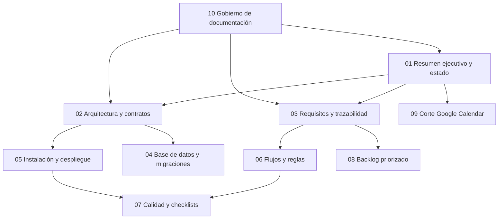

# Índice y gobierno documental de Poli-REDI

**Estado:** CANÓNICO  
**Corte:** 2026-08-04

## 1. Objetivo

Definir qué documento consultar, cuál prevalece cuando existen diferencias y cómo mantener trazabilidad entre tesis, producto, código, base de datos y pruebas.

## 2. Jerarquía de fuentes

Cuando dos documentos discrepen, aplicar este orden:

1. **Evidencia técnica más reciente y fechada**, sin extrapolarla a ambientes no ejecutados.
2. **Actas de revisión y decisiones explícitas** aprobadas.
3. **Estado actual de producto** y documentación canónica consolidada.
4. **Requisitos, arquitectura y guías operativas vigentes**.
5. **Backlog**, que expresa trabajo y no prueba por sí solo que algo esté implementado.
6. **Documentos históricos**, que conservan contexto pero no describen necesariamente el sistema actual.

La implementación observable puede demostrar que una función existe, pero no prueba automáticamente que esté aprobada ni validada en Azure.

## 3. Convenciones de estado

| Estado | Significado |
|---|---|
| `APROBADO` | Existe una decisión explícita o alcance aceptado. |
| `IMPLEMENTADO` | Existe comportamiento observable en código o esquema. |
| `VERIFICADO LOCALMENTE` | Se ejecutó una comprobación local satisfactoria. |
| `VALIDADO INTEGRADAMENTE` | Frontend, API, identidad y base desplegada fueron comprobados juntos. |
| `APROBABLE CONDICIONADO` | Puede avanzar a cierre, pero aún tiene condiciones verificables pendientes. |
| `PENDIENTE` | No está resuelto o no existe evidencia suficiente. |
| `HISTÓRICO` | Registra un corte anterior y no debe usarse como estado vigente. |

## 4. Mapa documental

## 5. Trazabilidad académica y técnica

| Necesidad del informe | Documento canónico | Evidencia técnica esperada |
|---|---|---|
| Problema, objetivo y alcance | `01`, `03` | Levantamiento y decisiones de alcance. |
| Arquitectura y tecnologías | `02`, `04` | Código, esquema y configuración. |
| Requisitos y casos de uso | `03`, `06` | Rutas, reglas, UI y restricciones SQL. |
| Desarrollo del prototipo | `02`, `05` | Builds, pruebas y despliegue. |
| Evaluación | `07` | Resultados automatizados y checklists manuales. |
| Plan de continuidad | `08`, `09` | Pendientes, riesgos y transición operativa. |

## 6. Documentos reemplazados o absorbidos

Los archivos duplicados con sufijo `(1)` eran idénticos byte a byte a su versión sin sufijo y no se conservan como documentos independientes.

| Fuente anterior | Destino canónico |
|---|---|
| `00-resumen-proyecto.md`, `01-resumen-y-estado-actual.md`, `13-estado-actual-producto.md` | `01-resumen-ejecutivo-y-estado.md` |
| `02-arquitectura.md`, `02-arquitectura-y-sistema.md`, `04-backend.md`, `05-frontend.md` | `02-arquitectura-y-contratos.md` |
| `03-requisitos-casos-uso.md`, `08-requisitos-historias-casos-uso.md`, `09-mvps-roadmap.md` | `03-requisitos-casos-uso-y-trazabilidad.md` |
| `03-base-de-datos.md` y README de migraciones | `04-base-de-datos-y-migraciones.md` |
| `01-instalacion-y-ejecucion.md`, `04-guias-y-despliegue.md`, `10-guia-redeploy.md` | `05-instalacion-despliegue-y-recuperacion.md` |
| `06-flujo-reservas.md` | `06-flujos-y-reglas-de-negocio.md` |
| checklists MVP 1 y MVP 2, acta de revisión | `07-calidad-pruebas-y-checklists.md` |
| `07-backlog.md` | `08-backlog-priorizado.md` y copia completa en `referencia/` |
| `11-plan-corte-google-calendar.md` | `09-plan-corte-google-calendar.md` |
| `12-guia-documentacion-legibilidad.md` | `10-guia-documentacion-y-mantenimiento.md` |
| `00-revision-inicial.md` | `historico/00-revision-inicial.md` |

## 7. Regla de actualización

Todo cambio funcional debe actualizar, como mínimo:

1. requisito o decisión afectada;
2. contrato técnico correspondiente;
3. prueba o evidencia;
4. estado del backlog;
5. fecha de corte y limitaciones de la verificación.

No se debe reemplazar `PENDIENTE` por `IMPLEMENTADO` usando solo intención, diseño o un ítem marcado como terminado.
