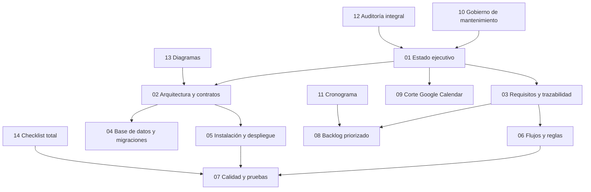

# Índice y gobierno documental de Poli-REDI

**Estado:** CANÓNICO ADOPTADO

**Corte:** 2026-08-11

**Autoridad:** Orquestador Principal de Poli-REDI
**Propósito:** definir qué documento manda, cómo registrar evidencia y cómo mantener trazabilidad hasta la entrega obligatoria del 2026-12-10.

## 1. Autoridad y vigencia

Desde el 2026-08-11, esta carpeta conserva su nombre `Propuesta nueva/` para no romper enlaces, pero deja de ser una propuesta: es el **canon documental vigente** de Poli-REDI.

Los documentos `../00-indice-maestro-y-trazabilidad.md` a `../04-guias-y-despliegue.md` quedan supersedidos. No se eliminan ni se reescriben retroactivamente; su índice raíz debe redirigir a este paquete.

No son fuentes vigentes de estado:

- `../historico_y_checklists/`;
- `historico/`;
- `referencia/`;
- `../../Documentos/Entregables_Previos/`;
- cronogramas, checklists o actas cuyo corte sea anterior y no estén acompañados por una nueva evidencia.

## 2. Jerarquía de fuentes

Cuando dos fuentes discrepen, aplicar este orden:

1. evidencia técnica más reciente, fechada y asociada a ambiente y versión;
2. decisiones explícitas del Orquestador o actas aprobadas;
3. este paquete canónico `00` a `14`;
4. alcance y documentos académicos vigentes de `../../Documentos/`;
5. backlog, que expresa trabajo pero no demuestra implementación;
6. referencias e históricos, que conservan contexto pero no describen necesariamente el producto actual.

La implementación observable puede demostrar existencia, pero no equivale por sí sola a aprobación, integración online o cierre de MVP.

## 3. Convenciones de estado

| Estado | Significado |
|---|---|
| `APROBADO` | Existe una decisión explícita de producto o alcance. |
| `IMPLEMENTADO` | Existe comportamiento observable en código o esquema. |
| `VERIFICADO LOCALMENTE` | Existe una ejecución local satisfactoria y registrada. |
| `VALIDADO ONLINE` | Frontend, API, identidad y base desplegada fueron comprobados juntos. |
| `DEMOSTRABLE LOCALMENTE` | El flujo puede presentarse en local, sin acreditar el ambiente online. |
| `PARCIAL` | Existe una parte del alcance, pero faltan contratos, integración o evidencia obligatoria. |
| `PENDIENTE` | No está resuelto o no existe evidencia suficiente. |
| `HISTÓRICO` | Registra un corte anterior y no debe utilizarse como estado vigente. |

## 4. Mapa documental

## 5. Catálogo canónico

| ID | Documento | Uso |
|---:|---|---|
| 00 | [`00-indice-y-gobierno-documental.md`](00-indice-y-gobierno-documental.md) | Autoridad, precedencia e índice. |
| 01 | [`01-resumen-ejecutivo-y-estado.md`](01-resumen-ejecutivo-y-estado.md) | Estado real y brechas. |
| 02 | [`02-arquitectura-y-contratos.md`](02-arquitectura-y-contratos.md) | Arquitectura y contratos. |
| 03 | [`03-requisitos-casos-uso-y-trazabilidad.md`](03-requisitos-casos-uso-y-trazabilidad.md) | Alcance funcional y MVP. |
| 04 | [`04-base-de-datos-y-migraciones.md`](04-base-de-datos-y-migraciones.md) | Datos y migraciones. |
| 05 | [`05-instalacion-despliegue-y-recuperacion.md`](05-instalacion-despliegue-y-recuperacion.md) | Operación y recuperación. |
| 06 | [`06-flujos-y-reglas-de-negocio.md`](06-flujos-y-reglas-de-negocio.md) | Reglas y flujos. |
| 07 | [`07-calidad-pruebas-y-checklists.md`](07-calidad-pruebas-y-checklists.md) | Evidencia y QA. |
| 08 | [`08-backlog-priorizado.md`](08-backlog-priorizado.md) | Trabajo pendiente. |
| 09 | [`09-plan-corte-google-calendar.md`](09-plan-corte-google-calendar.md) | Corte del legado. |
| 10 | [`10-guia-documentacion-y-mantenimiento.md`](10-guia-documentacion-y-mantenimiento.md) | Norma de mantenimiento. |
| 11 | [`11-cronograma-cierre-2026.md`](11-cronograma-cierre-2026.md) | Plan hasta el 10-12-2026. |
| 12 | [`12-auditoria-alcance-implementacion-2026-08-11.md`](12-auditoria-alcance-implementacion-2026-08-11.md) | Auditoría de alcance e implementación. |
| 13 | [`13-diagramas-arquitectura-flujos-y-secuencias-mvp1-mvp2.md`](13-diagramas-arquitectura-flujos-y-secuencias-mvp1-mvp2.md) | Diagramas de arquitectura, flujos y secuencias de MVP 1–2. |
| 14 | [`14-checklist-cierre-total-2026-12-10.md`](14-checklist-cierre-total-2026-12-10.md) | Control de cierre total. |

Los documentos `12` y `13` existen y forman parte del canon con el alcance indicado en esta tabla.

## 6. Trazabilidad académica y técnica

| Necesidad del informe | Fuente canónica | Evidencia esperada |
|---|---|---|
| Problema, objetivo y alcance | `01`, `03`, `../../Documentos/01-alcance-definitivo-prototipo.md` | Levantamiento y decisiones aprobadas. |
| Arquitectura y tecnologías | `02`, `04`, `13` | Código, esquema, diagramas y configuración. |
| Requisitos y casos de uso | `03`, `06` | Rutas, reglas, interfaz y restricciones. |
| Implementación del prototipo | `02`, `05`, `12` | Builds, pruebas, migraciones y despliegue. |
| Evaluación | `07`, `14` | Resultados automatizados y checklists manuales. |
| Plan de continuidad | `08`, `09`, `11` | Pendientes, riesgos, fechas y transición operativa. |

## 7. Documentos reemplazados o absorbidos

| Fuente anterior | Destino canónico |
|---|---|
| `../00-indice-maestro-y-trazabilidad.md` | Este índice `00`. |
| `../01-resumen-y-estado-actual.md` y resúmenes históricos | `01-resumen-ejecutivo-y-estado.md`. |
| `../02-arquitectura-y-sistema.md` y documentos técnicos históricos | `02-arquitectura-y-contratos.md`, `04`, `05` y `13`. |
| `../03-requisitos-casos-uso.md`, requisitos y roadmap históricos | `03-requisitos-casos-uso-y-trazabilidad.md` y `11`. |
| `../04-guias-y-despliegue.md` y guías históricas | `05-instalacion-despliegue-y-recuperacion.md`. |
| checklists MVP 1/MVP 2 y actas previas | `07` y `14`, conservando los originales como evidencia. |
| backlog completo histórico | `08` y copia íntegra en `referencia/`. |

## 8. Regla de actualización

Todo cambio funcional debe actualizar, en el mismo incremento:

1. requisito o decisión afectada;
2. contrato técnico correspondiente;
3. prueba o evidencia;
4. estado del backlog;
5. fecha, ambiente y limitaciones de verificación;
6. criterio del checklist total cuando afecte el cierre.

No se reemplaza `PENDIENTE` por `IMPLEMENTADO`, ni `PARCIAL` por `CERRADO`, usando solo intención, diseño, una tarea marcada como terminada o una prueba de otro ambiente.
