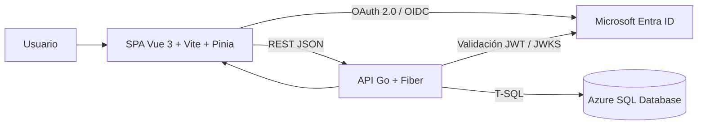

# Arquitectura y contratos del sistema Poli-REDI

**Estado:** CANÓNICO  
**Motor de persistencia:** Azure SQL Database

## 1. Vista general

La arquitectura es cliente-servidor desacoplada. La interfaz presenta el estado y solicita acciones; el backend decide identidad, permisos y reglas; Azure SQL protege integridad y concurrencia.

## 2. Responsabilidades por capa

### Frontend

- Autenticación mediante MSAL o modo local controlado.
- Navegación pública, autenticada y administrativa.
- Disponibilidad, reserva, detalle, historial, talleres y panel base.
- Estados asíncronos consistentes: carga inicial, refresh y mutación.
- Accesibilidad de tarjetas, diálogos, foco, teclado y movimiento reducido.
- Presentación segura por audiencia, sin ampliar permisos.

### Backend

- Validar token, issuer, audience y claims.
- Resolver usuario local, rol, bloqueo y RUT.
- Aplicar autorización en servidor.
- Validar reglas temporales, políticas, cupos y conflictos.
- Entregar contratos sanitizados para usuarios normales.
- Traducir errores de base de datos a errores de dominio seguros.

### Base de datos

- Persistir usuarios, recursos, reservas, participantes, talleres, inscripciones, actividades, notificaciones y auditoría.
- Aplicar constraints, índices, triggers y vistas.
- Defender reglas críticas ante escrituras concurrentes o externas.
- Mantener políticas versionadas y snapshots por solicitud.

## 3. Contratos de seguridad

1. El cliente nunca decide la identidad del usuario autenticado.
2. Los endpoints administrativos verifican rol en backend.
3. `DEV_AUTH_ENABLED` es exclusivo de desarrollo y debe estar desactivado en nube.
4. Una reserva ajena no expone identidad, actividad, participantes, capacidad, deadline ni permisos.
5. El código grupal no aparece en listados; se recupera bajo demanda por el propietario.
6. Los errores públicos no deben incluir SQL, secretos, tokens ni detalles internos.

## 4. Contrato temporal

- La agenda utiliza fecha y hora institucional de muro en `America/Santiago`.
- `DATETIME2` de agenda no debe interpretarse automáticamente como UTC.
- `created_at` y `updated_at` generados con `SYSUTCDATETIME()` representan UTC técnico.
- Los intervalos se consideran semiabiertos: `[inicio, fin)`; extremos contiguos están permitidos.

## 5. Contrato de políticas de reserva

- Cada solicitud referencia la política vigente al crearse.
- Las modificaciones administrativas son prospectivas.
- Sin política publicada válida, la creación falla cerrada.
- El recurso y la política determinan si la reserva queda `PENDING` o `CONFIRMED`.
- La capacidad y los límites críticos se congelan en snapshots cuando corresponde.

## 6. Contrato de disponibilidad

La taxonomía visible separa tipo u origen del bloque de su estado:

- Reserva.
- Reserva grupal.
- Uso libre.
- Taller.
- Clase.
- Entrenamiento.
- Campeonato.
- Evento.
- Institucional.

El backend publica una categoría segura y el frontend conserva la misma clasificación en vistas por recurso y agenda del día.

## 7. Contrato asíncrono de interfaz

- El skeleton aparece solo durante la primera carga y sin datos previos.
- Un refresh conserva los datos y muestra un indicador discreto.
- Una mutación conserva el contexto y muestra un spinner local.
- Las consultas se deduplican y se protegen contra respuestas obsoletas.
- Historial puede conservar resultados parciales si falla una sola fuente.

## 8. Componentes y paquetes relevantes

| Área | Estructura esperada |
|---|---|
| Backend | `cmd/`, `internal/routes/`, `middleware/`, `handlers/`, `services/`, `repositories/`, `models/`, `validators/` |
| Frontend | `views/`, `components/`, `stores/`, `services/`, `router/`, `auth/`, `utils/`, `assets/styles/` |
| Base de datos | `schema.sql`, `seed.sql`, `drop.sql`, `migrations/` |

## 9. Riesgos arquitectónicos abiertos

- Validación integrada en Azure SQL y entorno online pendiente.
- Gestión administrativa incompleta.
- Contrato de bloqueos aún no integrado plenamente en disponibilidad.
- Bundle frontend por optimizar.
- La defensa por trigger no reemplaza el orden transaccional definido por repositorios para evitar deadlocks.
