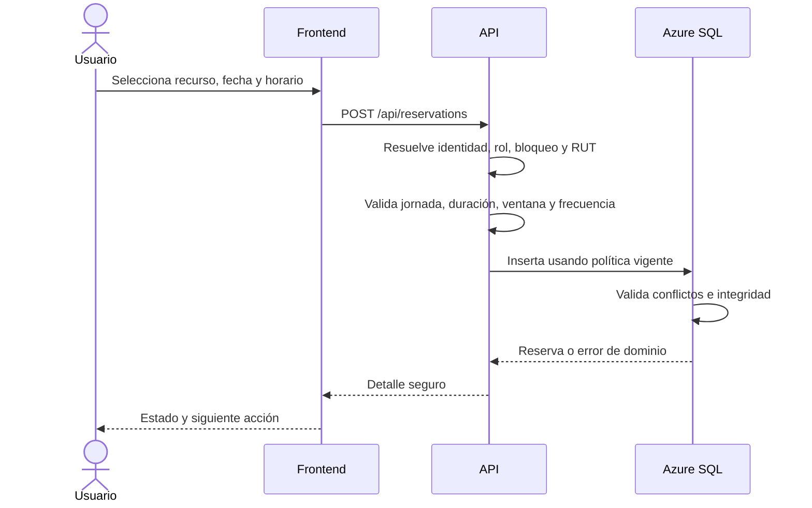

# Flujos y reglas de negocio de Poli-REDI

**Estado:** CANÓNICO

## 1. Creación de reserva

### Reglas

- El usuario se obtiene de la sesión, nunca del payload.
- Las duraciones aprobadas son 30, 60, 90, 120, 150 y 180 minutos.
- La ventana vigente permite seleccionar desde hoy hasta el día anterior al mismo día de la semana siguiente.
- La frecuencia se calcula desde la creación de la solicitud activa anterior.
- `PENDING` consume oportunidad; `CANCELLED` deja de consumirla.
- La política aplicable queda asociada a la solicitud.

## 2. Recursos `OPEN_USE`

- No exigen quórum grupal.
- No consumen la frecuencia de solicitudes normales.
- Permiten concurrencia sobre el recurso.
- El mismo usuario no puede solapar una reserva propia o una participación confirmada.
- Los extremos contiguos están permitidos.

## 3. Flujo grupal

1. Las canchas grupales crean una solicitud `PENDING` y bloquean el horario.
2. El propietario cuenta dentro del mínimo y no puede retirar su participación.
3. El mínimo vigente es 10; el objetivo opcional no puede bajar del mínimo ni superar capacidad.
4. El código se almacena como hash y secreto cifrado; se consulta bajo demanda.
5. Los participantes ingresan manualmente o mediante `/join/:code`.
6. Confirmar valida autenticación, cupo, deadline y solape personal.
7. Al alcanzar el mínimo, la solicitud pasa a `CONFIRMED`.
8. Si una retirada válida deja el conteo bajo el mínimo, vuelve a `PENDING`.
9. Si vence bajo el mínimo, se cancela mediante resolución idempotente y libera la oportunidad semanal.
10. El owner puede rotar el código en estados permitidos.

## 4. Agenda personal y solapes

Una persona no puede tener intervalos solapados entre:

- reservas propias activas;
- participaciones `CONFIRMED` en solicitudes grupales;
- talleres activos con inscripción `CONFIRMED` cuando corresponda.

Comparación: `inicio_nuevo < fin_existente` y `fin_nuevo > inicio_existente`. Por ello, `12:00–13:00` y `13:00–14:00` son contiguos, no solapados.

## 5. Talleres

### Inscripción

- Usa al usuario autenticado.
- Exige RUT para usuario normal.
- Valida taller activo, cupo, duplicado y conflictos.
- Crea un episodio `CONFIRMED` y auditoría de alta.

### Desinscripción

- Afecta solo el episodio `CONFIRMED` propio.
- No exige RUT.
- Es idempotente.
- Requiere taller activo; un taller inactivo responde `409 WORKSHOP_ENROLLMENT_CLOSED`.
- Cambia el episodio a `CANCELLED`, libera cupo y deja de bloquear solapes.
- Conserva el episodio en Historial.

### Reinscripción

Crea un episodio nuevo `CONFIRMED`; no reactiva ni elimina el registro cancelado.

## 6. Cancelación de reserva

- Puede ejecutarla el propietario o un administrador autorizado.
- La reserva debe estar en estado activo y no haber finalizado.
- El propietario grupal cancela la solicitud completa para abandonar el flujo.
- La acción debe conservar auditoría y refrescar disponibilidad e historial.

## 7. Conflictos institucionales

Las decisiones aprobadas indican:

- actividad institucional frente a reserva particular: cancelar la reserva particular y notificar al afectado;
- actividad frente a actividad: informar al administrador para cancelar una o mantener ambas.

La gestión institucional completa sigue pendiente de MVP 3; no se debe presentar como flujo cerrado.

## 8. Privacidad por audiencia

| Audiencia | Información permitida |
|---|---|
| Propietario | Detalle propio, progreso, capacidades y acciones. |
| Participante confirmado | Información necesaria para su participación, sin secretos owner-only. |
| Usuario tercero | Bloque seguro sin identidad ni métricas privadas. |
| Administrador | Detalle operacional según permisos. |

## 9. Estados asíncronos

- Carga inicial sin datos: skeleton.
- Refresh: conservar datos y mostrar actividad discreta.
- Mutación: spinner local y controles protegidos contra doble envío.
- Error parcial: conservar información válida y advertir la fuente fallida.

## 10. Casos límite mínimos

- política ausente o no publicada;
- RUT inválido o duplicado;
- reserva en el pasado;
- inicio fuera de paso o jornada;
- objetivo menor al mínimo o mayor a capacidad;
- deadline exacto;
- retiro del propietario;
- rotación de código en estado terminal;
- taller inactivo;
- doble confirmación concurrente;
- solape entre reserva, participación y taller;
- extremos contiguos permitidos.
