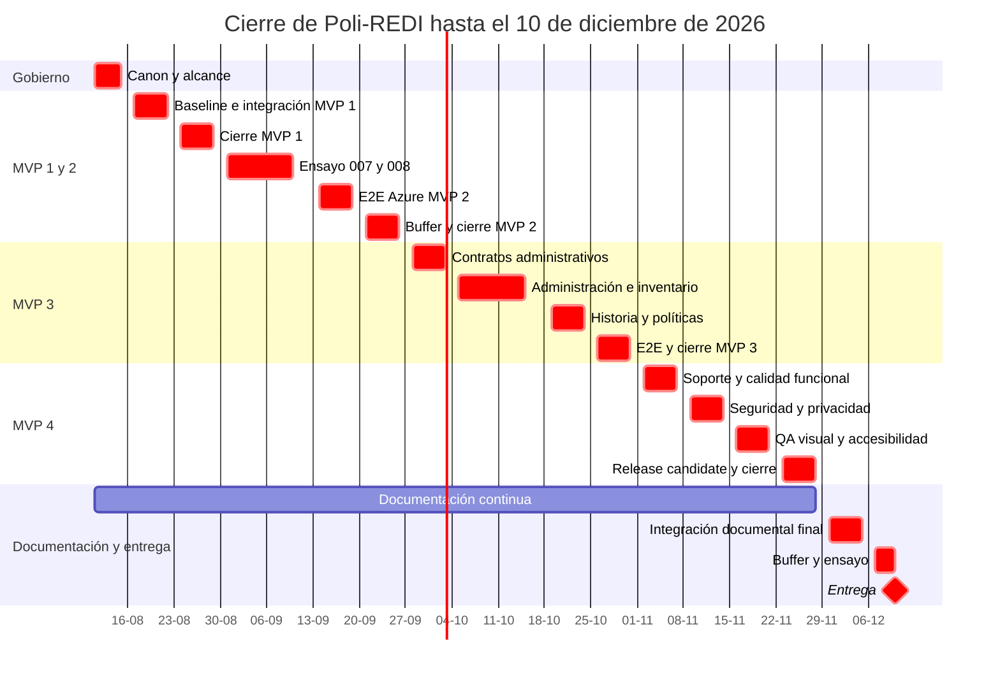

# Cronograma de cierre 2026 de Poli-REDI

**Estado:** CANÓNICO ADOPTADO

**Corte de planificación:** 2026-08-11

**Zona horaria de gestión:** `America/Santiago`
**Fecha límite absoluta:** **2026-12-10**

## 1. Objetivo y restricciones

Este cronograma conduce el prototipo desde su estado parcialmente integrado hasta el cierre técnico, documental y de defensa. La fecha límite no admite desplazar trabajo más allá del 2026-12-10.

Restricciones de planificación:

- MVP 1 es demostrable en local, pero no está cerrado online;
- MVP 2 es parcial y depende de frontend de disponibilidad, migraciones `007`/`008` y Azure;
- MVP 3 es parcial;
- MVP 4 está pendiente y queda acotado a calidad, soporte, sistema core de notificaciones, reportes básicos, auditoría y despliegue;
- la migración `009` no está aprobada y no pertenece a la ruta de ejecución;
- los hitos deben producir evidencia reproducible, no solo una declaración de avance.

## 2. Hitos obligatorios

| Hito | Fecha límite | Criterio de salida |
|---|---:|---|
| Gobierno y alcance congelados | 2026-08-14 | Canon adoptado, asignación de MVP, exclusiones y trazabilidad publicadas. |
| MVP 1 cerrado | 2026-08-28 | Base, identidad, disponibilidad y reserva básica estabilizadas; cualquier brecha online queda explícita y no se oculta. |
| MVP 2 cerrado | 2026-09-25 | Usuario, grupo y talleres verificados de extremo a extremo, incluidas `007`/`008` y Azure. |
| MVP 3 cerrado | 2026-10-30 | Administración, inventario, bloqueos, programación, prioridad, notificación específica de prioridad, pantalla pública sanitizada e historial institucional verificados. |
| MVP 4 cerrado y feature freeze | 2026-11-27 | Calidad, soporte, sistema core de notificaciones, reportes básicos, auditoría, seguridad y despliegue en candidato de entrega. |
| Documentación y evidencia integradas | 2026-12-04 | Memoria, diagramas, anexos, matriz y paquete de evidencia consistentes. |
| Ensayo y buffer final | 2026-12-09 | Regresión final, contingencia y defensa ensayadas. |
| Entrega absoluta | 2026-12-10 | Prototipo y documentación entregados y registrados. |

## 3. Calendario semanal

| Semana | Objetivo | Actividades principales | Roles responsables | Salida verificable |
|---|---|---|---|---|
| 11–14 ago | Gobierno y alcance | Adoptar canon; congelar MVP y exclusiones; baseline de requisitos, riesgos y evidencia | Analista, Arquitecto, Documentador | Índice, alcance, backlog y cronograma coherentes. |
| 17–21 ago | Baseline y estabilización MVP 1 | Auditar contratos; integrar disponibilidad por rango en frontend; regresión local | Arquitecto, Frontend, Backend, QA | Matriz de regresión y defectos priorizados. |
| 24–28 ago | Cierre MVP 1 | Resolver defectos críticos; validar identidad/reserva/disponibilidad; preparar online | Backend, Frontend, QA, DevOps | Acta de cierre MVP 1 con límites de ambiente. |
| 31 ago–4 sep | MVP 2 local y ensayo DB | Congelar flujo grupal/talleres; ensayar `007`/`008` en copia recuperable | Arquitecto, Backend, QA, DevOps | Preflight, postcheck y rollback reproducibles. |
| 7–11 sep | Migraciones MVP 2 | Ejecutar `007`/`008` en orden controlado; validar integridad y no retroactividad | Backend, QA, DevOps | Evidencia DB y decisión de continuidad. |
| 14–18 sep | Integración online MVP 2 | E2E Entra ID, CORS, frontend, API y Azure SQL; privacidad del código | Backend, Frontend, QA, DevOps | Matriz online con resultados y defectos. |
| 21–25 sep | Buffer y cierre MVP 2 | Corregir defectos; regresión grupo/taller; cerrar documentación | Frontend, Backend, QA, Documentador | Acta y checklist MVP 2 aprobables. |
| 28 sep–2 oct | Diseño MVP 3 | Congelar contratos administrativos, permisos, estados, prioridad y auditoría | Analista, Arquitecto, Diseñador UX | Contratos y flujos aceptados por rol. |
| 5–9 oct | Administración base | Inventario, modos de recursos, usuarios y bloqueos | Backend, Frontend, QA | Flujos CRUD autorizados con trazabilidad. |
| 12–16 oct | Programación institucional | Bloqueos, talleres/clases/eventos, prioridad, notificación específica y conflictos | Backend, Frontend, QA | Resolución determinista de conflictos y evento específico verificable. |
| 19–23 oct | Historia, pantalla y reglas | Historial institucional, pantalla pública sanitizada, filtros, políticas e infracciones acotadas | Backend, Frontend, QA | Historia consultable sin inferir asistencia y vista pública sin datos personales. |
| 26–30 oct | Buffer y cierre MVP 3 | E2E administrativo, concurrencia, permisos, regresión y documentación | Arquitecto, QA, Documentador | Acta y checklist MVP 3 aprobables. |
| 2–6 nov | Construcción MVP 4 | Sistema core de notificaciones, reportes básicos, auditoría y soporte | Backend, Frontend, QA | Flujos funcionales integrados. |
| 9–13 nov | Seguridad y privacidad | Revisar autorización, secretos, datos, dependencias y configuración | Arquitecto, Backend, QA, DevOps | Hallazgos clasificados y críticos resueltos. |
| 16–20 nov | QA visual y accesibilidad | Responsive, esqueleto, teclado, foco, contraste, lector y privacidad visual | Diseñador UX, Frontend, QA | Matriz visual/accesible aprobable. |
| 23–27 nov | Feature freeze y cierre MVP 4 | Regresión, candidato, despliegue, monitoreo básico y rollback | QA, DevOps, Documentador | Release candidate y acta MVP 4. |
| 30 nov–4 dic | Integración documental | Consolidar memoria, diagramas, anexos, evidencia y referencias | Documentador, Analista, Arquitecto | Paquete documental completo. |
| 7–9 dic | Buffer final y defensa | Smoke final, contingencia, demo y ensayo de defensa | QA, DevOps, Analista, Documentador | Candidato final y ensayo registrado. |
| 10 dic | Entrega | Verificar paquete, entregar y registrar recepción | Documentador | Entrega completada. |

## 4. Gantt de cierre

## 5. Ruta crítica

```mermaid
flowchart LR
    A["Canon y alcance"] --> B["Baseline MVP 1 y 2"]
    B --> C["Migraciones 007 y 008"]
    C --> D["E2E Azure MVP 2"]
    D --> E["Contratos administrativos"]
    E --> F["MVP 3 integrado"]
    F --> G["MVP 4 acotado"]
    G --> H["Seguridad, accesibilidad y QA"]
    H --> I["Release candidate Azure"]
    I --> J["Evidencia, memoria y diagramas"]
    J --> K["Entrega 2026-12-10"]
```

Una demora en cualquier nodo crítico consume el buffer posterior. Ninguna ampliación de alcance puede desplazar seguridad, E2E, documentación o entrega.

## 6. Corriente documental paralela

| Periodo | Documentación a cerrar | Responsable principal |
|---|---|---|
| 11 ago–4 sep | Problema, objetivos, alcance, metodología, requisitos y gobierno | Documentador / Analista |
| 7 sep–2 oct | Arquitectura, datos, migraciones y resultados MVP 1–2 | Documentador / Arquitecto |
| 5 oct–6 nov | Administración, diagramas y resultados MVP 3 | Documentador / Arquitecto |
| 9–27 nov | Pruebas, seguridad, resultados, conclusiones y referencias | Documentador / QA |
| 30 nov–9 dic | Integración, formato, anexos, evidencia y defensa | Documentador |

La documentación histórica se cita o anota; no se reescribe para simular el estado actual.

## 7. Criterios de salida transversales

Cada hito exige:

- alcance congelado y trazado a requisitos;
- defectos críticos y altos resueltos o aceptación explícita del riesgo;
- pruebas reproducibles con fecha, ambiente y resultado;
- seguridad y privacidad revisadas para los flujos afectados;
- documentación y diagramas sincronizados;
- despliegue y reversión definidos cuando aplica;
- checklist y acta de decisión.

## 8. Riesgos y respuesta

| Riesgo | Impacto | Respuesta y responsable |
|---|---|---|
| Ambigüedad o expansión de alcance | Consume buffers y compromete la entrega | Control de cambios semanal; Analista y Arquitecto. |
| Una sola base de datos disponible | Eleva riesgo de migraciones | Copia recuperable, backup, pre/postcheck y rollback; DevOps y Backend. |
| Cuota o costo de Azure | Impide evidencia online | Ventana de prueba acordada, smoke priorizado y evidencia local claramente rotulada; DevOps. |
| Ejecutar `009` sin aprobación | Daño o divergencia de datos | Mantenerla fuera de ejecución hasta decisión formal; Arquitecto y DevOps. |
| Amplitud de MVP 3–4 | Cierre incompleto | Respetar asignación final y exclusiones; Analista. |
| Evidencia desactualizada | Dictamen no defendible | Registrar evidencia por incremento; QA y Documentador. |
| Filtración de datos o secretos | Riesgo técnico y académico alto | Revisión de privacidad, configuración y logs antes de cada despliegue; Arquitecto y QA. |
| Defectos tardíos de UI/accesibilidad | Retrasa el candidato | QA incremental desde MVP 1 y semana dedicada en noviembre; Diseñador UX y QA. |
| Documentación o diagramas atrasados | Entrega inconsistente | Corriente paralela y congelamiento el 2026-12-04; Documentador. |

## 9. Gobierno del cambio

Los cambios de alcance posteriores al 2026-08-14 requieren registrar impacto en ruta crítica, riesgos y fecha de entrega. Si un cambio amenaza el 2026-12-10, debe diferirse o sustituir alcance equivalente; no puede eliminar pruebas, seguridad, documentación ni el buffer final.
