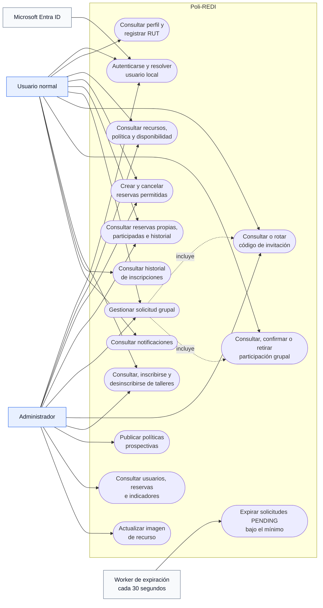
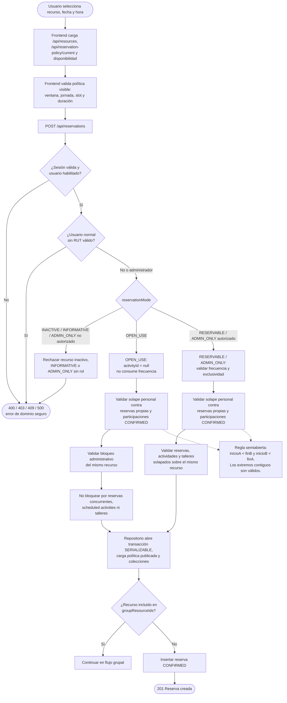
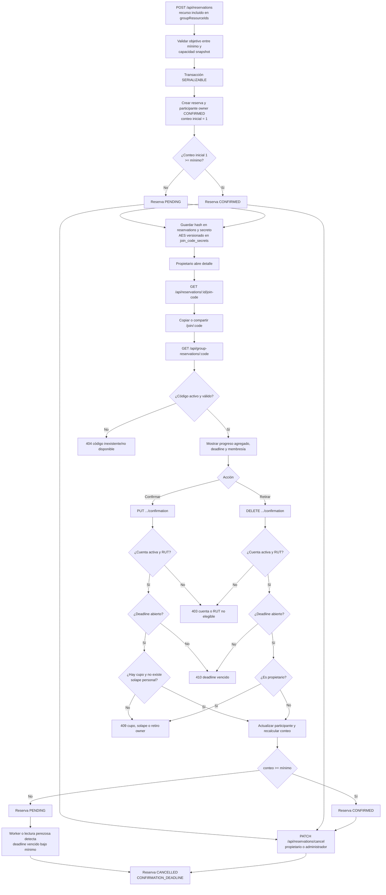
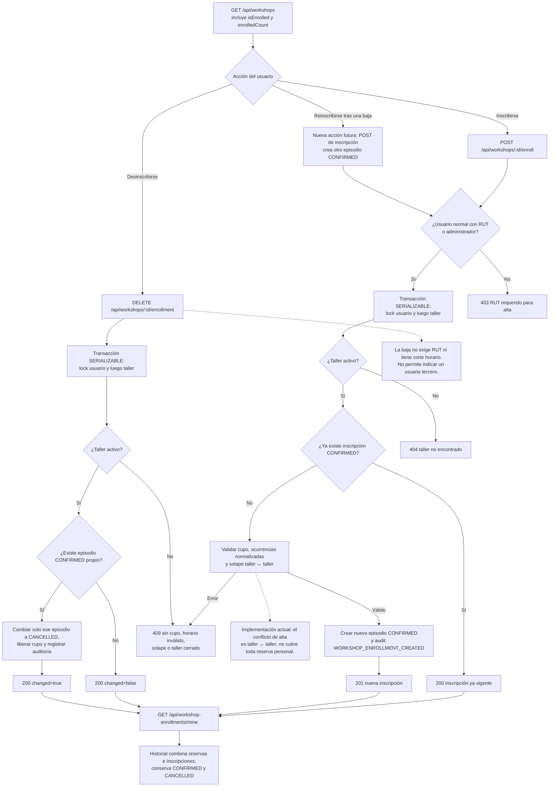
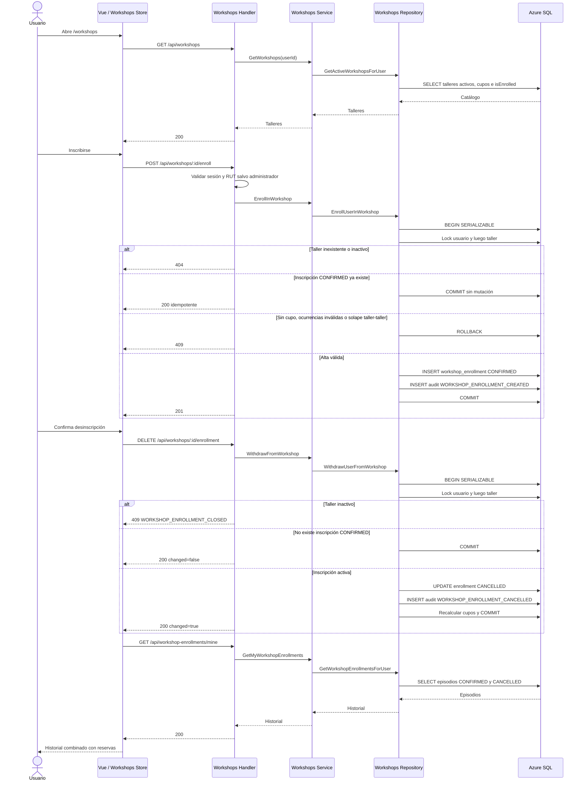
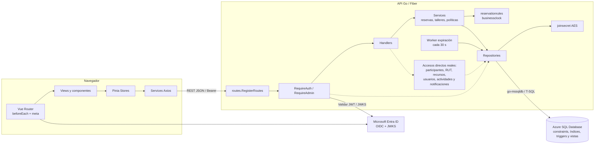
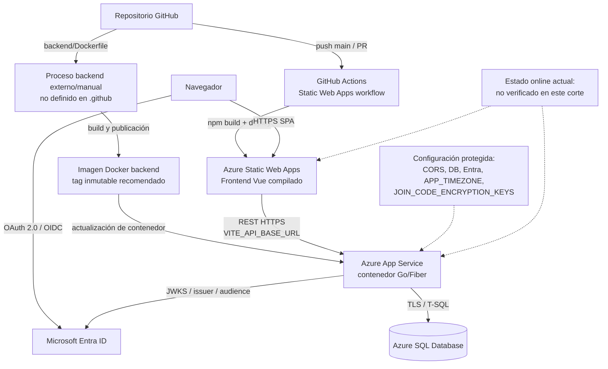

# Diagramas de arquitectura, flujos y secuencias de Poli-REDI

**Estado documental:** PROPUESTA TÉCNICA CONTRASTADA CON EL CÓDIGO LOCAL

**Fecha de corte:** 2026-08-11

**Alcance:** MVP 1, MVP 2 y límites conocidos hacia MVP 3/MVP 4

## 1. Propósito y criterio de lectura

Este documento consolida los diagramas que faltan en la documentación vigente
y corrige representaciones que ya no coinciden con la implementación. El
contraste se realizó contra las rutas, handlers, servicios, repositorios,
modelos, frontend y esquema T-SQL disponibles en el árbol de trabajo local.

Las etiquetas de estado se interpretan así:

- **IMPLEMENTADO EN CÓDIGO:** existe una implementación observable en el
  árbol local; no demuestra por sí sola despliegue ni validación integrada.
- **PENDIENTE / NO VALIDADO:** existe diseño o trabajo local, pero falta una
  verificación completa del flujo indicado.
- **PARCIAL:** solo una parte del caso de uso o de la administración está
  disponible.
- **PROPUESTA:** todavía requiere aprobación, integración o migración formal.

El feed unificado de disponibilidad por rango, con reservas, actividades
programadas, talleres, bloqueos y banderas de conflicto, está
**IMPLEMENTADO EN CÓDIGO en el backend local**. Su integración completa en el
frontend se considera **PENDIENTE / NO VALIDADA** en este corte. No se afirma
que el flujo haya sido ejecutado en Azure ni que los cambios locales hayan sido
publicados.

Documentos relacionados:

- [Arquitectura y contratos](./02-arquitectura-y-contratos.md)
- [Requisitos y casos de uso](./03-requisitos-casos-uso-y-trazabilidad.md)
- [Base de datos y migraciones](./04-base-de-datos-y-migraciones.md)
- [Instalación, despliegue y recuperación](./05-instalacion-despliegue-y-recuperacion.md)
- [Flujos y reglas de negocio](./06-flujos-y-reglas-de-negocio.md)

## 2. Actores y casos de uso

**Objetivo:** delimitar quién inicia cada capacidad y separar usuarios,
administración, identidad externa y procesos automáticos.

**Alcance y estado:** las capacidades de usuario del MVP 1 y MVP 2 existen en
el código local. La administración de usuarios, inventario, bloqueos,
programación, notificaciones y reportes continúa parcial.



### Notas de decisión y divergencia

- La autenticación externa acredita identidad; el backend resuelve el usuario
  local, rol, bloqueo y RUT.
- El administrador reutiliza varios casos de uso de usuario, pero su exención
  de RUT no aplica al confirmar como participante grupal.
- `GROUP` y `CODE` están disponibles para usuario normal o administrador solo
  respecto de una solicitud de la que sea propietario.
- No existe un componente llamado `AdminGuard`. El frontend usa
  `router.beforeEach` y metadatos `requiresAdmin`; la autorización efectiva se
  aplica con `RequireAdmin` en el backend.
- Las rutas frontend reales son `/availability`, `/reservations`, `/history`,
  `/workshops`, `/join/:code?` y `/admin`; no `/disponibilidad` ni
  `/mis-reservas`.

## 3. Máquina de estados de una reserva

**Objetivo:** representar las transiciones operativas implementadas y corregir
la afirmación de que el retiro de participantes cancela automáticamente una
solicitud grupal.

**Alcance y estado:** implementado en el flujo grupal local. La finalización por
transcurso del horario se deriva para presentación e historial; no existe un
estado persistido `COMPLETED` para reservas.

```mermaid
stateDiagram-v2
    [*] --> CONFIRMED : Crear reserva no grupal
    [*] --> PENDING : Crear solicitud grupal; conteo inicial bajo el mínimo

    PENDING --> PENDING : Confirmación o retiro sin alcanzar el mínimo
    PENDING --> CONFIRMED : Confirmación deja conteo >= mínimo
    CONFIRMED --> CONFIRMED : Cambio mantiene conteo >= mínimo
    CONFIRMED --> PENDING : Retiro no-owner deja conteo < mínimo

    PENDING --> CANCELLED : Deadline vencido y conteo < mínimo
    PENDING --> CANCELLED : Cancela propietario o administrador
    CONFIRMED --> CANCELLED : Cancela propietario o administrador

    CANCELLED --> [*]

    note right of PENDING
      El propietario ya cuenta como
      participante CONFIRMED.
    end note

    note right of CONFIRMED
      Finalizar el horario no cambia
      el estado persistido; Historial
      lo deriva de fecha y hora.
    end note
```



### Notas de decisión y divergencia

- El propietario no puede retirar su participación; para abandonar el flujo
  cancela la solicitud completa.
- Confirmar, retirar y editar el objetivo permiten el instante exacto del
  deadline y se cierran cuando `now` queda después del plazo.
- Una solicitud `PENDING` solo pasa a `CANCELLED` por expiración bajo el mínimo
  o por cancelación autorizada; un retiro ordinario recalcula `PENDING` o
  `CONFIRMED`.
- El modelo y el constraint SQL también admiten `REJECTED` y `EXPIRED`, pero
  no existen rutas backend que produzcan esas transiciones en este corte.
- La cancelación manual implementada se permite mientras la reserva no haya
  finalizado. Un cutoff anticipado configurable es una decisión futura y no se
  representa como comportamiento vigente.

## 4. Flujo de reserva individual y recurso `OPEN_USE`

**Objetivo:** separar las reglas de agenda personal de la exclusividad del
recurso y mostrar por qué `OPEN_USE` admite concurrencia sin permitir solapes
personales.

**Alcance y estado:** creación y reglas principales implementadas localmente.
El feed backend por rango está implementado en código; la experiencia frontend
completa que lo consume permanece pendiente/no validada.



### Notas de decisión y divergencia

- `OPEN_USE` no consume la frecuencia de solicitudes normales y no se permite
  como recurso grupal en una política publicada.
- Los bloqueos administrativos activos sí afectan `OPEN_USE` en el contrato
  SQL actual. Reservas concurrentes, actividades programadas y talleres no
  bloquean el recurso `OPEN_USE`.
- El solape personal abarca reservas propias y participaciones grupales
  `CONFIRMED`; no abarca de forma general una inscripción a taller situada en
  otro recurso.
- El backend decide identidad, política y permisos. Las validaciones del
  frontend solo anticipan errores y no son una barrera de seguridad.

## 5. Flujo grupal completo

**Objetivo:** cubrir creación, secreto, consulta del código, unión, cambios de
participación, confirmación, retorno a pendiente, expiración y cancelación.

**Alcance y estado:** implementado y probado localmente según la evidencia
existente. La ejecución integrada sobre Azure SQL y el ambiente online no queda
demostrada por este documento.



### Notas de decisión y divergencia

- El código no viaja en listados ni en la respuesta normal de creación. El
  propietario lo recupera bajo demanda y puede rotarlo en estados activos.
- Un no propietario, una reserva terminal o un secreto inexistente reciben una
  respuesta uniforme de no disponibilidad, sin filtrar información.
- `GET /api/group-reservations/:code` entrega progreso agregado; no constituye
  un contrato completo de recurso, actividad o identidad del propietario.
- El owner cuenta desde la creación y no puede retirarse como participante.

## 6. Talleres: alta, baja, reinscripción e historial

**Objetivo:** representar cada episodio de inscripción sin confundir una baja
con eliminación ni una inscripción con evidencia de asistencia.

**Alcance y estado:** alta, baja propia idempotente, cupo, auditoría,
reinscripción e historial están implementados en código local. La integración
online no está validada.



### Notas de decisión y divergencia

- El taller debe seguir activo para permitir la baja. Repetir la baja sobre un
  taller activo devuelve `changed=false`; un taller inactivo responde
  `409 WORKSHOP_ENROLLMENT_CLOSED`.
- La reinscripción crea una fila nueva `CONFIRMED`; no reactiva la fila
  `CANCELLED`.
- Historial ordena los talleres por `enrolledAt`; el filtro de fechas no usa la
  fecha de cada ocurrencia semanal.
- La alta valida solapes entre talleres activos con inscripciones
  `CONFIRMED`. No existe una regla general taller ↔ reserva personal entre
  recursos diferentes.

## 7. Secuencia completa MVP 1

**Objetivo:** mostrar lectura de contexto, creación, consulta personal y
cancelación con las capas reales y sus errores principales.

**Alcance y estado:** base MVP 1 implementada localmente. El bloque de
disponibilidad por `from/to` se identifica expresamente como trabajo backend
implementado, con integración frontend pendiente/no validada.

```mermaid
sequenceDiagram
    actor U as Usuario
    participant FE as Vue / Pinia / Axios
    participant API as Fiber Routes + Handlers
    participant SVC as Reservations Service
    participant REP as Repositories
    participant SQL as Azure SQL

    U->>FE: Abre /availability
    par Contexto de usuario
        FE->>API: GET /api/me
        API->>REP: Resolver usuario local
        REP->>SQL: SELECT users
        SQL-->>REP: Usuario, rol, bloqueo y RUT
        REP-->>API: LocalAuthUser
        API-->>FE: Perfil sanitizado
    and Catálogos y política
        FE->>API: GET /api/resources, /api/activities y /api/reservation-policy/current
        API->>REP: Consultar catálogos y política publicada
        REP->>SQL: SELECT resources, activities y reservation_policies
        SQL-->>REP: Datos vigentes
        REP-->>API: Modelos
        API-->>FE: JSON
    and Disponibilidad
        FE->>API: GET /api/availability/reservations
        Note over FE,REP: from/to y feed unificado: backend implementado; frontend pendiente/no validado
        API->>SVC: GetAvailabilityItems o GetAvailabilityItemsForRange
        SVC->>REP: Consultar fuentes de agenda
        REP->>SQL: SELECT agenda
        SQL-->>REP: Bloques
        REP-->>SVC: Elementos
        SVC-->>API: Payload por audiencia
        API-->>FE: Disponibilidad sanitizada
    end

    U->>FE: Selecciona recurso, fecha, hora y duración
    FE->>FE: Validación de política visible
    FE->>API: POST /api/reservations
    API->>API: RequireAuth, JSON estricto, RUT y hora institucional

    alt Datos o sesión inválidos
        API-->>FE: 400 / 401 / 403
        FE-->>U: Error accionable
    else Solicitud válida
        API->>SVC: CreateReservation(usuario de sesión)
        SVC->>REP: GetResourceByID y frecuencia aplicable
        REP->>SQL: SELECT resource y última solicitud activa
        SQL-->>REP: Contexto
        SVC->>SVC: Validar pasado, modo, frecuencia y taller del recurso
        SVC->>REP: AddReservationWithPolicy
        REP->>SQL: BEGIN SERIALIZABLE
        REP->>SQL: Cargar política publicada y colecciones
        REP->>SQL: Validar solape personal
        REP->>SQL: INSERT reservation
        SQL->>SQL: Constraints y triggers de conflictos

        alt Conflicto o regla de negocio
            SQL-->>REP: Error numerado y rollback
            REP-->>SVC: Error
            SVC-->>API: Error de dominio
            API-->>FE: 400 / 409 / 500
            FE-->>U: Motivo seguro
        else Creación exitosa
            SQL-->>REP: Reserva CONFIRMED
            REP->>SQL: COMMIT
            REP-->>SVC: Reserva creada
            SVC-->>API: Resultado
            API-->>FE: 201
            FE-->>U: Detalle actualizado
        end
    end

    U->>FE: Abre /reservations o /history
    FE->>API: GET /api/reservations/mine
    API->>SVC: GetMyReservations
    SVC->>REP: Reservas propias o participadas
    REP->>SQL: SELECT reservations + participants
    SQL-->>REP: Lista
    REP-->>SVC: Reservas
    SVC-->>API: Lista sanitizada
    API-->>FE: 200

    opt Propietario o administrador cancela
        U->>FE: Confirma cancelación
        FE->>API: PATCH /api/reservations/cancel
        API->>SVC: CancelReservation
        SVC->>REP: Snapshot de dueño, estado y horario
        REP->>SQL: SELECT reservation
        alt Sin permiso, terminal o finalizada
            API-->>FE: 400 / 403 / 404
        else Cancelable
            SVC->>REP: CancelReservation
            REP->>SQL: UPDATE status = CANCELLED
            SQL-->>REP: Reserva cancelada
            REP-->>SVC: Resultado
            SVC-->>API: Resultado
            API-->>FE: 200
        end
    end
```

### Notas de decisión y divergencia

- `GET /api/reservations` requiere administrador. Los usuarios normales usan
  `GET /api/reservations/mine`.
- Recursos y actividades son consultados por handlers que llaman directamente
  a repositorios; no todos los recorridos pasan por servicios.
- La creación devuelve `CONFIRMED` solo cuando el recurso no exige flujo
  grupal. El caso grupal se detalla en la siguiente secuencia.

## 8. Secuencia MVP 2: solicitud grupal

**Objetivo:** mostrar el recorrido completo del código grupal y evidenciar que
los handlers de participantes llaman directamente al repositorio.

**Alcance y estado:** implementado localmente. Azure SQL real, concurrencia del
ambiente desplegado e integración online permanecen no validadas en este corte.

```mermaid
sequenceDiagram
    actor O as Propietario
    actor P as Participante
    participant FE as Vue / Pinia / Modal compartido
    participant API as Fiber Handlers
    participant SVC as Reservations Service
    participant REP as Reservations + Participants Repository
    participant CRYPTO as JoinSecret AES
    participant SQL as Azure SQL
    participant W as Worker 30 s

    O->>FE: Crea solicitud grupal con objetivo
    FE->>API: POST /api/reservations
    API->>SVC: CreateReservation
    SVC->>REP: AddReservationWithPolicy
    REP->>SQL: BEGIN SERIALIZABLE
    REP->>SQL: Leer política, capacidad y mínimo
    REP->>SQL: INSERT reservation PENDING
    REP->>SQL: INSERT owner participant CONFIRMED
    REP->>SQL: INSERT participant audit
    REP->>CRYPTO: Encrypt(código, reservationId)
    CRYPTO-->>REP: version, nonce y ciphertext
    REP->>SQL: INSERT join_code_secret
    REP->>SQL: COMMIT
    API-->>FE: 201 sin código en el listado

    O->>FE: Solicita código desde el detalle
    FE->>API: GET /api/reservations/:id/join-code
    API->>REP: GetOwnerJoinCode
    Note over API,REP: Participantes y join code no usan una capa Service intermedia
    REP->>SQL: Validar owner, grupo y estado activo
    alt No owner o estado no disponible
        API-->>FE: 404 uniforme
    else Autorizado
        SQL-->>REP: Secreto cifrado
        REP->>CRYPTO: Decrypt
        CRYPTO-->>REP: Código
        API-->>FE: joinCode
        FE-->>O: Copiar o compartir /join/:code
    end

    P->>FE: Abre /join/:code
    FE->>API: GET /api/group-reservations/:code
    API->>REP: GetReservationProgress
    REP->>REP: Expirar pendientes vencidas
    REP->>SQL: SELECT agregado por hash
    alt Código cancelado, rotado o inexistente
        API-->>FE: 404
    else Código activo
        SQL-->>REP: Conteo, mínimo, objetivo, capacidad, deadline y membresía
        API-->>FE: Progreso agregado
        FE-->>P: Modal compartido
    end

    P->>FE: Confirmar participación
    FE->>API: PUT /api/group-reservations/:code/confirmation
    API->>REP: ChangeParticipation(confirm = true)
    REP->>SQL: BEGIN SERIALIZABLE
    REP->>SQL: Lock reserva, usuario y participante
    REP->>SQL: Validar RUT, bloqueo, deadline, cupo y solape personal

    alt Cuenta o RUT no elegible
        API-->>FE: 403
    else Deadline vencido
        API-->>FE: 410
    else Cupo o solape
        API-->>FE: 409
    else Confirmación válida
        REP->>SQL: INSERT/UPDATE participant CONFIRMED
        REP->>SQL: Recalcular conteo y estado PENDING/CONFIRMED
        REP->>SQL: INSERT participant audit
        REP->>SQL: COMMIT
        API-->>FE: 200 progreso actualizado
    end

    opt Participante no propietario se retira antes del deadline
        P->>FE: Retirar participación
        FE->>API: DELETE /api/group-reservations/:code/confirmation
        API->>REP: ChangeParticipation(confirm = false)
        REP->>SQL: Lock reserva y usuario; validar bloqueo, RUT y deadline
        alt Cuenta bloqueada o RUT ausente
            API-->>FE: 403
        else Deadline vencido
            API-->>FE: 410
        else Cuenta elegible y deadline abierto
            REP->>SQL: Lock participante
            alt Es propietario
                API-->>FE: 409 owner no puede retirarse
            else Válido
                REP->>SQL: CANCEL participant y recalcular estado
                API-->>FE: 200 PENDING o CONFIRMED
            end
        end
    end

    loop Cada 30 segundos y también en lecturas
        W->>REP: ExpirePendingGroupReservations
        REP->>SQL: Buscar PENDING con deadline vencido
        alt Bajo el mínimo
            REP->>SQL: UPDATE CANCELLED + expiration + notification
        end
    end
```

### Notas de decisión y divergencia

- La respuesta de progreso es agregada y no expone PII, actividad privada ni
  el secreto del propietario.
- La rotación reemplaza el hash y el secreto cifrado; el código anterior deja
  de resolver la solicitud.
- La expiración combina worker periódico y resolución perezosa desde consultas
  o acciones.

## 9. Secuencia MVP 2: talleres

**Objetivo:** documentar alta, baja propia idempotente e historial con el orden
transaccional implementado.

**Alcance y estado:** implementado en código local; no validado de punta a punta
en Azure en este corte.



### Notas de decisión y divergencia

- La baja no exige RUT y no recibe un `userId` desde el cliente.
- El trigger complementa la transacción, pero el camino soportado mantiene el
  orden de locks usuario → taller para reducir carreras y deadlocks.
- La inscripción verifica taller ↔ taller; no debe documentarse todavía como
  una agenda personal unificada con todas las reservas.

## 10. Componentes internos reales

**Objetivo:** mostrar la estructura real sin imponer una capa de servicio donde
el código no la utiliza.

**Alcance y estado:** refleja el árbol local. La arquitectura es principalmente
por capas, con accesos directos Handler → Repository en varios dominios.



### Notas de decisión y divergencia

- `participants_handlers.go`, `me_handler.go`, `resources_handlers.go`,
  `users_handlers.go`, `activities_handlers.go` y
  `notifications_handlers.go` llaman repositorios directamente en todo o parte
  de sus operaciones.
- Reservas, talleres y políticas sí poseen servicios de dominio explícitos.
- El middleware consulta y sincroniza el usuario local; la autorización no se
  deduce del estado de la interfaz.

## 11. Despliegue real

**Objetivo:** separar el pipeline frontend observable del procedimiento backend
que no está automatizado en este repositorio.

**Alcance y estado:** la configuración y los artefactos existen, pero este
documento no afirma disponibilidad online actual ni una prueba integrada de
Microsoft Entra ID, CORS, App Service y Azure SQL.



### Notas de decisión y divergencia

- `.github/workflows/azure-static-web-apps-purple-ground-0205c9f10.yml`
  automatiza el build y despliegue del frontend.
- No existe un workflow equivalente para construir, publicar y actualizar la
  imagen del backend. El diagrama lo rotula como proceso externo/manual y no
  inventa un registro de contenedores concreto.
- `DEV_AUTH_ENABLED` y `VITE_DEV_AUTH_ENABLED` deben permanecer desactivados en
  ambientes públicos. CORS y redirect URIs deben verificarse con el dominio
  realmente desplegado.

## 12. Modelo entidad-relación vigente

**Objetivo:** reemplazar el ER histórico que omitía políticas, secretos,
auditorías, expiraciones y ocurrencias normalizadas.

**Alcance y estado:** representa las relaciones principales de
`database/schema.sql`. No sustituye el detalle de columnas, constraints,
índices ni triggers.

```mermaid
erDiagram
    VENUES ||--o{ RESOURCES : contiene
    USERS ||--o{ RESERVATIONS : crea
    USERS ||--o{ PARTICIPANTS : participa
    USERS ||--o{ WORKSHOP_ENROLLMENTS : registra
    USERS ||--o{ AVAILABILITY_BLOCKS : crea
    USERS ||--o{ SCHEDULED_ACTIVITIES : crea
    USERS ||--o{ NOTIFICATIONS : recibe
    USERS o|--o{ AUDIT_LOGS : ejecuta
    USERS o|--o{ RESERVATION_POLICIES : publica
    USERS ||--o{ VIOLATIONS : recibe
    USERS o|--o{ VIOLATIONS : registra
    USERS ||--o{ RESERVATION_PARTICIPANT_AUDIT : actua
    USERS ||--o{ RESERVATION_PARTICIPANT_AUDIT : afecta
    USERS ||--o{ RESERVATION_TARGET_AUDIT : modifica

    RESOURCES o|--o{ RESERVATIONS : recibe
    RESOURCES ||--o{ WORKSHOPS : aloja
    RESOURCES ||--o{ AVAILABILITY_BLOCKS : bloquea
    RESOURCES ||--o{ SCHEDULED_ACTIVITIES : programa

    ACTIVITIES o|--o{ RESERVATIONS : clasifica
    ACTIVITIES o|--o{ SCHEDULED_ACTIVITIES : clasifica

    RESERVATION_POLICIES ||--o{ RESERVATIONS : versiona
    RESERVATION_POLICIES ||--o{ RESERVATION_POLICY_RESOURCES : permite
    RESERVATION_POLICIES ||--o{ RESERVATION_POLICY_GROUP_RESOURCES : agrupa
    RESERVATION_POLICIES ||--o{ RESERVATION_POLICY_DURATIONS : admite
    RESERVATION_POLICIES ||--o| RESERVATION_POLICY_SCOPE_MIGRATIONS : migra
    RESOURCES ||--o{ RESERVATION_POLICY_RESOURCES : integra
    RESOURCES ||--o{ RESERVATION_POLICY_GROUP_RESOURCES : integra

    RESERVATIONS ||--o{ PARTICIPANTS : contiene
    RESERVATIONS ||--o| RESERVATION_JOIN_CODE_SECRETS : protege
    RESERVATIONS ||--o| RESERVATION_GROUP_EXPIRATIONS : expira
    RESERVATIONS ||--o{ RESERVATION_PARTICIPANT_AUDIT : audita
    RESERVATIONS ||--o{ RESERVATION_TARGET_AUDIT : audita
    RESERVATIONS o|--o{ NOTIFICATIONS : origina
    RESERVATIONS o|--o{ VIOLATIONS : relaciona

    WORKSHOPS ||--o{ WORKSHOP_OCCURRENCES : normaliza
    WORKSHOPS ||--o{ WORKSHOP_ENROLLMENTS : recibe
```



### Notas de decisión y divergencia

- `workshops` referencia un `resource_id`, relación ausente en el ER histórico.
- Las políticas publicadas se relacionan con duraciones y recursos mediante
  tablas puente y quedan referenciadas por cada reserva.
- El secreto recuperable del código se almacena separado del hash usado para
  resolver la invitación.
- Las cardinalidades opcionales reflejan las claves foráneas anulables del
  esquema, aunque rutas de creación como `POST /api/reservations` exijan un
  recurso válido en su contrato de aplicación.
- `database/poliredi_database_improved/` incluye una migración propuesta `009`.
  Se mantiene como **PROPUESTA**: no forma parte de la secuencia oficial ni se
  considera aplicada o validada en Azure.

## 13. Diagramas por completar en MVP3/MVP4

Los siguientes diagramas no deben presentarse como flujos cerrados hasta que
exista una decisión funcional aprobada y una implementación contrastable:

1. **Prioridad institucional y resolución de conflictos**
   - actividad institucional frente a reserva particular;
   - actividad frente a actividad;
   - cancelación, notificación, permisos y auditoría;
   - tratamiento particular de recursos `OPEN_USE`.
2. **Política prospectiva y corrección excepcional**
   - publicación con `Idempotency-Key`;
   - cierre de vigencia anterior;
   - inmutabilidad de versiones publicadas;
   - diferencia entre nueva versión prospectiva y reparación controlada.
3. **Bloqueo y desbloqueo administrativo**
   - alta, modificación y desactivación;
   - conflicto con reservas, solicitudes `PENDING`, actividades y `OPEN_USE`;
   - información pública sanitizada frente al motivo administrativo.
4. **Migración, postcheck y rollback operativo**
   - backup o export;
   - preflight;
   - ejecución con `GO`;
   - postcheck e idempotencia;
   - sesión limpia, recuperación y restauración;
   - evaluación separada de la propuesta `009`.
5. **Composición de disponibilidad por audiencia**
   - reserva propia, participación, reserva ajena y administrador;
   - `RESERVATION`, `SCHEDULED_ACTIVITY`, `WORKSHOP` y
     `AVAILABILITY_BLOCK`;
   - títulos seguros, PII, métricas y banderas de bloqueo;
   - consumo frontend del rango `from/to` una vez validado.
6. **Notificaciones y reportes**
   - generación, lectura, marcado y destinos;
   - expiración grupal, cancelaciones, prioridad e infracciones;
   - vistas SQL, agregación, permisos y exportación.
7. **Corte desde Google Calendar**
   - congelamiento de altas legacy;
   - inventario y conciliación;
   - carga o convivencia temporal;
   - validación, reversa y cierre del sistema anterior.

## 14. Fuentes técnicas contrastadas

- [`backend/internal/routes/routes.go`](../../backend/internal/routes/routes.go)
- [`backend/internal/middleware/auth_middleware.go`](../../backend/internal/middleware/auth_middleware.go)
- [`backend/internal/services/reservations_service.go`](../../backend/internal/services/reservations_service.go)
- [`backend/internal/repositories/reservations_repository.go`](../../backend/internal/repositories/reservations_repository.go)
- [`backend/internal/repositories/participants_repository.go`](../../backend/internal/repositories/participants_repository.go)
- [`backend/internal/repositories/workshops_repository.go`](../../backend/internal/repositories/workshops_repository.go)
- [`backend/internal/repositories/availability_repository.go`](../../backend/internal/repositories/availability_repository.go)
- [`frontend/src/router/index.js`](../../frontend/src/router/index.js)
- [`frontend/src/services/reservations.service.js`](../../frontend/src/services/reservations.service.js)
- [`frontend/src/services/workshops.service.js`](../../frontend/src/services/workshops.service.js)
- [`frontend/src/stores/reservations.js`](../../frontend/src/stores/reservations.js)
- [`frontend/src/stores/workshops.js`](../../frontend/src/stores/workshops.js)
- [`database/schema.sql`](../../database/schema.sql)
