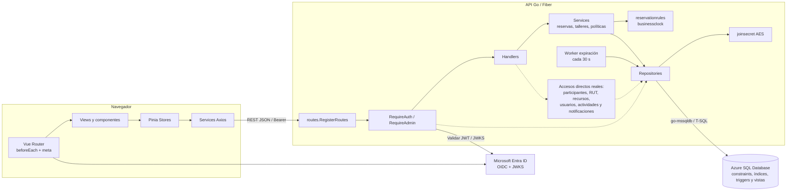
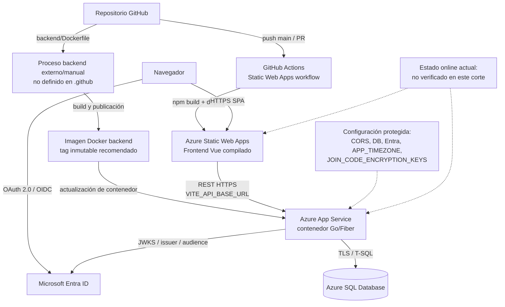

# Anexo — Arquitectura interna y despliegue

**Audiencia:** Arquitecto, desarrollo, QA y DevOps

**Propósito:** representar componentes internos y la topología prevista u observable de despliegue

**Estado:** ANEXO TÉCNICO CONTRASTADO CON EL CÓDIGO LOCAL

**Corte:** 2026-08-11

**Fuente:** código local, configuración de despliegue y arquitectura canónica

**No demuestra:** disponibilidad online actual ni despliegue integrado de frontend, API, identidad y base

## Resumen

- La API combina servicios de dominio con accesos directos a repositorios.
- `RequireAuth` valida identidad y sincroniza el usuario local mediante el
  repositorio; no existe un componente `AdminGuard`.
- El repositorio contiene automatización de Azure Static Web Apps para el
  frontend, no un pipeline equivalente para el backend.
- App Service y Azure SQL describen la topología objetivo/documentada; su
  operación actual no fue verificada en este corte.

Volver a [Arquitectura y contratos](../../02-arquitectura-y-contratos.md).

## 1. Componentes internos reales

**Objetivo:** mostrar la estructura real sin imponer una capa Service donde el
código no la utiliza.

Decisiones y divergencias:

- Participantes, perfil/RUT, recursos, usuarios, actividades y notificaciones
  llaman al repositorio directamente en todo o parte de sus operaciones.
- Reservas, talleres y políticas poseen servicios de dominio explícitos.
- El middleware consulta/sincroniza al usuario local; la autorización no se
  deduce de la interfaz ni de un guard inexistente.
- `joinsecret` cifra el código recuperable; el hash de búsqueda permanece en
  la reserva y no sustituye el secreto owner-only.

## 2. Despliegue documentado

**Objetivo:** separar el pipeline frontend observable del procedimiento
backend que no está automatizado en este repositorio.

Decisiones y divergencias:

- `.github/workflows/azure-static-web-apps-purple-ground-0205c9f10.yml`
  automatiza build y despliegue del frontend.
- No existe un workflow equivalente para construir, publicar y actualizar la
  imagen backend. El diagrama no inventa un registro de contenedores.
- `DEV_AUTH_ENABLED` y `VITE_DEV_AUTH_ENABLED` deben permanecer desactivados en
  ambientes públicos.
- CORS, redirect URIs, health, commit, versiones y conexión a Azure SQL deben
  verificarse juntos antes de afirmar operación online.

## Documentos relacionados

- [Arquitectura y contratos](../../02-arquitectura-y-contratos.md)
- [Base de datos y migraciones](../../04-base-de-datos-y-migraciones.md)
- [Reglas y flujos](../../06-reglas-y-flujos.md)
- [Modelo entidad-relación](modelo-entidad-relacion.md)

## Fuentes

- [`backend/internal/routes/routes.go`](../../../backend/internal/routes/routes.go)
- [`backend/internal/middleware/auth_middleware.go`](../../../backend/internal/middleware/auth_middleware.go)
- [`backend/internal/handlers`](../../../backend/internal/handlers)
- [`backend/internal/services`](../../../backend/internal/services)
- [`backend/internal/repositories`](../../../backend/internal/repositories)
- [`backend/Dockerfile`](../../../backend/Dockerfile)
- [`frontend/src/router/index.js`](../../../frontend/src/router/index.js)
- [`.github/workflows/azure-static-web-apps-purple-ground-0205c9f10.yml`](../../../.github/workflows/azure-static-web-apps-purple-ground-0205c9f10.yml)
