# Anexo — Modelo entidad-relación

**Audiencia:** Arquitecto, Backend, QA y evaluación académica

**Propósito:** representar relaciones principales, cardinalidad y nulabilidad del esquema vigente

**Estado:** ANEXO TÉCNICO CONTRASTADO CON `database/schema.sql`

**Corte:** 2026-08-11

**Fuente:** `database/schema.sql`, migraciones oficiales y modelos del backend

**No demuestra:** migraciones aplicadas en Azure ni integridad de los datos de un ambiente real

## Resumen

- El modelo abarca identidad, inventario, política, reservas, grupos,
  programación, talleres, trazabilidad y notificaciones.
- Las cardinalidades opcionales reflejan claves foráneas anulables del esquema,
  aunque una ruta pueda aplicar un contrato más estricto.
- Las auditorías de participantes distinguen actor y participante afectado.
- `009` no integra este modelo como migración oficial; permanece propuesta.

Volver a [Base de datos y migraciones](../../04-base-de-datos-y-migraciones.md).

## Leyenda

| Símbolo | Significado |
|---|---|
| `||` | exactamente uno |
| `o|` | cero o uno |
| `o{` | cero o más |

El diagrama presenta relaciones, no todas las columnas, índices, constraints o
triggers. Para esos detalles prevalece `database/schema.sql`.

## Modelo vigente

```mermaid
erDiagram
    VENUES ||--o{ RESOURCES : contiene
    USERS ||--o{ RESERVATIONS : crea
    USERS ||--o{ PARTICIPANTS : participa
    USERS ||--o{ WORKSHOP_ENROLLMENTS : registra
    USERS ||--o{ AVAILABILITY_BLOCKS : crea
    USERS ||--o{ SCHEDULED_ACTIVITIES : crea
    USERS ||--o{ NOTIFICATIONS : recibe
    USERS o|--o{ AUDIT_LOGS : ejecuta
    USERS o|--o{ RESERVATION_POLICIES : publica
    USERS ||--o{ VIOLATIONS : recibe
    USERS o|--o{ VIOLATIONS : registra
    USERS ||--o{ RESERVATION_PARTICIPANT_AUDIT : actua
    USERS ||--o{ RESERVATION_PARTICIPANT_AUDIT : afecta
    USERS ||--o{ RESERVATION_TARGET_AUDIT : modifica

    RESOURCES o|--o{ RESERVATIONS : recibe
    RESOURCES ||--o{ WORKSHOPS : aloja
    RESOURCES ||--o{ AVAILABILITY_BLOCKS : bloquea
    RESOURCES ||--o{ SCHEDULED_ACTIVITIES : programa

    ACTIVITIES o|--o{ RESERVATIONS : clasifica
    ACTIVITIES o|--o{ SCHEDULED_ACTIVITIES : clasifica

    RESERVATION_POLICIES ||--o{ RESERVATIONS : versiona
    RESERVATION_POLICIES ||--o{ RESERVATION_POLICY_RESOURCES : permite
    RESERVATION_POLICIES ||--o{ RESERVATION_POLICY_GROUP_RESOURCES : agrupa
    RESERVATION_POLICIES ||--o{ RESERVATION_POLICY_DURATIONS : admite
    RESERVATION_POLICIES ||--o| RESERVATION_POLICY_SCOPE_MIGRATIONS : migra
    RESOURCES ||--o{ RESERVATION_POLICY_RESOURCES : integra
    RESOURCES ||--o{ RESERVATION_POLICY_GROUP_RESOURCES : integra

    RESERVATIONS ||--o{ PARTICIPANTS : contiene
    RESERVATIONS ||--o| RESERVATION_JOIN_CODE_SECRETS : protege
    RESERVATIONS ||--o| RESERVATION_GROUP_EXPIRATIONS : expira
    RESERVATIONS ||--o{ RESERVATION_PARTICIPANT_AUDIT : audita
    RESERVATIONS ||--o{ RESERVATION_TARGET_AUDIT : audita
    RESERVATIONS o|--o{ NOTIFICATIONS : origina
    RESERVATIONS o|--o{ VIOLATIONS : relaciona

    WORKSHOPS ||--o{ WORKSHOP_OCCURRENCES : normaliza
    WORKSHOPS ||--o{ WORKSHOP_ENROLLMENTS : recibe
```

## Decisiones y divergencias

- `reservations.resource_id` es nullable por compatibilidad del esquema; el
  endpoint de creación exige un recurso válido.
- `reservations.activity_id` es opcional y queda `NULL` para `OPEN_USE`.
- `notifications.reservation_id` y `violations.reservation_id` son opcionales.
- `audit_logs.user_id`, `violations.created_by_user_id` y
  `reservation_policies.created_by_user_id` también son opcionales.
- `violations.user_id` identifica al usuario afectado; `created_by_user_id`,
  cuando existe, identifica al actor que la registró.
- `reservation_participant_audit` referencia tanto actor como participante;
  `reservation_target_audit` referencia al actor que modificó el objetivo.
- El secreto recuperable se separa del hash usado para resolver el código.
- Las ocurrencias normalizadas pertenecen al taller; las inscripciones
  conservan episodios `CONFIRMED` y `CANCELLED`.

## Límite de la propuesta `009`

`database/poliredi_database_improved/` contiene una migración `009` propuesta.
No forma parte de `database/migrations/`, no se considera aplicada ni validada
en Azure y no modifica el estado canónico de este anexo hasta ser aprobada,
incorporada a la cadena y ejecutada con evidencia.

## Documentos relacionados

- [Base de datos y migraciones](../../04-base-de-datos-y-migraciones.md)
- [Arquitectura y contratos](../../02-arquitectura-y-contratos.md)
- [Reglas y flujos](../../06-reglas-y-flujos.md)
- [Arquitectura y despliegue](arquitectura-y-despliegue.md)

## Fuentes

- [`database/schema.sql`](../../../database/schema.sql)
- [`database/migrations`](../../../database/migrations)
- [`backend/internal/models`](../../../backend/internal/models)
- [`backend/internal/repositories/reservations_repository.go`](../../../backend/internal/repositories/reservations_repository.go)
- [`backend/internal/repositories/participants_repository.go`](../../../backend/internal/repositories/participants_repository.go)
- [`backend/internal/repositories/workshops_repository.go`](../../../backend/internal/repositories/workshops_repository.go)
