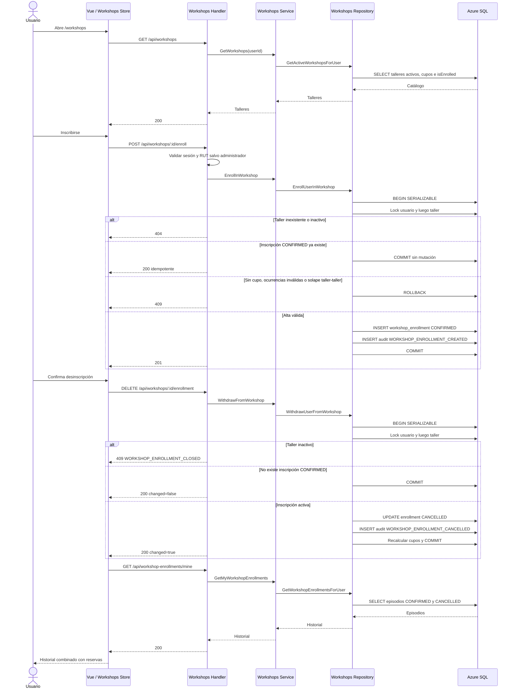

# Anexo — Secuencias MVP 2

**Audiencia:** Analista, Arquitecto, desarrollo y QA

**Propósito:** representar solicitud grupal y talleres a través de frontend, API, repositorios y SQL

**Estado:** IMPLEMENTACIÓN LOCAL PARCIAL; CIERRE INTEGRADO PENDIENTE

**Corte:** 2026-08-11

**Fuente:** código local y arquitectura y reglas canónicas

**No demuestra:** migraciones, concurrencia ni experiencia online validadas en Azure

## Resumen

- El flujo grupal conserva el secreto fuera de listados, agrega progreso y
  cambia el estado según el conteo confirmado.
- Participantes y código owner-only llaman directamente al repositorio.
- Talleres usan Service y Repository, transacción `SERIALIZABLE` y orden de
  locks usuario → taller.
- La baja de taller es propia, idempotente y sin cutoff mientras siga activo.
- El conflicto de inscripción implementado es taller ↔ taller.

Volver a [Reglas y flujos](../../06-reglas-y-flujos.md).

## 1. Solicitud grupal

**Objetivo:** mostrar creación, secreto, unión, confirmación/retiro, quórum y
expiración con los accesos directos reales.

```mermaid
sequenceDiagram
    actor O as Propietario
    actor P as Participante
    participant FE as Vue / Pinia / Modal compartido
    participant API as Fiber Handlers
    participant SVC as Reservations Service
    participant REP as Reservations + Participants Repository
    participant CRYPTO as JoinSecret AES
    participant SQL as Azure SQL
    participant W as Worker 30 s

    O->>FE: Crea solicitud grupal con objetivo
    FE->>API: POST /api/reservations
    API->>SVC: CreateReservation
    SVC->>REP: AddReservationWithPolicy
    REP->>SQL: BEGIN SERIALIZABLE
    REP->>SQL: Leer política, capacidad y mínimo
    REP->>SQL: INSERT reservation PENDING o CONFIRMED según mínimo
    REP->>SQL: INSERT owner participant CONFIRMED
    REP->>SQL: INSERT participant audit
    REP->>CRYPTO: Encrypt(código, reservationId)
    CRYPTO-->>REP: version, nonce y ciphertext
    REP->>SQL: INSERT join_code_secret
    REP->>SQL: COMMIT
    API-->>FE: 201 sin joinCode

    O->>FE: Solicita código desde el detalle
    FE->>API: GET /api/reservations/:id/join-code
    API->>REP: GetOwnerJoinCode
    Note over API,REP: Participantes y join code no usan una capa Service intermedia
    REP->>SQL: Validar owner, grupo y estado activo
    alt No owner o estado no disponible
        API-->>FE: 404 uniforme
    else Autorizado
        SQL-->>REP: Secreto cifrado
        REP->>CRYPTO: Decrypt
        CRYPTO-->>REP: Código
        API-->>FE: joinCode
        FE-->>O: Copiar o compartir /join/:code
    end

    P->>FE: Abre /join/:code
    FE->>API: GET /api/group-reservations/:code
    API->>REP: GetReservationProgress
    REP->>REP: Expirar pendientes vencidas
    REP->>SQL: SELECT agregado por hash
    alt Código cancelado, rotado o inexistente
        API-->>FE: 404
    else Código activo
        SQL-->>REP: Conteo, mínimo, objetivo, capacidad, deadline y membresía
        API-->>FE: Progreso agregado
        FE-->>P: Modal compartido
    end

    P->>FE: Confirmar participación
    FE->>API: PUT /api/group-reservations/:code/confirmation
    API->>REP: ChangeParticipation(confirm = true)
    REP->>SQL: BEGIN SERIALIZABLE
    REP->>SQL: Lock reserva, usuario y participante
    REP->>SQL: Validar RUT, bloqueo, deadline, cupo y solape personal

    alt Cuenta o RUT no elegible
        API-->>FE: 403
    else Deadline vencido
        API-->>FE: 410
    else Cupo o solape
        API-->>FE: 409
    else Confirmación válida
        REP->>SQL: INSERT/UPDATE participant CONFIRMED
        REP->>SQL: Recalcular conteo y estado PENDING/CONFIRMED
        REP->>SQL: INSERT participant audit
        REP->>SQL: COMMIT
        API-->>FE: 200 progreso actualizado
    end

    opt Participante no propietario se retira antes del deadline
        P->>FE: Retirar participación
        FE->>API: DELETE /api/group-reservations/:code/confirmation
        API->>REP: ChangeParticipation(confirm = false)
        REP->>SQL: Lock reserva y usuario; validar bloqueo, RUT y deadline
        alt Cuenta bloqueada o RUT ausente
            API-->>FE: 403
        else Deadline vencido
            API-->>FE: 410
        else Cuenta elegible y deadline abierto
            REP->>SQL: Lock participante
            alt Es propietario
                API-->>FE: 409 owner no puede retirarse
            else Válido
                REP->>SQL: CANCEL participant y recalcular estado
                API-->>FE: 200 PENDING o CONFIRMED
            end
        end
    end

    loop Cada 30 segundos y también en lecturas
        W->>REP: ExpirePendingGroupReservations
        REP->>SQL: Buscar PENDING con deadline vencido
        alt Bajo el mínimo
            REP->>SQL: UPDATE CANCELLED + expiration + notification
        end
    end
```

Decisiones y divergencias:

- El owner se crea `CONFIRMED`; con mínimo 1 el estado inicial puede quedar
  `CONFIRMED`, aunque el caso operativo habitual nace `PENDING`.
- Progreso no expone PII, actividad privada ni el secreto del propietario.
- Rotar reemplaza hash y secreto cifrado; el código anterior deja de resolver.
- La expiración combina worker periódico y resolución perezosa.

## 2. Talleres

**Objetivo:** mostrar alta, baja propia idempotente e historial con el orden
transaccional implementado.



Decisiones y divergencias:

- Alta exige RUT solo al usuario normal; la baja no exige RUT ni recibe un
  `userId` del cliente.
- Taller inactivo: `404` en alta y `409 WORKSHOP_ENROLLMENT_CLOSED` en baja.
- El trigger complementa, pero no reemplaza, el lock usuario → taller.
- La alta verifica taller ↔ taller; no cubre reservas personales.
- Reinscribir requiere un POST futuro y crea un episodio nuevo.

## Documentos relacionados

- [Reglas y flujos](../../06-reglas-y-flujos.md)
- [Arquitectura y contratos](../../02-arquitectura-y-contratos.md)
- [Modelo entidad-relación](modelo-entidad-relacion.md)

## Fuentes

- [`backend/internal/handlers/participants_handlers.go`](../../../backend/internal/handlers/participants_handlers.go)
- [`backend/internal/repositories/participants_repository.go`](../../../backend/internal/repositories/participants_repository.go)
- [`backend/internal/repositories/participants_rules.go`](../../../backend/internal/repositories/participants_rules.go)
- [`backend/internal/handlers/workshops_handlers.go`](../../../backend/internal/handlers/workshops_handlers.go)
- [`backend/internal/services/workshops_service.go`](../../../backend/internal/services/workshops_service.go)
- [`backend/internal/repositories/workshops_repository.go`](../../../backend/internal/repositories/workshops_repository.go)
- [`frontend/src/services/workshops.service.js`](../../../frontend/src/services/workshops.service.js)
- [`frontend/src/stores/workshops.js`](../../../frontend/src/stores/workshops.js)
