# Despliegue self-hosted de MVP 2

**Audiencia:** DevOps, desarrollo, QA, operación y evaluación técnica

**Propósito:** documentar en 34 pasos la preparación, despliegue y validación de Poli-REDI MVP 2 sobre WSL2, Podman rootless, Quadlet, Caddy y Tailscale Funnel

**Estado:** BITÁCORA OPERATIVA PARCIAL; cierre de despliegue pendiente

**Corte:** 2026-08-13

**Fuente:** bitácora de despliegue self-hosted entregada el 2026-08-13

## Resumen

La bitácora acredita que las imágenes versionadas de API para MVP 1 y MVP 2 arrancaron de forma aislada con la misma configuración, conectaron con Azure SQL y habilitaron Microsoft Entra ID. También refiere que el merge de infraestructura en MVP 2 pasó build frontend y pruebas backend.

No acredita todavía operación estable de API y web mediante Quadlet ni el E2E público de login, `/join`, participantes y reserva grupal. Por ello, esta guía no declara MVP 2 desplegado: los pasos finales de servicio, smoke y E2E siguen siendo obligatorios.

## Convenciones y seguridad

| Placeholder | Reemplazar por |
|---|---|
| `<IP_LAN>` | IP privada actual del host, nunca una IP real en Git. |
| `<HOSTNAME_TAILSCALE>` | Host asignado por Tailscale, sin registrarlo en evidencia pública. |
| `<ID_IMAGEN_*>` | Identificador local de imagen, si hace falta para una evidencia privada. |
| `<RUTA_CONTAINERFILE_*>` | Ruta local al Containerfile correspondiente. |
| `<CONTEXTO_*>` | Contexto local de build. |

Los comandos usan nombres de servicio e imagen no sensibles. Nunca pegar contraseñas, claves AES, tokens, IDs de aplicaciones Entra, cadenas SQL ni archivos `.env` en Git o capturas.

## Paso 1 — Definir el objetivo de la arquitectura

El objetivo fue convertir el proyecto de desarrollo en un laboratorio cercano a producción: frontend y backend contenerizados, API no publicada directamente, HTTPS, identidad Entra, Azure SQL, arranque declarativo, separación de redes, secretos fuera de Git y rollback entre MVP 1 y MVP 2.

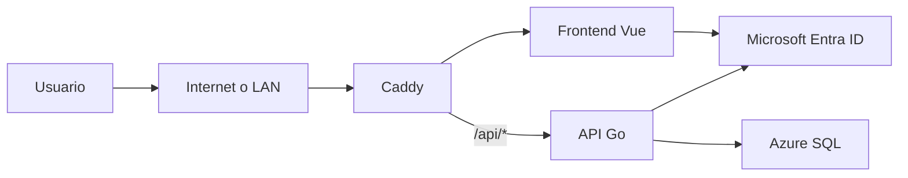

El diseño no implica por sí mismo que el ambiente esté estable o aprobado; define el resultado buscado.

## Paso 2 — Preparar WSL2 como servidor de laboratorio

Se utilizó Windows con Debian sobre WSL2. El código se mantuvo en el filesystem Linux, no bajo `/mnt/c`, para evitar problemas de permisos, rendimiento y `node_modules`.

```text
$HOME/projects/
├── poliredi/
└── poliredi-infra/
```

La configuración prevista de WSL usa red reflejada:

```ini
[wsl2]
networkingMode=mirrored
```

Después de cambiar `.wslconfig`, reiniciar WSL desde PowerShell:

```powershell
wsl --shutdown
```

## Paso 3 — Instalar y verificar Podman rootless

Los contenedores se ejecutan con el usuario Linux, sin privilegios de root.

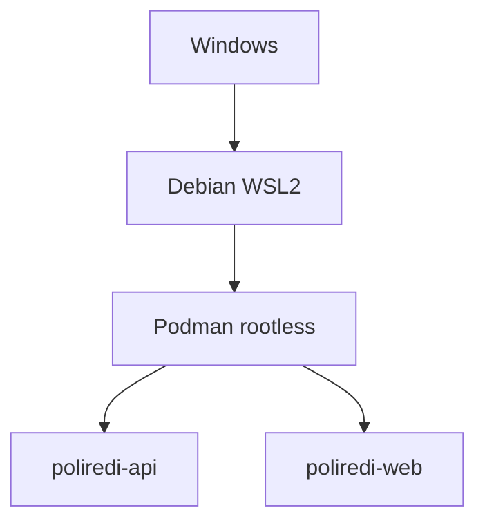

Verificar la configuración:

```bash
podman info --format 'rootless={{.Host.Security.Rootless}} cgroupManager={{.Host.CgroupManager}} cgroupVersion={{.Host.CgroupsVersion}}'
```

La bitácora refiere `rootless=true`, `cgroupManager=systemd` y cgroups v2.

## Paso 4 — Separar las redes por responsabilidad

Se definieron las redes `poliredi-frontend`, `poliredi-backend` y `poliredi-management`.

```bash
podman network create poliredi-frontend
podman network create poliredi-backend
podman network create poliredi-management
```

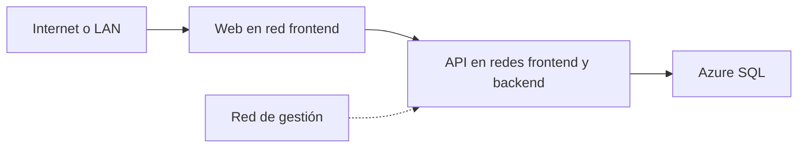

La web puede llegar a la API; no se concede una ruta directa de la web a la base de datos.

## Paso 5 — Construir la imagen del backend Go

El backend usa un build multi-stage y una imagen de ejecución mínima.

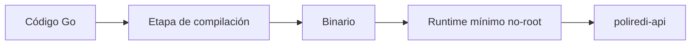

Comando reproducible con placeholders:

```bash
podman build \
  --file <RUTA_CONTAINERFILE_API> \
  --tag localhost/poliredi-api:mvp2 \
  <CONTEXTO_API>
```

La API escucha en el puerto interno `3000`; no debe publicarse directamente al host. El contenedor aplica usuario no-root, filesystem de solo lectura, `NoNewPrivileges` y `/tmp` temporal cuando la definición Quadlet lo indique.

## Paso 6 — Construir la imagen del frontend

Vue se compila en una etapa Node y el resultado se sirve mediante Caddy.

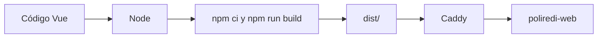

```bash
podman build \
  --file <RUTA_CONTAINERFILE_WEB> \
  --tag localhost/poliredi-web:mvp2 \
  <CONTEXTO_WEB>
```

Caddy sirve la SPA bajo `/` y reenvía `/api/*` a la API.

## Paso 7 — Usar Caddy como única puerta de entrada

La API queda accesible normalmente solo desde Caddy por la red interna.

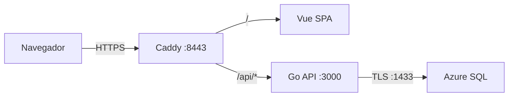

Comprobar la configuración antes de recargarla:

```bash
podman exec poliredi-web caddy validate --config /etc/caddy/Caddyfile
```

## Paso 8 — Habilitar HTTPS local

Al operar rootless se eligió `8443`, evitando depender de puertos privilegiados `80/443`. Caddy generó una CA interna para el laboratorio.

```bash
curl -k https://localhost:8443/
```

La CA solo debe instalarse en equipos controlados. No publicar su clave privada ni confundir confianza local con un certificado público.

## Paso 9 — Comprobar acceso desde la LAN

La red reflejada de WSL permitió probar el servicio desde otro equipo de la misma LAN.

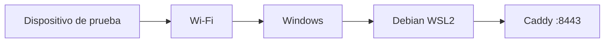

```bash
curl -k "https://<IP_LAN>:8443/api/health"
```

La IP real debe mantenerse fuera del repositorio y puede cambiar entre sesiones.

## Paso 10 — Evaluar y descartar mDNS para este laboratorio

Se probó un nombre `.local` mediante Avahi. Resolvía dentro de Debian, pero un dispositivo externo respondió `NXDOMAIN`.

```bash
getent hosts <HOST_LOCAL_MDNS>
```

Como mDNS no era requisito del MVP ni resultó confiable en la red disponible, se descartó sin afectar la publicación por Tailscale.

## Paso 11 — Evitar dependencia del router

La publicación tradicional habría requerido port forwarding, control del router y una ruta pública utilizable.

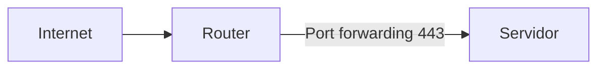

Al no controlar el router y existir direccionamiento privado, no se abrieron puertos ni se asumió que NAT/CGNAT fuera configurable.

## Paso 12 — Publicar mediante Tailscale Funnel

Funnel entrega una entrada HTTPS pública hacia el Caddy local sin abrir puertos del router.

```bash
tailscale funnel --bg https+insecure://localhost:8443
tailscale funnel status
```

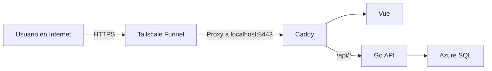

La URL se documenta como `https://<HOSTNAME_TAILSCALE>`; el hostname real no se versiona.

## Paso 13 — Corregir la respuesta vacía por el encabezado Host

La entrada pública respondió `200` con cuerpo vacío porque Caddy solo reconocía hosts locales y LAN. Funnel enviaba su hostname público.

Incluir los tres orígenes mediante variables o plantilla local, sin registrar valores reales:

```caddyfile
https://localhost:8443, https://<IP_LAN>:8443, https://<HOSTNAME_TAILSCALE> {
    # SPA y reverse_proxy definidos por la infraestructura.
}
```

Validar y reiniciar la web:

```bash
systemctl --user restart poliredi-web.service
curl -sS "https://<HOSTNAME_TAILSCALE>/api/health"
```

## Paso 14 — Mantener identidad y autorización separadas

Microsoft Entra ID autentica; la base Poli-REDI conserva rol, RUT, bloqueo y reglas del dominio.

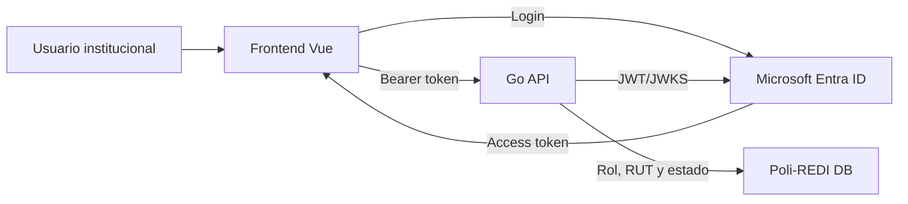

No incluir tenant, client IDs, scopes ni tokens reales en esta guía.

## Paso 15 — Adaptar MSAL a múltiples orígenes

El frontend debe derivar callbacks del origen actual para funcionar en localhost, LAN y Funnel.

```javascript
const appOrigin = window.location.origin

const redirectUri = `${appOrigin}/auth/callback`
const postLogoutRedirectUri = `${appOrigin}/login`
```

La bitácora refiere el uso de `sessionStorage` en lugar de `localStorage`. Cada origen debe estar autorizado explícitamente en Entra; el origen dinámico no sustituye esa configuración.

## Paso 16 — Declarar servicios con systemd y Quadlet

Se prepararon contenedores y redes como unidades de usuario:

```text
$HOME/.config/containers/systemd/
├── poliredi-api.container
├── poliredi-web.container
├── poliredi-frontend.network
├── poliredi-backend.network
└── poliredi-management.network
```

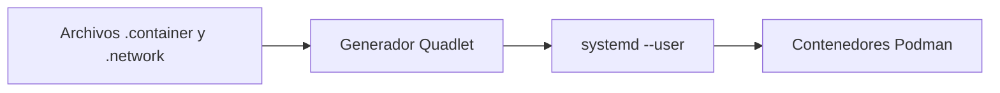

```bash
systemctl --user daemon-reload
systemctl --user start poliredi-api.service
systemctl --user start poliredi-web.service
```

La estabilidad de ambas unidades continúa pendiente de confirmación formal.

## Paso 17 — Separar código e infraestructura

El código de producto y la operación self-hosted se mantuvieron en repositorios distintos.

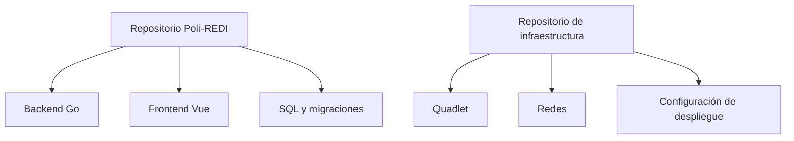

Los secretos no pertenecen a ninguno de los repositorios.

## Paso 18 — Definir la estrategia Git

La estrategia acordada usa ramas para trabajo, `main` como integración estable y tags como fotografías de MVP.

```bash
git branch --list
git tag --list 'v*-mvp*'
```

No se mantienen indefinidamente ramas `mvp1`, `mvp2`, `mvp3` y `mvp4`. El objetivo referido es etiquetar versiones como `v0.1.0-mvp1` y `v0.2.0-mvp2` una vez aprobadas.

## Paso 19 — Integrar infraestructura en la rama MVP 2

La bitácora refiere un merge de infraestructura sobre MVP 2 con conflictos deliberadamente resueltos.

```bash
git switch mvp2
git merge infra/self-hosting
```

Decisiones registradas:

| Archivo | Resolución |
|---|---|
| `msalConfig.js` | Origen dinámico y `sessionStorage`. |
| `FacilityCarousel.vue` | Conservar comportamiento de MVP 2. |
| `Sidebar.vue` | Conservar `/join` y el icono compatible con `@lucide/vue`. |

No repetir el merge si ya está integrado; verificar primero el historial.

## Paso 20 — Validar el merge

Se comprobó ausencia de conflictos y la bitácora refiere build frontend y pruebas backend.

```bash
git diff --name-only --diff-filter=U
git grep -n -e '<<<<<<<' -e '=======' -e '>>>>>>>' -- .

cd frontend
npm ci
npm run build

cd ../backend
go test ./...
```

Estos resultados proceden de la bitácora; deben conservarse logs y versión si se usarán como evidencia de cierre.

## Paso 21 — Crear imágenes versionadas y conservar rollback

Los tags ambiguos `:dev` se reemplazaron por `:mvp1` y `:mvp2`. Los IDs reales se sanitizan.

| Componente | MVP 1 | MVP 2 |
|---|---|---|
| API | `<ID_IMAGEN_API_MVP1>` | `<ID_IMAGEN_API_MVP2>` |
| Web | `<ID_IMAGEN_WEB_MVP1>` | `<ID_IMAGEN_WEB_MVP2>` |

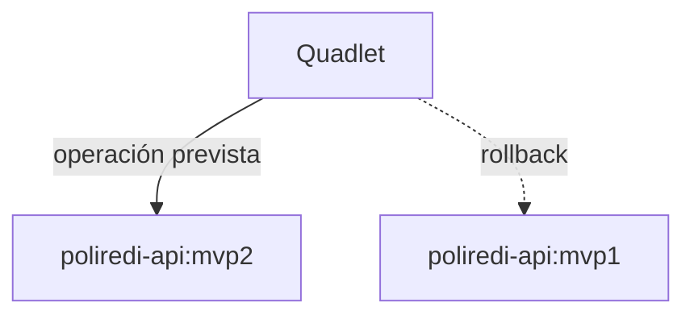

```bash
podman images --format 'table {{.Repository}}:{{.Tag}}\t{{.ID}}\t{{.Created}}' | grep poliredi
```

## Paso 22 — Fijar las imágenes MVP 2 en Quadlet

Las unidades deben declarar versiones explícitas:

```ini
Image=localhost/poliredi-api:mvp2
```

```ini
Image=localhost/poliredi-web:mvp2
```

Después de editar la infraestructura local:

```bash
systemctl --user daemon-reload
systemctl --user restart poliredi-api.service poliredi-web.service
```

No usar `:latest` o `:dev` en una release que pretenda ser recuperable.

## Paso 23 — Diagnosticar la falta de versión de clave

El primer arranque de MVP 2 falló porque `JOIN_CODE_KEY_VERSION` era obligatorio. Esa variable identifica la versión activa del cifrado de códigos grupales.

```bash
grep -q '^JOIN_CODE_KEY_VERSION=' "$HOME/.config/poliredi/api.env" \
  && echo 'Versión configurada' \
  || echo 'Falta JOIN_CODE_KEY_VERSION'
```

El valor no secreto puede ser `1` en la configuración inicial. La clave real nunca debe almacenarse en Git.

## Paso 24 — Guardar las claves como Podman Secrets

La contraseña SQL y las claves de códigos se inyectan por separado de `api.env`.

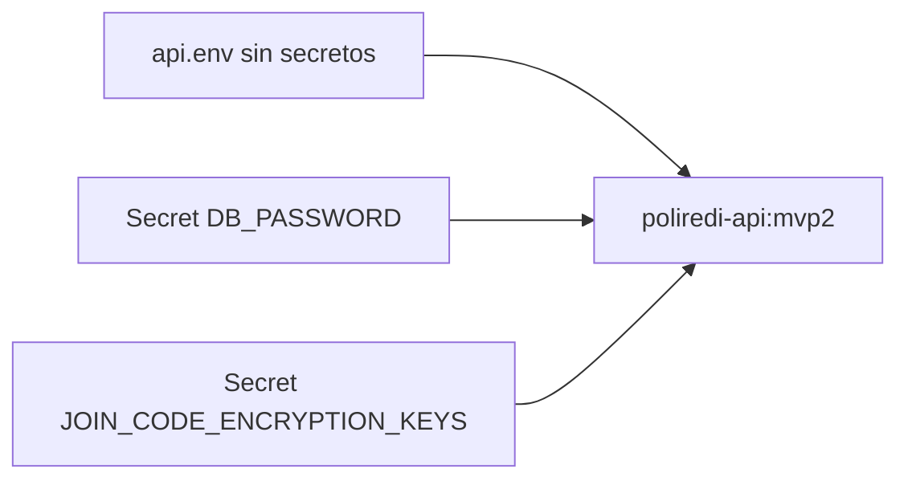

Ejemplo de creación interactiva sin imprimir el secreto:

```bash
read -rsp 'DB password: ' POLIREDI_DB_PASSWORD
printf '%s' "$POLIREDI_DB_PASSWORD" | podman secret create poliredi-db-password -
unset POLIREDI_DB_PASSWORD

(printf '1:'; openssl rand -base64 32 | tr -d '\n') \
  | podman secret create poliredi-join-code-keys -
```

Listar solo nombres, nunca contenidos:

```bash
podman secret ls
```

## Paso 25 — Distinguir el timeout SQL del error de configuración

Tras corregir el secreto apareció `context deadline exceeded` al conectar con SQL. Ese mensaje exigía separar posibles causas: imagen, Azure, red, credenciales o firewall.

```bash
journalctl --user -u poliredi-api.service --since '15 minutes ago' --no-pager
```

Los logs compartidos deben sanitizar cadenas, usuarios, hosts, tokens y datos personales.

## Paso 26 — Ejecutar una prueba controlada con MVP 1

Se ejecutó MVP 1 con las mismas redes, `api.env`, secreto SQL y Azure SQL. El arranque conectó correctamente y habilitó Entra, lo que redujo la probabilidad de un problema persistente en infraestructura común.

```bash
timeout 20s podman run --rm \
  --name poliredi-api-mvp1-test \
  --network poliredi-frontend \
  --network poliredi-backend \
  --env-file "$HOME/.config/poliredi/api.env" \
  --secret poliredi-db-password,type=env,target=DB_PASSWORD \
  localhost/poliredi-api:mvp1
```

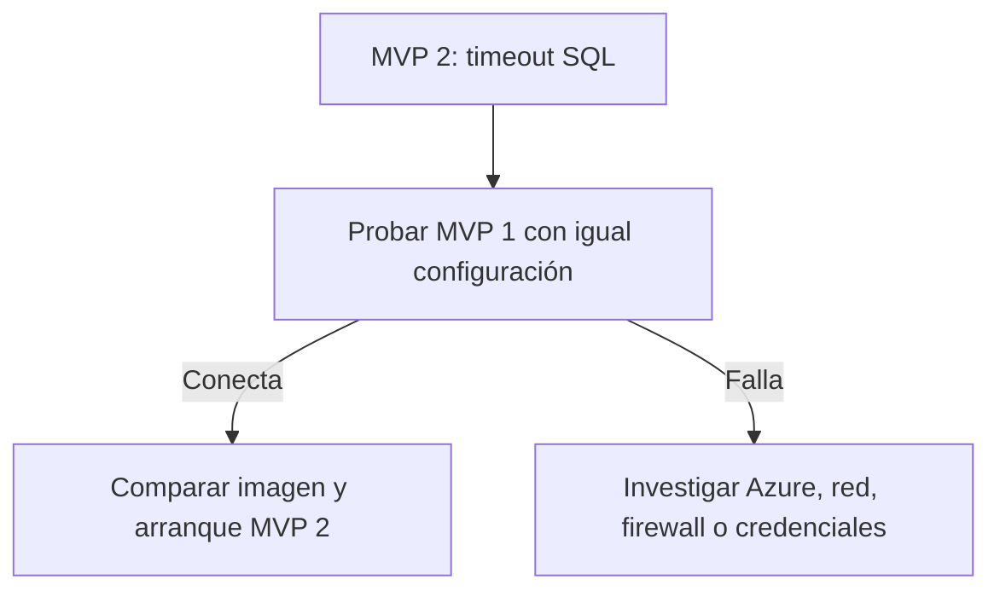

## Paso 27 — Ejecutar MVP 2 de forma aislada

La segunda prueba añadió el secreto de códigos y también conectó con Azure SQL y habilitó Entra.

```bash
timeout 30s podman run --rm \
  --name poliredi-api-mvp2-test \
  --network poliredi-frontend \
  --network poliredi-backend \
  --env-file "$HOME/.config/poliredi/api.env" \
  --secret poliredi-db-password,type=env,target=DB_PASSWORD \
  --secret poliredi-join-code-keys,type=env,target=JOIN_CODE_ENCRYPTION_KEYS \
  localhost/poliredi-api:mvp2
```

El resultado permite clasificar el timeout anterior como transitorio/no reproducido. No demuestra todavía que la unidad Quadlet permanezca estable ni que la web funcione E2E.

## Paso 28 — Representar el flujo completo previsto

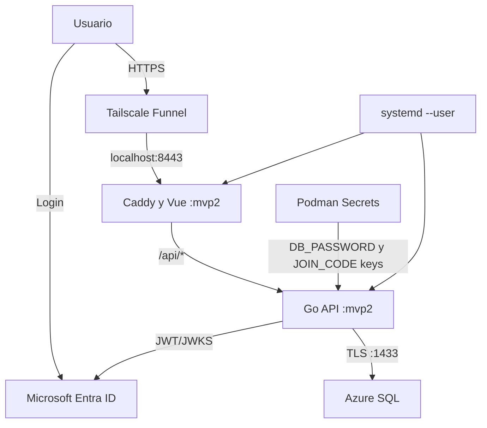

Este es el flujo objetivo del servicio formal, no una afirmación de E2E aprobado.

## Paso 29 — Verificar el flujo de arranque

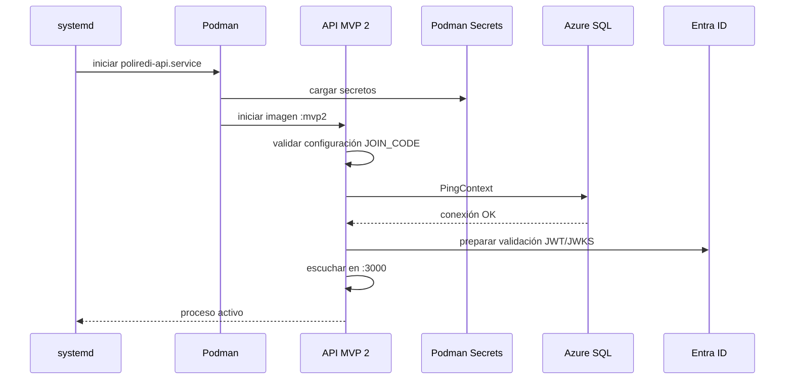

Comprobar estabilidad y logs:

```bash
systemctl --user reset-failed poliredi-api.service
systemctl --user restart poliredi-api.service
systemctl --user is-active poliredi-api.service
systemctl --user show poliredi-api.service -p ActiveEnterTimestamp -p NRestarts
journalctl --user -u poliredi-api.service --since '10 minutes ago' --no-pager
```

Una respuesta inmediata `active` no basta: observar reinicios y estabilidad durante una ventana acordada.

## Paso 30 — Verificar una petición pública real

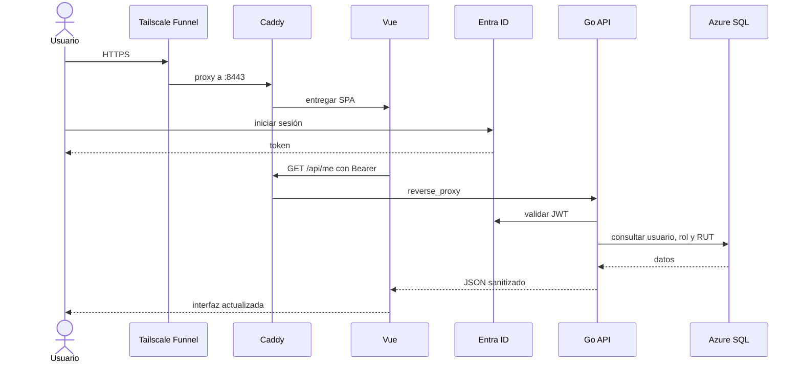

Validación mínima:

```bash
curl -k https://localhost:8443/api/health
curl -sS "https://<HOSTNAME_TAILSCALE>/api/health"
```

Después se requiere login real y comprobación de permisos, no solo health.

## Paso 31 — Preparar el flujo de release Git

La bitácora propone fusionar MVP 2 a `main` y crear `v0.2.0-mvp2` únicamente después del cierre técnico.

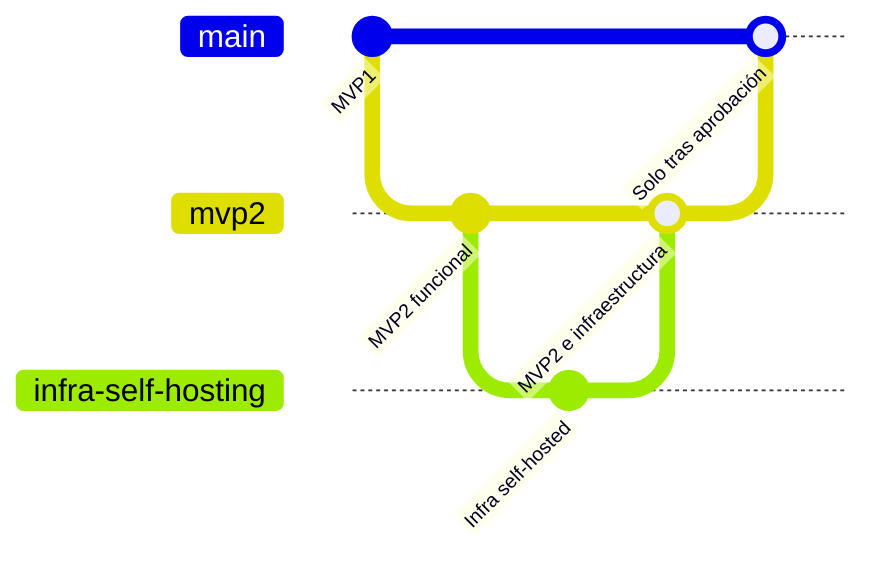

Antes de etiquetar:

```bash
git status --short
git log --oneline --decorate -n 10
```

No ejecutar merge, tag o push mientras Quadlet y E2E público estén pendientes.

## Paso 32 — Revisar las capas de seguridad

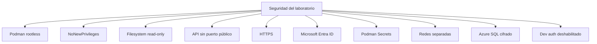

Verificaciones sin revelar valores:

```bash
podman inspect poliredi-api --format '{{.HostConfig.ReadonlyRootfs}}'
podman port poliredi-api
systemctl --user cat poliredi-api.service
```

Estas medidas endurecen el laboratorio, pero no sustituyen una revisión completa de seguridad ni lo convierten automáticamente en producción.

## Paso 33 — Registrar estado comprobado y pendientes

| Componente o evidencia | Estado según bitácora |
|---|---|
| Debian WSL2, Podman rootless y redes | Configurados. |
| Imágenes API MVP 1 y MVP 2 | Arranque aislado correcto. |
| Azure SQL y Entra desde ambas imágenes API | Confirmados en prueba aislada. |
| Caddy, HTTPS LAN y Funnel | Configurados/probados durante la preparación. |
| Merge de infraestructura, build frontend y pruebas backend | Referidos por la bitácora; conservar logs para cierre. |
| Secretos DB y join code | Inyectados mediante Podman Secrets. |
| API y web MVP 2 estables mediante Quadlet | Pendiente de confirmación. |
| E2E público de login, `/join`, participantes y reserva grupal | Pendiente. |

Ejecutar el gate pendiente:

```bash
systemctl --user is-active poliredi-api.service
systemctl --user is-active poliredi-web.service
podman ps --format 'table {{.Names}}\t{{.Image}}\t{{.Status}}'
curl -k https://localhost:8443/api/health
curl -sS "https://<HOSTNAME_TAILSCALE>/api/health"
```

Luego probar manualmente, con datos no sensibles: login, `/join`, consulta de invitación, confirmación/retiro, progreso, creación grupal, privacidad, permisos y logout.

## Paso 34 — Consolidar la imagen mental y el criterio de cierre

```mermaid
flowchart LR
    G["Git mvp2"] --> B["Build y pruebas"]
    B --> I["Imágenes api:mvp2 y web:mvp2"]
    I --> Q["Quadlet"]
    Q --> S["systemd --user"]
    S --> C["Contenedores rootless"]
    SEC["Podman Secrets"] --> C
    U["Internet"] --> T["Tailscale Funnel"]
    T --> W["Caddy"]
    W --> C
    C --> DB["Azure SQL"]
    C --> E["Entra ID"]
```

El recorrido es: código → Git → build → imagen versionada → Quadlet → systemd → Podman rootless → Caddy → HTTPS → Funnel. Entra aporta identidad, Azure SQL persistencia, Podman Secrets protege credenciales y las imágenes MVP 1 permiten rollback.

MVP 2 solo puede declararse desplegado cuando API y web permanezcan estables bajo Quadlet, el health local y público sea correcto, el E2E funcional público resulte aprobado y se archive evidencia sanitizada de versión, ambiente y resultado. Hasta entonces, el estado es **despliegue self-hosted parcial**.

